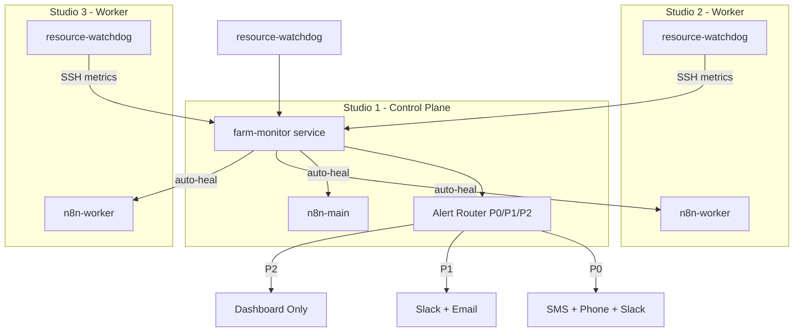

# Agent Farm Monitoring and Automated Recovery

## Architecture Overview




Two main components:

1. `**resource-watchdog.sh**` -- lightweight shell script running on each Studio via launchd, performs local resource checks and automated responses (prune, kill) without network dependency
2. `**packages/farm-monitor**` -- TypeScript service on Studio 1 that collects metrics from all Studios, monitors APIs, tracks builds, routes alerts, and triggers automated recovery

## Part 1: Resource Watchdog (Shell + launchd)

A self-contained shell script deployed to each Studio, running every 60 seconds via launchd.

### New files

- **[mac-studios-iac/scripts/monitoring/resource-watchdog.sh](mac-studios-iac/scripts/monitoring/resource-watchdog.sh)** -- The watchdog script with:
  - RAM check: maintains a counter file at `/tmp/mismo-ram-high-count`. If RAM >85% for 5 consecutive checks (5min), calls the alert webhook and reduces n8n worker concurrency by setting `QUEUE_BULL_CONCURRENCY` and restarting the worker container
  - Disk check: if disk >90%, runs `docker system prune -af --volumes` (only dangling), sends alert
  - CPU check: maintains `/tmp/mismo-cpu-high-count`. If CPU >95% for 10 consecutive checks (10min), identifies hung build processes (docker containers running >90min), kills them, sends alert
  - Alert delivery: POST to the farm-monitor service on Studio 1 (or direct Slack webhook as fallback)
- **[mac-studios-iac/scripts/monitoring/com.mismo.resource-watchdog.plist](mac-studios-iac/scripts/monitoring/com.mismo.resource-watchdog.plist)** -- launchd plist to run watchdog every 60s

### Modified files

- **[mac-studios-iac/ansible/setup-studio.yml](mac-studios-iac/ansible/setup-studio.yml)** -- Add tasks to deploy watchdog script and launchd plist, install fail2ban

## Part 2: Farm Monitor Service (TypeScript)

New package `packages/farm-monitor` that runs as a long-lived process on Studio 1.

### New package: `packages/farm-monitor`

```
packages/farm-monitor/
  src/
    index.ts              # Main loop with setInterval collectors
    config.ts             # All thresholds as constants
    collectors/
      resource.ts         # SSH into Studios, parse metrics
      api-health.ts       # Probe Kimi, Supabase, GitHub APIs
      build-tracker.ts    # Query Supabase for build status
      security.ts         # Parse auth.log / pf logs
    responders/
      resource-actions.ts # Docker prune, kill, concurrency adjustment (via SSH)
      api-failover.ts     # Switch Kimi -> DeepSeek, queue builds on Supabase drop
      build-recovery.ts   # Kill stuck builds, track retries, escalate
      security-actions.ts # fail2ban trigger, alert
    alerts/
      router.ts           # P0/P1/P2 routing logic
      sms.ts              # Twilio SMS
      phone.ts            # Twilio voice call
      dashboard.ts        # Write to Supabase monitoring_alerts table
    state.ts              # In-memory state (counters, timers, circuit breakers)
  package.json
  tsconfig.json
```

### Key module details

`**config.ts**` -- Central thresholds:

```typescript
export const THRESHOLDS = {
  RAM_WARN_PERCENT: 85,
  RAM_WARN_DURATION_MS: 5 * 60_000,
  DISK_CRITICAL_PERCENT: 90,
  CPU_CRITICAL_PERCENT: 95,
  CPU_CRITICAL_DURATION_MS: 10 * 60_000,
  KIMI_LATENCY_THRESHOLD_MS: 3_000,
  SUPABASE_RETRY_INTERVAL_MS: 30_000,
  BUILD_MAX_RETRIES: 3,
  BUILD_STUCK_TIMEOUT_MS: 60 * 60_000,
  SUCCESS_RATE_CRITICAL: 0.80,
  SUCCESS_RATE_WINDOW_MS: 60 * 60_000,
  CRED_ROTATION_WARNING_DAYS: 30,
}
```

`**collectors/api-health.ts**` -- API monitoring:

- **Kimi**: timed `fetch` to `https://api.moonshot.ai/v1/models` with the API key; if latency >3s or error, return `degraded`
- **Supabase**: `SELECT 1` via Supabase client or direct PG connection check; on failure, return `down`
- **GitHub**: check `X-RateLimit-Remaining` header from `https://api.github.com/rate_limit`; if remaining <100, return `rate_limited`

`**responders/api-failover.ts`** -- Automated failover:

- When Kimi is degraded: update a Supabase row in a `system_config` table setting `active_provider` to `deepseek`, which agents read at build start. Revert after 5 min of healthy Kimi checks.
- When Supabase is down: write build requests to a local SQLite file as a queue. A recovery loop retries every 30s. On reconnection, drain the queue.
- When GitHub is rate-limited: set a flag that the build pipeline checks before creating repos. Queue new builds with `queued_until` timestamp (next hour boundary).

`**collectors/build-tracker.ts**` -- Build failure tracking:

- Query Supabase `commissions` table for builds in `building` state >1hr (stuck builds)
- Query recent build results grouped by commission_id for retry counts
- Calculate rolling success rate over last hour

`**responders/build-recovery.ts**` -- Build recovery:

- Stuck >1hr: SSH to the Studio running the build, `docker kill` the container, update Supabase status to `failed`, trigger P1 notification to client
- Same commission fails 3x: update status to `escalated`, trigger P0 (SMS to developer)
- Success rate <80%: trigger P0 critical alert

`**collectors/security.ts**`:

- Parse `/var/log/system.log` (macOS) for failed SSH auth attempts
- Monitor pf logs for unexpected outbound connections from Studios
- Check credential expiry dates from a `credentials` table in Supabase

`**responders/security-actions.ts**`:

- Failed SSH: add IP to pf block table via SSH command on the affected Studio
- Strange outbound: alert only (P0)
- Credential expiry <30 days: P1 alert with details

### Alert routing

`**alerts/router.ts**` -- Priority-based dispatch using existing comms infrastructure:

```typescript
async function route(alert: FarmAlert): Promise<void> {
  await writeToDashboard(alert) // always

  if (alert.priority === 'P2') return

  await sendSlack(alert)
  await sendEmail(alert)

  if (alert.priority === 'P0') {
    await sendSMS(alert)
    await sendPhoneCall(alert)
  }
}
```

`**alerts/sms.ts**` and `**alerts/phone.ts**` -- Twilio integration:

- Uses `twilio` npm package
- Env vars: `TWILIO_ACCOUNT_SID`, `TWILIO_AUTH_TOKEN`, `TWILIO_FROM_NUMBER`, `ALERT_PHONE_NUMBER`
- Phone calls use TwiML to read the alert message

## Part 3: Extend Existing Infrastructure

### Modified files

- **[packages/ai/src/providers/index.ts](packages/ai/src/providers/index.ts)** -- Add `getActiveProviderWithFallback()` that checks the `system_config` table for provider overrides before using the default. This is the integration point for API failover.
- **[packages/shared/src/constants.ts](packages/shared/src/constants.ts)** -- Add monitoring-related constants (alert priorities enum, notification event types for farm alerts)
- **[packages/comms/src/dispatcher.ts](packages/comms/src/dispatcher.ts)** -- Add `FARM_ALERT` notification event type and SMS/Phone channels to the dispatch system
- **[packages/comms/src/channels/sms.ts](packages/comms/src/channels/sms.ts)** (new) -- Twilio SMS channel
- **[packages/comms/src/channels/phone.ts](packages/comms/src/channels/phone.ts)** (new) -- Twilio voice call channel
- **[.env.example](.env.example)** -- Add Twilio env vars, alert phone number, farm-monitor config vars

### Docker additions

- **[docker/n8n-ha/docker-compose.main.yml](docker/n8n-ha/docker-compose.main.yml)** -- Add `farm-monitor` service that runs alongside n8n-main on Studio 1

### Ansible additions

- **[mac-studios-iac/ansible/setup-monitoring.yml](mac-studios-iac/ansible/setup-monitoring.yml)** (new) -- Playbook that:
  - Deploys `resource-watchdog.sh` and launchd plist to all Studios
  - Configures macOS `pf` logging for security monitoring
  - Sets up log rotation for monitoring logs

### Auto-heal: n8n Worker Recovery

Docker compose already has `restart: always`, which handles basic crashes. The farm-monitor adds a deeper check:

- Every 2 minutes, SSH to Studios 2 and 3, run `docker ps --filter name=n8n-worker`
- If the container is missing or unhealthy, run `docker compose -f docker-compose.worker.yml up -d`
- If the container restarted >5 times in 10 minutes, alert P0 (likely a persistent issue)

### Backup Verification

- **[mac-studios-iac/scripts/backups/verify-backup.sh](mac-studios-iac/scripts/backups/verify-backup.sh)** (new) -- Daily script on Studio 3 that:
  - Finds the latest backup in `/Volumes/1TB_Storage/supabase_backups/`
  - Restores it to a temp Postgres database
  - Runs a count query on key tables
  - Drops the temp database
  - Reports success/failure to farm-monitor

## Part 4: Farm Monitor Dashboard API

- **[apps/internal/src/app/api/farm/status/route.ts](apps/internal/src/app/api/farm/status/route.ts)** (new) -- API endpoint that queries the `monitoring_alerts` table and returns current farm status for the internal dashboard
- **[apps/internal/src/app/api/farm/alerts/route.ts](apps/internal/src/app/api/farm/alerts/route.ts)** (new) -- API endpoint listing recent alerts with filtering

## Data model

Add to Supabase (via Prisma migration):

- `**system_config`** table: `key` (string PK), `value` (jsonb), `updated_at` -- for provider overrides, feature flags
- `**monitoring_alerts**` table: `id`, `priority` (P0/P1/P2), `category` (resource/api/build/security), `studio` (1/2/3), `title`, `details` (jsonb), `resolved_at`, `created_at` -- for dashboard and audit trail
- `**build_queue_local**` -- only used by farm-monitor when Supabase is down (stored in local SQLite, not Supabase)

## Startup and Deployment

1. Farm monitor runs as a Docker service on Studio 1 via the main compose file
2. Resource watchdog runs natively on each Studio via launchd (no Docker dependency -- must work even if Docker is down)
3. Backup verification runs as a daily cron/launchd job on Studio 3

## Monitoring intervals


| Collector                    | Interval  | Notes                     |
| ---------------------------- | --------- | ------------------------- |
| Resource watchdog (local)    | 60s       | launchd on each Studio    |
| Resource collector (central) | 2min      | SSH from Studio 1         |
| API health (Kimi)            | 30s       | Direct HTTP from Studio 1 |
| API health (Supabase)        | 30s       | PG connection check       |
| API health (GitHub)          | 60s       | Rate limit header check   |
| Build tracker                | 30s       | Supabase query            |
| Security scanner             | 5min      | Log parsing via SSH       |
| n8n container health         | 2min      | Docker ps via SSH         |
| Backup verification          | Daily 3am | launchd on Studio 3       |


