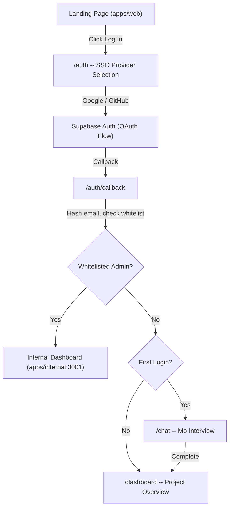

# Auth System and Dashboard Implementation

## SSO Provider Research Results

All OAuth flows go through **Supabase Auth** (free tier: 50,000 MAUs). The cost is only on the provider side:

- **Google OAuth** -- Free. Create OAuth consent screen in Google Cloud Console. No per-auth charges. Widely trusted, covers the majority of users.
- **GitHub OAuth** -- Free. Create an OAuth App in GitHub Developer Settings. No charges. Good for tech-savvy users.
- **Apple Sign In** -- OAuth API is free, but requires an Apple Developer Account ($99/year). Deferred for now; can be added later without architecture changes.
- **X/Twitter OAuth** -- Free tier available on X developer portal, but X's API policies have been unstable. Deferred for now.

**Recommendation:** Launch with **Google and GitHub** (both completely free). The architecture supports adding Apple/X/Discord later by simply enabling them in the Supabase dashboard.

---

## Architecture Overview



### Privacy-First Data Model

The system stores **zero personal information** in our database. The flow:

1. User authenticates via Supabase OAuth (Google/GitHub)
2. Supabase stores the user's email/name in its own auth system (encrypted, managed by Supabase)
3. Our `/auth/callback` route receives the Supabase user ID and the provider email
4. We **hash the email with SHA-256** and compare against the admin whitelist (stored as hashes in env var)
5. We create a `User` record with **only**: `supabaseAuthId`, `role`, `createdAt` -- no email, no name
6. The email is never written to our database; it exists only in Supabase's auth system and transiently in memory during the callback

**Admin whitelist** stored as env var:

```
ADMIN_EMAIL_HASHES=sha256_of_youwenshao@gmail.com
```

The SHA-256 hash of `youwenshao@gmail.com` will be precomputed and stored in the env.

---

## Phase 1: Auth Infrastructure

### 1a. Supabase Project Setup

Include setup instructions in the repo (update README):

- Create Supabase project at [supabase.com](https://supabase.com)
- Enable Google and GitHub providers in Auth > Providers
- Configure OAuth credentials from Google Cloud Console and GitHub Developer Settings
- Set redirect URL to `http://localhost:3000/auth/callback`
- Copy project URL, anon key, and service role key to `.env`

### 1b. Install Dependencies

**apps/web:**

- `@supabase/supabase-js` -- Supabase client
- `@supabase/ssr` -- Server-side auth helpers for Next.js

**apps/internal:**

- `@supabase/supabase-js`
- `@supabase/ssr`

### 1c. Prisma Schema Migration

Modify [packages/db/prisma/schema.prisma](packages/db/prisma/schema.prisma):

```prisma
model User {
  id               String    @id @default(cuid())
  supabaseAuthId   String    @unique
  role             Role      @default(CLIENT)
  hasCompletedOnboarding Boolean @default(false)
  stripeCustomerId String?
  createdAt        DateTime  @default(now())
  updatedAt        DateTime  @updatedAt
  // ... existing relations unchanged
}
```

Key changes:

- **Remove** `email` (was `String @unique`) -- not stored
- **Remove** `name` (was `String?`) -- not stored
- **Remove** `ageVerified`, `ageTier` -- defer to later if needed
- **Add** `supabaseAuthId` (`String @unique`) -- links to Supabase auth user
- **Add** `hasCompletedOnboarding` (`Boolean @default(false)`) -- tracks first-time flow

### 1d. Auth Utility Files

Create `apps/web/src/lib/supabase/`:

- `client.ts` -- Browser Supabase client (`createBrowserClient`)
- `server.ts` -- Server Supabase client (`createServerClient` with cookie handling)
- `middleware.ts` -- Supabase middleware helper for session refresh

Create `apps/web/src/lib/auth.ts`:

- `hashEmail(email: string): string` -- SHA-256 hash utility
- `isWhitelistedAdmin(email: string): boolean` -- checks hash against `ADMIN_EMAIL_HASHES` env var
- `getSessionUser()` -- server-side helper to get current user from Supabase + Prisma

Mirror the Supabase client files in `apps/internal/src/lib/supabase/` (same Supabase project, shared cookies).

### 1e. Middleware Updates

Update [apps/web/src/middleware.ts](apps/web/src/middleware.ts):

- Add Supabase session refresh on every request (per Supabase SSR docs)
- Protect `/dashboard`, `/chat`, `/project/`\* routes -- redirect to `/auth` if not authenticated
- Allow `/`, `/auth`, `/auth/callback`, `/api/`\* without auth

Create `apps/internal/src/middleware.ts`:

- Supabase session refresh
- Protect all routes -- redirect to `http://localhost:3000/auth` if not authenticated
- **Role check**: only allow `ENGINEER` and `ADMIN` roles; redirect others to `http://localhost:3000/dashboard`

---

## Phase 2: Auth Pages

### 2a. Auth Page (`apps/web/src/app/auth/page.tsx`)

A clean, centered page matching the landing page aesthetic:

- "Mismo" wordmark at top
- "Sign in to continue" heading
- Two SSO buttons (large, pill-style, matching design system):
  - "Continue with Google" (Google icon)
  - "Continue with GitHub" (GitHub icon)
- Footer note: "We never store your email or personal information."
- No email/password fields. SSO only.

### 2b. Auth Callback (`apps/web/src/app/auth/callback/route.ts`)

Server-side route handler:

1. Exchange auth code for session via `supabase.auth.exchangeCodeForSession(code)`
2. Get user email from Supabase auth metadata
3. Hash email, check against admin whitelist
4. Upsert `User` in Prisma (by `supabaseAuthId`) with appropriate role
5. If new client user: set `hasCompletedOnboarding = false`
6. Redirect:

- `ADMIN`/`ENGINEER` role -> `http://localhost:3001` (internal app)
- `CLIENT` role + `!hasCompletedOnboarding` -> `/chat` (Mo interview)
- `CLIENT` role + `hasCompletedOnboarding` -> `/dashboard`

### 2c. Update Header and Login Flow

Modify [apps/web/src/components/Header.tsx](apps/web/src/components/Header.tsx):

- "Log in" button now links directly to `/auth` (no dropdown)
- When user is authenticated: show user avatar (initials from UID, no personal info) with sign-out option

Remove or repurpose [apps/web/src/components/LoginDropdown.tsx](apps/web/src/components/LoginDropdown.tsx) -- no longer needed as a provider selector since the auth page handles that.

---

## Phase 3: Client Dashboard (`apps/web`)

### Design Philosophy

The client never sees technical details. Everything is human-friendly with simple language. No status codes, no technical jargon. The dashboard is a calm, quiet space.

### 3a. Dashboard Page (`apps/web/src/app/dashboard/page.tsx`)

**For new users (no projects):**

- Clean empty state with "Welcome to Mismo" heading
- "Let's start by telling Mo about your idea" subtext
- Single prominent CTA button -> `/chat`

**For returning users (has projects):**

- Simple project cards in a vertical list:
  - Project name (user-chosen or Mo-generated)
  - Status in plain language: "Talking to Mo", "Reviewing your spec", "Being built", "Ready for you"
  - Last activity timestamp
  - Click to open project detail
- "Start a new project" button at top

### 3b. Dashboard Layout (`apps/web/src/app/dashboard/layout.tsx`)

- Clean header: "Mismo" wordmark left, user menu (initials avatar + sign out) right
- No sidebar for the client dashboard -- just a clean single-column layout
- Max width constrained (`max-w-4xl mx-auto`)
- Matches the landing page's clean white background, system sans-serif typography

### 3c. Mo Chat Interface (`apps/web/src/app/chat/page.tsx`)

This is the centerpiece of the client experience. It mirrors the hero section's aesthetic:

**Layout:**

- Full-height centered layout
- "What can I help you build?" heading (same as hero)
- Chat messages appear in a clean thread below
- Input at bottom (same rounded-2xl style as hero input)
- Toggle between text and voice mode

**Text Mode:**

- Messages displayed as a clean conversation thread
- No chat bubbles -- simple alternating messages with subtle spacing
- Mo's messages in regular weight, user messages slightly bolder
- Typing indicator: three subtle dots

**Voice Mode (LiveKit):**

- When user selects voice: connect to LiveKit room
- Visual indicator: subtle pulsing circle when Mo is "listening"
- Mo responds with synthesized speech (LiveKit + AI TTS)
- Transcript shown in real-time below the voice indicator
- "Switch to text" option always visible

**Integration with existing API:**

- Uses existing `/api/interview/start`, `/api/interview/message`, `/api/interview/session` endpoints
- New: `/api/interview/voice` endpoint for LiveKit room token generation

### 3d. Project Detail (`apps/web/src/app/project/[id]/page.tsx`)

Simple, non-technical view:

- Project name and plain-language status
- Timeline showing progress (visual steps, not technical pipeline)
- "Chat with Mo" button to continue conversation
- When PRD is ready: simple review interface
- When checkout needed: payment flow

---

## Phase 4: Internal Dashboard (`apps/internal`)

### 4a. Dashboard Shell

**Sidebar** (`apps/internal/src/components/sidebar.tsx`):

- Fixed left sidebar (w-56), white background, subtle right border
- "Mismo" wordmark at top
- Nav items: Overview, Projects, Settings
- Active state: bold text, no colored backgrounds
- User info at bottom: role badge, sign out

**Header** (inline, not a separate component):

- Page title on left
- Minimal -- the sidebar handles navigation

### 4b. Overview Page (`apps/internal/src/app/page.tsx`)

The engineer's home screen:

- **Quick stats row**: Active projects count, Pending reviews, Avg. project age
- **Pending reviews table**: Clean table with project name, client UID (not name), tier, submitted date, "Claim" action
- **Recent activity feed**: Simple chronological list of events

### 4c. Projects Page (`apps/internal/src/app/projects/page.tsx`)

- Filterable project list (by status, tier)
- Table view: Project name, Client UID, Status, Tier, Safety score, Last updated
- Click through to project detail

### 4d. Project Detail (`apps/internal/src/app/projects/[id]/page.tsx`)

- Full project information (technical details appropriate for engineers)
- Tabs: Overview, PRD, Build Logs, Tokens
- Status management (ability to advance pipeline stage)
- Safety classification display

### 4e. Settings (`apps/internal/src/app/settings/page.tsx`)

- Admin whitelist management (future)
- System health overview
- Sign out

---

## Phase 5: Env and Config

### Environment Variables (additions to `.env`)

```
# Auth
ADMIN_EMAIL_HASHES=<sha256-of-youwenshao@gmail.com>

# Supabase (already present, to be filled)
NEXT_PUBLIC_SUPABASE_URL=
NEXT_PUBLIC_SUPABASE_ANON_KEY=
SUPABASE_SERVICE_ROLE_KEY=

# LiveKit (already present, to be filled)
LIVEKIT_API_KEY=
LIVEKIT_API_SECRET=
NEXT_PUBLIC_LIVEKIT_URL=
```

---

## Parallelization Strategy

```mermaid
gantt
    title Implementation Phases
    dateFormat X
    axisFormat %s

    section Phase1
    Auth infra and schema     :a1, 0, 2
    section Phase2
    Auth pages and callback   :a2, 2, 4
    section Parallel
    Client dashboard          :a3, 4, 7
    Internal dashboard        :a4, 4, 7
    Mo chat and voice         :a5, 4, 8
```



- **Phase 1** (serial): Auth infrastructure must come first (Supabase setup, schema migration, auth utilities, middleware)
- **Phase 2** (serial): Auth pages depend on Phase 1
- **Phase 3-5** (parallel): Once auth is working, client dashboard, internal dashboard, and Mo chat interface can all be built concurrently by parallel agents

---

## Files Summary

**New files (~25):**

- `apps/web/src/lib/supabase/client.ts`, `server.ts`, `middleware.ts`
- `apps/web/src/lib/auth.ts`
- `apps/web/src/app/auth/page.tsx`
- `apps/web/src/app/auth/callback/route.ts`
- `apps/web/src/app/dashboard/page.tsx`, `layout.tsx`
- `apps/web/src/app/chat/page.tsx`
- `apps/web/src/app/api/interview/voice/route.ts`
- `apps/internal/src/lib/supabase/client.ts`, `server.ts`, `middleware.ts`
- `apps/internal/src/middleware.ts`
- `apps/internal/src/components/sidebar.tsx`
- `apps/internal/src/app/page.tsx` (rewrite)
- `apps/internal/src/app/layout.tsx` (rewrite)
- `apps/internal/src/app/projects/page.tsx`
- `apps/internal/src/app/projects/[id]/page.tsx`
- `apps/internal/src/app/settings/page.tsx`

**Modified files (~5):**

- `packages/db/prisma/schema.prisma`
- `apps/web/src/middleware.ts`
- `apps/web/src/components/Header.tsx`
- `apps/web/src/app/layout.tsx` (add auth provider context)
- `.env` (add `ADMIN_EMAIL_HASHES`)
