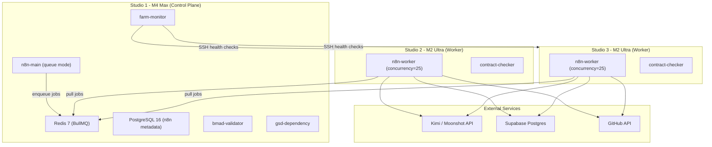

# Concurrent Build Validation and Capacity Planning

## Current Architecture




**Key constraints for 10 concurrent builds:**

- 50 total n8n worker slots (25 per Studio) -- sufficient headroom
- Redis is single-instance on Studio 1 -- potential bottleneck
- Kimi API has unknown rate limits -- potential bottleneck
- Supabase connection pooling via Supavisor (port 6543) -- no explicit pool size configured in Prisma
- Git clones at `--depth=100` in [packages/ai/src/repo-surgery/ingestion.ts](packages/ai/src/repo-surgery/ingestion.ts) -- wasteful for concurrent builds
- No Docker image registry -- every Studio rebuilds from scratch

---

## Part 1: Concurrent Build Load Test

### 1a. Create a k6/shell load test harness

The existing k6 test ([apps/web/k6/load-test.js](apps/web/k6/load-test.js)) tests web API endpoints, not build pipelines. We need a new test that triggers actual builds through n8n webhooks.

**New file: `scripts/load-test/concurrent-builds.ts`**

A TypeScript script (runnable via `tsx`) that:

1. Creates 10 test commissions in Supabase with different archetypes: 3 `web-app`, 3 `automation`, 2 `mobile`, 2 `mod`
2. Fires build pipeline webhooks to n8n-main for all 10 simultaneously
3. Polls `Build` table for completion status every 10s
4. Records per-build and total wall-clock time
5. Outputs comparison table: concurrent total vs sum-of-individual (sequential estimate)

**New file: `scripts/load-test/sequential-baseline.ts`**

Runs the same 10 builds sequentially for comparison baseline.

### 1b. Monitor instrumentation during load test

**New file: `scripts/load-test/monitor.ts`**

A background monitor that runs alongside the load test, sampling every 5s:

- **Redis**: `INFO` command for `connected_clients`, `used_memory`, `instantaneous_ops_per_sec`; BullMQ queue depth via `LLEN bull:n8n:wait`
- **DB connections**: Query `SELECT count(*) FROM pg_stat_activity` on both n8n Postgres and Supabase
- **Studio resources**: SSH to each studio, capture `memory_pressure`, CPU via `top -l 1`
- **Kimi API**: Track request count and latencies from farm-monitor's existing `api-health` collector

Writes a timestamped CSV for post-analysis.

### 1c. Pass/fail criteria


| Metric                     | Threshold                                      |
| -------------------------- | ---------------------------------------------- |
| Total concurrent wall time | Less than 2x single-build avg                  |
| Redis queue depth          | Never exceeds 50 pending jobs                  |
| DB connections             | Never exceeds 80% of Supavisor limit           |
| Kimi API errors            | Less than 5% of total requests                 |
| Build success rate         | 100% (all 10 complete)                         |
| RAM usage per Studio       | Below 85% (no concurrency reduction triggered) |


---

## Part 2: Optimizations

### 2a. Git shallow clones (`--depth 1`)

In [packages/ai/src/repo-surgery/ingestion.ts](packages/ai/src/repo-surgery/ingestion.ts) line 24:

```typescript
// Current:
`git clone --branch ${branch} --depth=100 ${repoUrl} ${targetDir}`
// Change to:
`git clone --branch ${branch} --depth=1 ${repoUrl} ${targetDir}`
```

The `analyzeActivity` method on line 125 uses `git log -50` which will return fewer results with `--depth=1`. This is acceptable -- the activity analysis is informational, not critical. Add a `shallowClone` option (default `true`) to `RepoIngestion` constructor that uses `--depth=1` for builds and `--depth=100` for surgery that needs history.

Also verify [packages/comms/src/maintenance/dependency-checker.ts](packages/comms/src/maintenance/dependency-checker.ts) already uses `--depth 1` (confirmed from exploration).

### 2b. Docker layer caching via local registry

Set up a Docker registry on Studio 1 that Studios 2 and 3 can pull cached layers from.

**Modify [docker/n8n-ha/docker-compose.main.yml](docker/n8n-ha/docker-compose.main.yml):**

Add a `registry` service:

```yaml
registry:
  image: registry:2
  restart: always
  ports:
    - "5000:5000"
  volumes:
    - registry_data:/var/lib/registry
```

**Modify build process** in n8n workflows to:

1. Tag images as `${STUDIO_1_IP}:5000/mismo/<image>:<hash>`
2. Push to local registry after build on any Studio
3. Pull from registry before building (cache hit = skip rebuild)

**Add `--cache-from` to Docker build commands** in n8n workflow nodes that invoke `docker build`.

### 2c. Kimi API request batching

The Kimi/Moonshot API uses OpenAI-compatible endpoints. The OpenAI Batch API (`/v1/batches`) is not universally supported by compatible providers. After investigation:

- If Moonshot supports `/v1/batches`: implement a batch queue in [packages/ai/src/providers/index.ts](packages/ai/src/providers/index.ts) that collects requests over a 100ms window and submits as a batch
- If not supported (likely): implement **client-side request throttling** with a semaphore in the AI provider layer to limit concurrent Kimi requests to a configurable max (e.g., 20). This prevents 10 concurrent builds from each firing 5+ parallel Kimi requests simultaneously (50+ total)

**New file: `packages/ai/src/providers/rate-limiter.ts`**

A token-bucket rate limiter wrapping the Kimi provider:

- Max concurrent requests: configurable via `KIMI_MAX_CONCURRENT` env var (default: 20)
- Request queue with priority (builds in progress > new builds)
- Exponential backoff on 429 responses

---

## Part 3: Failover Tests

### 3a. Kill Studio 2 during build

**Test script: `scripts/load-test/failover-worker-kill.ts`**

1. Start 4 builds (2 routed to Studio 2, 2 to Studio 3)
2. Wait for builds to be in progress (poll `Build.status = 'RUNNING'`)
3. SSH to Studio 2: `docker compose -f docker/n8n-ha/docker-compose.worker.yml down`
4. Verify: Studio 2's builds go to FAILED (farm-monitor stuck-build recovery handles this via [packages/farm-monitor/src/responders/build-recovery.ts](packages/farm-monitor/src/responders/build-recovery.ts))
5. Verify: New builds are picked up only by Studio 3 workers
6. Verify: Alert was fired (check `FarmAlert` table)
7. Restart Studio 2, verify it reconnects and starts pulling jobs

**Expected behavior**: BullMQ's Redis-based queue means Studio 3's workers automatically get the next jobs. Studio 2's in-flight jobs will time out after `BUILD_STUCK_TIMEOUT_MS` (1 hour in [packages/shared/src/constants.ts](packages/shared/src/constants.ts)) and be marked FAILED by farm-monitor.

**Optimization**: Reduce stuck timeout to 10min for the test, or add a "worker heartbeat" mechanism that detects worker death faster.

### 3b. Restart Studio 1 (control plane)

**Test script: `scripts/load-test/failover-control-plane.ts`**

1. Start 4 builds, wait for them to be RUNNING
2. Restart all services on Studio 1: `docker compose -f docker/n8n-ha/docker-compose.main.yml restart`
3. Verify: Redis comes back with persisted data (`appendonly yes` in [docker-compose.main.yml](docker/n8n-ha/docker-compose.main.yml) line 22)
4. Verify: Workers on Studios 2/3 reconnect within `QUEUE_BULL_REDIS_TIMEOUT` (30s, configured in [docker-compose.worker.yml](docker/n8n-ha/docker-compose.worker.yml) line 23)
5. Verify: In-flight builds either resume or get re-queued
6. Verify: No data loss (compare Build records before/after)

### 3c. Internet outage simulation

**Test script: `scripts/load-test/failover-network.ts`**

1. Use `pfctl` (macOS firewall) to block outbound traffic to Kimi, GitHub, Supabase endpoints on Studio 2
2. Verify: Builds fail gracefully with clear error messages
3. Verify: Farm-monitor detects API health degradation and triggers Kimi->DeepSeek failover ([packages/farm-monitor/src/responders/api-failover.ts](packages/farm-monitor/src/responders/api-failover.ts))
4. Verify: `localQueuePath` at `/tmp/mismo-build-queue.db` (from [packages/farm-monitor/src/config.ts](packages/farm-monitor/src/config.ts) line 44) captures pending work
5. Restore connectivity, verify builds resume

**Note**: The `localQueuePath` is defined in config but needs verification that the local queue persistence logic is fully implemented (may need implementation if it's just a config placeholder).

---

## Part 4: Capacity Planning Document

### New file: `docs/capacity-planning.md`

Document structure:

- **Current capacity**: X concurrent builds sustained, Y builds/day throughput (populated from load test results)
- **Resource utilization per build**: avg RAM, CPU time, Kimi tokens, disk I/O, network
- **Bottleneck analysis**: Ranked list of what saturates first (likely: Kimi API rate limits > Redis throughput > disk I/O for Docker builds)
- **Scaling triggers**: Add to [packages/shared/src/constants.ts](packages/shared/src/constants.ts):

```typescript
export const CAPACITY_THRESHOLDS = {
  QUEUE_DEPTH_SCALE_TRIGGER: 20,
  QUEUE_DEPTH_SCALE_DURATION_MS: 60 * 60_000, // 1 hour
  DAILY_BUILD_CAPACITY_WARNING: 40,
} as const
```

- **Scaling plan**: When to add 4th Studio (trigger: queue depth >20 for >1 hour)
- **Alert for scaling**: Add queue-depth threshold alert to farm-monitor

### Add queue depth monitoring to farm-monitor

**Modify [packages/farm-monitor/src/collectors/build-tracker.ts](packages/farm-monitor/src/collectors/build-tracker.ts):**

Add Redis queue depth check (`LLEN bull:n8n:wait`) to the existing build tracker collector. When depth exceeds `QUEUE_DEPTH_SCALE_TRIGGER` for `QUEUE_DEPTH_SCALE_DURATION_MS`, fire a P1 alert: "Queue depth sustained >20 for 1hr -- consider adding Studio 4."

---

## File Change Summary

**New files (8):**

- `scripts/load-test/concurrent-builds.ts` -- main load test harness
- `scripts/load-test/sequential-baseline.ts` -- sequential comparison
- `scripts/load-test/monitor.ts` -- resource monitoring during tests
- `scripts/load-test/failover-worker-kill.ts` -- Studio 2 kill test
- `scripts/load-test/failover-control-plane.ts` -- Studio 1 restart test
- `scripts/load-test/failover-network.ts` -- network outage test
- `packages/ai/src/providers/rate-limiter.ts` -- Kimi rate limiter
- `docs/capacity-planning.md` -- capacity planning document

**Modified files (5):**

- `packages/ai/src/repo-surgery/ingestion.ts` -- add `shallowClone` option, default `--depth=1`
- `docker/n8n-ha/docker-compose.main.yml` -- add local Docker registry service
- `packages/shared/src/constants.ts` -- add `CAPACITY_THRESHOLDS`
- `packages/farm-monitor/src/collectors/build-tracker.ts` -- add queue depth monitoring
- `packages/ai/src/providers/index.ts` -- wrap Kimi provider with rate limiter

