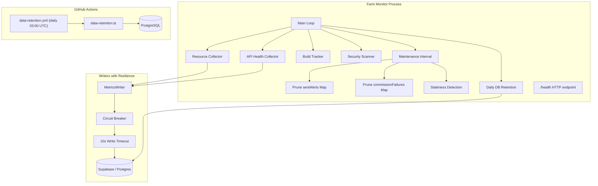

# Comprehensive Data Management Upgrade

## Current State Assessment

**What exists already:**

- A manual data retention script at `[packages/db/scripts/data-retention.ts](packages/db/scripts/data-retention.ts)` covering `BuildLog` (90d), `AuditLog` (365d), `Credential` (30d post-delivery), `StudioMetrics` (30d), `MonitoringAlert` (90d resolved). Run manually via `pnpm db:retention`.

**What is missing:**

- `ApiHealthSnapshot`, `TokenUsage`, `Notification` tables have NO retention policy
- The retention script is never run automatically
- `farm-monitor` `sentAlerts` and `commissionFailures` Maps grow indefinitely in memory
- `MetricsWriter` has no write timeout or circuit breaker
- No health self-check for the monitor process itself
- `Build.errorLogs` JSON field accumulates indefinitely per-build

---

## Part 1: Extend and Complete the DB Retention Script

File: `[packages/db/scripts/data-retention.ts](packages/db/scripts/data-retention.ts)`

**Add retention for currently-unmanaged tables:**

- `ApiHealthSnapshot`: 30 days (matches `StudioMetrics`)
- `TokenUsage`: 180 days
- `Notification`: 90 days
- `InterviewSession`: delete where `expiresAt < now()` and `completedAt` is set (or expired > 7 days ago)

**Add batch deletion for large tables** to avoid long-running transactions that lock the DB:

```typescript
async function batchDelete(table: string, where: object, batchSize = 1000): Promise<number> {
  let totalDeleted = 0
  let deleted: number
  do {
    const ids = await prisma.$queryRawUnsafe(
      `SELECT id FROM "${table}" WHERE ... LIMIT ${batchSize}`,
    )
    // delete by id batch
    deleted = ids.length
    totalDeleted += deleted
  } while (deleted === batchSize)
  return totalDeleted
}
```

**Add a summary report** that the retention script outputs (total rows deleted per table, duration) so cron runs produce auditable logs.

---

## Part 2: Automate Retention via GitHub Actions Cron

New file: `.github/workflows/data-retention.yml`

- Schedule: daily at 03:00 UTC
- Runs `pnpm --filter @mismo/db db:retention`
- Requires `DATABASE_URL` and `DIRECT_URL` secrets configured in the repo
- Posts a Slack notification on failure (uses existing `SLACK_ALERT_WEBHOOK_URL` secret)

```yaml
on:
  schedule:
    - cron: '0 3 * * *'
  workflow_dispatch: {}
```

---

## Part 3: Farm-Monitor In-Memory State Pruning

File: `[packages/farm-monitor/src/state.ts](packages/farm-monitor/src/state.ts)`

`**sentAlerts` Map pruning:\*\*

- Add a `pruneSentAlerts()` method that removes entries older than their priority's cooldown (P0: 5min, P1: 15min, P2: 60min). Since the longest cooldown is 60 minutes, any entry older than 60 minutes is dead weight.

```typescript
pruneSentAlerts(): number {
  const now = Date.now()
  let pruned = 0
  for (const [key, alert] of this.sentAlerts) {
    if (now - alert.sentAt > this.alertCooldownMs[alert.priority] * 2) {
      this.sentAlerts.delete(key)
      pruned++
    }
  }
  return pruned
}
```

`**commissionFailures` Map pruning:\*\*

- Add a `pruneCommissionFailures(maxAgeMs: number)` method. Since commission failures are keyed by commissionId and only store a count (no timestamp), we need to either:
  - (a) Change the value from `number` to `{ count: number; lastSeen: number }` so we can prune by age, OR
  - (b) Clear the entire map on a schedule (e.g., daily)
- Recommend option (a) for precision.

File: `[packages/farm-monitor/src/index.ts](packages/farm-monitor/src/index.ts)`

**Add a periodic maintenance interval:**

```typescript
setInterval(() => {
  const alertsPruned = state.pruneSentAlerts()
  const failuresPruned = state.pruneCommissionFailures(24 * 60 * 60_000)
  if (alertsPruned || failuresPruned) {
    console.log(
      `[farm-monitor] Maintenance: pruned ${alertsPruned} alerts, ${failuresPruned} failures`,
    )
  }
}, 10 * 60_000) // every 10 minutes
```

---

## Part 4: MetricsWriter Resilience

File: `[packages/farm-monitor/src/writers/metrics-writer.ts](packages/farm-monitor/src/writers/metrics-writer.ts)`

**Add write timeout:**

- Wrap each Supabase insert in an `AbortSignal.timeout(10_000)` or a manual `Promise.race` with a 10-second timeout.

**Add circuit breaker:**

- Track consecutive write failures. After 5 consecutive failures, stop attempting writes for 60 seconds and log a warning. Auto-recover after cooldown.

```typescript
private consecutiveFailures = 0
private circuitOpenUntil = 0
private readonly CIRCUIT_THRESHOLD = 5
private readonly CIRCUIT_COOLDOWN_MS = 60_000

private isCircuitOpen(): boolean {
  if (this.consecutiveFailures < this.CIRCUIT_THRESHOLD) return false
  if (Date.now() > this.circuitOpenUntil) {
    this.consecutiveFailures = 0
    return false
  }
  return true
}
```

---

## Part 5: Farm-Monitor Health Self-Check

File: `[packages/farm-monitor/src/index.ts](packages/farm-monitor/src/index.ts)`

**Add a lightweight health endpoint** (HTTP on a configurable port, e.g., 3006) so external systems can poll liveness:

```typescript
import http from 'http'

const healthServer = http.createServer((req, res) => {
  if (req.url === '/health') {
    res.writeHead(200, { 'Content-Type': 'application/json' })
    res.end(
      JSON.stringify({
        status: 'ok',
        uptime: process.uptime(),
        memoryMb: Math.round(process.memoryUsage().heapUsed / 1024 / 1024),
        sentAlerts: state.sentAlertsCount(),
        lastResourceCheck: lastCheckTimestamps.resource,
        lastApiCheck: lastCheckTimestamps.api,
      }),
    )
  } else {
    res.writeHead(404)
    res.end()
  }
})
healthServer.listen(Number(process.env.FARM_MONITOR_HEALTH_PORT || 3006))
```

**Add staleness detection:**

- Track `lastCheckTimestamp` for each collector loop. If any collector hasn't run within 3x its expected interval, log a P0 alert and attempt to restart the interval.

---

## Part 6: Integrate Retention into Farm-Monitor (Belt-and-Suspenders)

As a redundancy layer alongside the GitHub Actions cron, have `farm-monitor` itself trigger a DB retention run once per day using the Supabase client directly:

File: new `packages/farm-monitor/src/maintenance/db-retention.ts`

- Runs the same deletion logic as `data-retention.ts` but using the Supabase client (not Prisma) since farm-monitor already has Supabase access.
- Deletes `StudioMetrics` older than 30 days, `ApiHealthSnapshot` older than 30 days, resolved `MonitoringAlert` older than 90 days.
- Triggered once per 24 hours from the main loop.
- This ensures retention runs even if GitHub Actions fails or the repo is unreachable.

---

## Architecture Summary



---

## File Change Summary

| File                                                    | Change Type |
| ------------------------------------------------------- | ----------- |
| `packages/db/scripts/data-retention.ts`                 | Extend      |
| `packages/farm-monitor/src/state.ts`                    | Extend      |
| `packages/farm-monitor/src/index.ts`                    | Extend      |
| `packages/farm-monitor/src/writers/metrics-writer.ts`   | Extend      |
| `packages/farm-monitor/src/maintenance/db-retention.ts` | New         |
| `.github/workflows/data-retention.yml`                  | New         |
