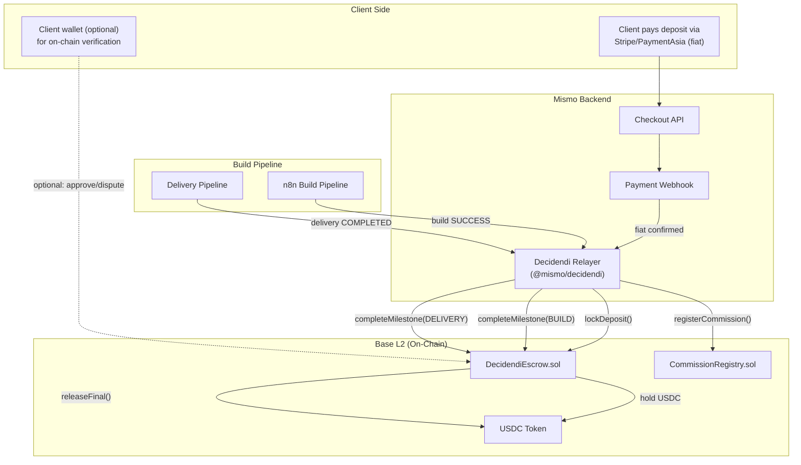

# Decidendi: Blockchain Milestone Escrow System for Mismo

This plan has two phases: **Phase A** patches the five critical automation gaps in the existing pipeline so the system works end-to-end, and **Phase B** introduces the Decidendi smart contract system on Base L2 to replace the traditional payment flow with an on-chain escrow.

---

## Phase A: Fix Pipeline Automation Gaps

These are prerequisite patches that make the existing flow functional before layering on Web3.

### A1. Update Payment Webhooks to Advance Commission State

**Problem:** Both Stripe and PaymentAsia webhooks update the `Payment` record but never touch `Commission.paymentState`.

**Fix in** `[apps/web/src/app/api/billing/webhooks/stripe/route.ts](apps/web/src/app/api/billing/webhooks/stripe/route.ts)`:

- After updating `Payment` to `COMPLETED`, load the associated `Payment.commissionId`.
- If the commission's `paymentState` is `UNPAID`, set it to `PARTIAL` (deposit received).
- If a second payment completes (final invoice), set it to `FINAL`.
- Use a helper function `advanceCommissionPaymentState(commissionId)` shared across both webhook files.

**Same fix in** `[apps/web/src/app/api/billing/webhooks/paymentasia/route.ts](apps/web/src/app/api/billing/webhooks/paymentasia/route.ts)`.

### A2. Trigger Build Pipeline After Deposit Payment

**Problem:** Nothing calls the n8n `POST /webhook/build-pipeline` after payment completes.

**Fix:** Inside the shared `advanceCommissionPaymentState()` helper, after transitioning from `UNPAID` to `PARTIAL`:

1. Create a `Build` record (`status: 'PENDING'`, linked to `commissionId`).
2. Fire an HTTP POST to the n8n build-pipeline webhook with `{ buildId, prdJson }` (read `prdJson` from `Commission.prdJson`).
3. Update `Commission.status` from `DRAFT`/`DISCOVERY` to `IN_PROGRESS`.
4. Guard with a feature flag `ENABLE_AUTO_BUILD=true` in `.env.example` to allow manual override.

### A3. Add Deposit vs Final Payment Schema Fields

**Problem:** No way to distinguish deposit from final payment.

**Schema change in** `[packages/db/prisma/schema.prisma](packages/db/prisma/schema.prisma)`:

```prisma
enum PaymentPhase {
  DEPOSIT
  FINAL
  HOSTING
  REFUND
}
```

Add `phase PaymentPhase @default(DEPOSIT)` to the `Payment` model. The checkout route will tag payments with the correct phase.

### A4. Add Client Acceptance API and Schema

**Problem:** No formal client acceptance gate exists.

**Schema change:** Add to `Commission`:

```prisma
clientAcceptedAt  DateTime?
clientRejectedAt  DateTime?
rejectionReason   String?
```

**New API route:** `apps/web/src/app/api/delivery/accept/route.ts`

- `POST { commissionId, accepted: boolean, reason?: string }`
- If `accepted`: set `clientAcceptedAt`, trigger final invoice (Phase B: release escrow).
- If rejected: set `clientRejectedAt` + `rejectionReason`, escalate to `ESCALATED` status, dispatch `SUPPORT_REQUIRED`.

### A5. Replace Mock Contract Routes

**Problem:** `[apps/web/src/app/api/contracts/send/route.ts](apps/web/src/app/api/contracts/send/route.ts)` and `[apps/web/src/app/api/contracts/status/route.ts](apps/web/src/app/api/contracts/status/route.ts)` are mocks.

**Fix:** Wire them to the existing `Contract` model in the database (`packages/db/prisma/schema.prisma` lines 90-103). The `send` route creates a `Contract` record with `status: 'PENDING'`. The `status` route queries the DB. DocuSign integration remains out of scope (can be added later), but the records are real. Contract signing will later be replaced by on-chain Decidendi signatures (Phase B).

---

## Phase B: Decidendi Smart Contract System

### B1. Architecture Overview

Decidendi is a milestone-based escrow protocol on **Base L2** using **native USDC** (`0x833589fCD6eDb6E08f4c7C32D4f71b54bdA02913`). It implements a transparent, auditable payment lifecycle where funds are locked on-chain and released only when milestones are verifiably met.



### B2. Smart Contract Design

**New package:** `packages/decidendi/` (Hardhat + Foundry hybrid)

#### Contract 1: `DecidendiEscrow.sol`

The core escrow contract. Mismo is the `operator` (relayer). The client is the `payer`. Each commission gets an escrow record.

```solidity
struct Commission {
    address payer;           // client wallet (or Mismo custodial if no wallet)
    address payee;           // Mismo treasury
    uint256 depositAmount;   // USDC amount (6 decimals)
    uint256 finalAmount;     // USDC amount for post-build
    uint256 totalAmount;     // deposit + final
    uint8 currentMilestone;  // 0=CREATED, 1=DEPOSIT_LOCKED, 2=BUILD_COMPLETE, 3=DELIVERED, 4=ACCEPTED, 5=FINALIZED
    uint256 createdAt;
    uint256 deadlineAt;      // SLA deadline (from PRD timeline)
    bool disputed;
    bool voided;
}
```

Key functions:

- `lockDeposit(commissionId, payer, depositAmount, finalAmount, deadlineAt)` -- Called by Mismo relayer after fiat deposit confirmed. Transfers USDC from Mismo treasury to escrow.
- `completeMilestone(commissionId, milestone)` -- Called by relayer when build succeeds or delivery completes. Emits `MilestoneCompleted` event.
- `clientAccept(commissionId)` -- Called by client wallet OR by relayer on client's behalf. Moves to ACCEPTED, releases deposit to Mismo.
- `lockFinal(commissionId)` -- Called by relayer after final fiat payment confirmed. Locks remaining USDC.
- `releaseFinal(commissionId)` -- Called after 3-day grace period post-acceptance. Releases final payment to Mismo.
- `dispute(commissionId, reason)` -- Called by client. Freezes all funds, emits `DisputeRaised`.
- `resolveDispute(commissionId, refundPercent)` -- Called by arbiter (multi-sig or Mismo admin). Splits funds.
- `voidContract(commissionId)` -- Called if SLA deadline exceeded without delivery. Returns deposit to payer.
- `reclaimExpired(commissionId)` -- Called by payer after deadline + grace period. Safety valve.

#### Contract 2: `CommissionRegistry.sol`

On-chain registry of all commissions. Stores PRD hash (keccak256 of PRD JSON), milestone timestamps, and final delivery hash. Provides a public `verify(commissionId)` view function that returns the full audit trail. This is the "transparency dashboard" data source.

#### Contract 3: `DecidendiArbiter.sol`

A lightweight multi-sig (2-of-3) for dispute resolution. Signers: Mismo founder, independent auditor, rotating community member. Only activated when `dispute()` is called.

### B3. Payment Flow (Deposit + Final Invoice)

The deposit/final split ratio:

| Tier     | Total (HKD) | Deposit (40%) | Final (60%) |
| -------- | ----------- | ------------- | ----------- |
| VIBE     | $15,600     | $6,240        | $9,360      |
| VERIFIED | $62,400     | $24,960       | $37,440     |
| FOUNDRY  | $195,000    | $78,000       | $117,000    |

**Flow:**

1. Client selects tier, Mo completes interview, PRD is generated.
2. Client signs contract (acknowledgments: IP, age, AUP).
3. Client pays **deposit** via Stripe/PaymentAsia (fiat).
4. Stripe webhook fires -> `advanceCommissionPaymentState()` -> sets `paymentState: PARTIAL`.
5. **Decidendi Relayer** converts deposit to USDC equivalent (via exchange rate oracle or fixed rate) and calls `lockDeposit()` on Base L2.
6. `CommissionRegistry.registerCommission()` records PRD hash on-chain.
7. Build pipeline is automatically triggered.
8. Build completes -> relayer calls `completeMilestone(BUILD_COMPLETE)`.
9. Delivery pipeline runs -> relayer calls `completeMilestone(DELIVERED)`.
10. Client reviews deliverables on frontend dashboard.
11. Client clicks "Accept" -> `clientAccept()` on-chain (via wallet or relayer). Deposit released to Mismo.
12. Client pays **final invoice** via Stripe/PaymentAsia.
13. Relayer calls `lockFinal()`, then after 3-day grace period, `releaseFinal()`.
14. Commission marked `COMPLETED`. Full audit trail on-chain.

**If client disputes:**

- Funds are frozen on-chain.
- `DecidendiArbiter` multi-sig resolves with a refund percentage.
- Partial refund returned to client, remainder to Mismo.

**If SLA deadline exceeded:**

- Client can call `voidContract()` to reclaim deposit.
- Or Mismo can extend deadline (requires client wallet signature or relayer consent).

### B4. Package Structure

```
packages/decidendi/
  contracts/
    DecidendiEscrow.sol
    CommissionRegistry.sol
    DecidendiArbiter.sol
    interfaces/
      IDecidendiEscrow.sol
    libraries/
      MilestoneLib.sol
  test/
    DecidendiEscrow.t.sol       (Foundry tests)
    CommissionRegistry.t.sol
    DecidendiArbiter.t.sol
  scripts/
    deploy.ts                    (Hardhat deploy to Base Sepolia + Mainnet)
  src/
    index.ts                     (TypeScript SDK: relayer, ABI exports, viem helpers)
    relayer.ts                   (DecidendiRelayer class)
    abi.ts                       (Generated ABI from compilation)
    types.ts                     (TypeScript types matching Solidity structs)
    oracle.ts                    (HKD->USDC exchange rate)
  hardhat.config.ts
  foundry.toml
  package.json                   (@mismo/decidendi)
```

### B5. Frontend Integration

**Stack:** Wagmi v2 + Viem + OnchainKit (for optional Coinbase Smart Wallet).

**In** `apps/web/`:

- Add `wagmi`, `viem`, `@coinbase/onchainkit` dependencies.
- Create a `WagmiProvider` wrapper (Base chain config).
- **Transparency Dashboard** (`/project/[id]/escrow`): Shows milestone timeline, on-chain tx links (BaseScan), PRD hash verification, fund status. Data from `CommissionRegistry.verify()` view call.
- **Optional Wallet Connect**: A "Connect Wallet" button using OnchainKit `<Wallet />` component. If connected, client can directly sign `clientAccept()` or `dispute()` on-chain. If not connected, Mismo relayer acts on their behalf after they click the button in the web UI.

### B6. Cybersecurity Threat Model and Mitigations

| Threat                                         | Severity | Mitigation                                                                                                                                                                                      |
| ---------------------------------------------- | -------- | ----------------------------------------------------------------------------------------------------------------------------------------------------------------------------------------------- |
| **Reentrancy** on `releaseFinal`/`lockDeposit` | Critical | OpenZeppelin `ReentrancyGuard` on all state-changing functions. Checks-effects-interactions pattern. USDC `transfer` (not `call`) for payouts.                                                  |
| **Front-running** milestone completions        | Medium   | Only `operator` (Mismo relayer) can call `completeMilestone`. No MEV benefit since funds don't move on milestone.                                                                               |
| **Flash loan** manipulation                    | Low      | No oracle dependency for fund amounts (fixed at lock time). No liquidity pool interaction.                                                                                                      |
| **Private key compromise** (relayer)           | Critical | Relayer key stored in HSM or AWS KMS. Multi-sig fallback: if relayer is compromised, arbiter can freeze all active escrows via `emergencyPause()`.                                              |
| **USDC depeg event**                           | Medium   | `emergencyPause()` callable by arbiter. Contract has a `withdrawStuck()` function gated by 7-day timelock + multi-sig for catastrophic scenarios.                                               |
| **Client wallet phishing**                     | Medium   | Optional wallet is read-only by default (verify/view). Write operations (accept/dispute) require explicit MetaMask/Coinbase Wallet confirmation with human-readable EIP-712 typed data signing. |
| **Relayer downtime**                           | Medium   | `reclaimExpired()` is permissionless -- client can reclaim after deadline + 30 day grace period even if Mismo is offline.                                                                       |
| **Integer overflow**                           | Low      | Solidity 0.8+ has built-in overflow checks. USDC uses 6 decimals (max ~$18T fits in uint256).                                                                                                   |
| **Upgradeability risk**                        | Medium   | Contracts are **not upgradeable** by design. New versions deployed as new contracts; old escrows honor original terms. Avoids proxy governance attack surface.                                  |
| **Unauthorized dispute spam**                  | Low      | `dispute()` requires `msg.sender == payer` (verified client wallet) or relayer acting on authenticated client request. 1 dispute per commission max.                                            |

### B7. Environment Variables (additions to `.env.example`)

```env
# Decidendi (Base L2 Smart Contract Escrow)
DECIDENDI_RELAYER_PRIVATE_KEY=          # Hot wallet key for on-chain calls (use KMS in prod)
DECIDENDI_ESCROW_ADDRESS=               # Deployed DecidendiEscrow contract
DECIDENDI_REGISTRY_ADDRESS=             # Deployed CommissionRegistry contract
DECIDENDI_ARBITER_ADDRESS=              # Deployed DecidendiArbiter contract
BASE_RPC_URL=https://mainnet.base.org   # Base L2 RPC
BASE_SEPOLIA_RPC_URL=https://sepolia.base.org  # Testnet
USDC_CONTRACT_ADDRESS=0x833589fCD6eDb6E08f4c7C32D4f71b54bdA02913  # Native USDC on Base
DECIDENDI_DEPOSIT_RATIO=0.40            # 40% deposit, 60% final
DECIDENDI_GRACE_PERIOD_DAYS=3           # Days after acceptance before final release
DECIDENDI_SLA_BUFFER_DAYS=7             # Extra days beyond PRD timeline before void eligible
ENABLE_AUTO_BUILD=true                  # Feature flag: auto-trigger build after deposit
ENABLE_DECIDENDI=false                  # Feature flag: enable on-chain escrow (false = legacy flow)
```

### B8. Testing Strategy

- **Foundry fuzz tests**: Random amounts, deadlines, milestone orderings against `DecidendiEscrow.sol`. Test reentrancy with mock malicious tokens.
- **Hardhat integration tests**: Full deploy -> lock -> milestone -> accept -> release cycle on Hardhat Network (fork of Base mainnet).
- **Base Sepolia testnet**: Deploy and run E2E with test USDC before mainnet.
- **Relayer unit tests**: Vitest tests for `DecidendiRelayer` TypeScript class, mocking viem contract calls.
- **Frontend E2E**: Playwright tests for the transparency dashboard with a mocked contract read.

### B9. Rollout Strategy

1. Deploy Phase A fixes first (pipeline automation). Test with `ENABLE_DECIDENDI=false`.
2. Deploy contracts to Base Sepolia. Run full E2E on testnet.
3. Security audit (self-audit with Slither + Mythril, then consider professional audit for mainnet).
4. Deploy contracts to Base Mainnet.
5. Enable `ENABLE_DECIDENDI=true` for new commissions. Existing commissions stay on legacy flow.
6. Monitor first 10 commissions closely. Arbiter on standby.
