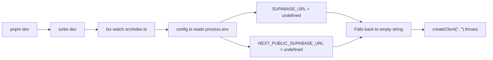

# Fix farm-monitor Supabase "supabaseUrl is required" Error

## Root Cause Analysis

The error chain is:



Three factors combine to cause this:

1. **Turbo does not load `.env` files** into task runtimes. From the Turbo docs: "Turborepo does not load .env files into your task's runtime, leaving them to be handled by your framework, or tools like dotenv." ([turbo.json](turbo.json) has no `globalPassThroughEnv` or `env` configured.)
2. **Farm-monitor has no dotenv loading.** Unlike Next.js apps (which auto-load `.env`), the farm-monitor package is a plain `tsx` script with zero `dotenv` usage. It reads `process.env` directly in [config.ts](packages/farm-monitor/src/config.ts), but nothing populates those values.
3. **Variable name mismatch.** The root [.env](.env) defines `NEXT_PUBLIC_SUPABASE_URL` but not `SUPABASE_URL`. The config reads `SUPABASE_URL` first, then falls back to `NEXT_PUBLIC_SUPABASE_URL` -- but since neither is loaded, both are `undefined`, and the fallback is `''`.

Additionally, the terminal log shows a **second class of errors**: SSH private key failures (`Cannot parse privateKey: Encrypted private OpenSSH key detected, but no passphrase given`), which is a separate issue from the Supabase one.

## Hypothesized Fixes (Ranked by Robustness)

### Fix A: Add dotenv loading to farm-monitor's entry point (Recommended)

Add `dotenv` to load the root `.env` at the top of [packages/farm-monitor/src/index.ts](packages/farm-monitor/src/index.ts):

```typescript
import { config as dotenvConfig } from 'dotenv'
import { resolve } from 'path'
dotenvConfig({ path: resolve(__dirname, '../../../.env') })
```

This is the most self-contained fix. The farm-monitor will always load its own env regardless of how it's invoked.

- **Pros:** Works in dev, Docker, and standalone. No changes needed elsewhere.
- **Cons:** Adds a `dotenv` dependency. Uses a relative path that assumes monorepo layout.

### Fix B: Use `dotenv-cli` in the dev script

Change the dev script in [packages/farm-monitor/package.json](packages/farm-monitor/package.json):

```json
"dev": "dotenv -e ../../.env -- tsx watch src/index.ts"
```

This is the same pattern already used by `packages/db` for its `db:setup-pgsodium` script.

- **Pros:** No code changes. Follows existing repo conventions.
- **Cons:** Only fixes the `dev` script; the `start` script would also need updating. Docker deployments pass env vars directly so it doesn't matter there.

### Fix C: Add `globalPassThroughEnv` to turbo.json

Add env passthrough in [turbo.json](turbo.json) so Turbo allows these variables through to all tasks:

```json
"globalPassThroughEnv": [
  "NEXT_PUBLIC_SUPABASE_URL",
  "SUPABASE_URL",
  "SUPABASE_SERVICE_ROLE_KEY",
  "REDIS_HOST", "REDIS_PORT", "REDIS_PASSWORD"
]
```

- **Pros:** Centralized config; benefits all packages.
- **Cons:** Still requires something to actually load `.env` into the shell first (Turbo passes through shell env, not `.env` files). Only works if you `source .env` or use a wrapper script. Fragile if new env vars are added.

### Fix D: Guard the Supabase client creation (Defensive improvement)

Regardless of which fix above is chosen, [build-tracker.ts](packages/farm-monitor/src/collectors/build-tracker.ts) line 32 should guard against empty URLs:

```typescript
private getClient(): SupabaseClient {
  if (!this.config.supabase.url) {
    throw new Error('SUPABASE_URL is not configured. Check .env or environment variables.')
  }
  if (!this.supabase) {
    this.supabase = createClient(this.config.supabase.url, this.config.supabase.serviceRoleKey)
  }
  return this.supabase
}
```

This provides a clear diagnostic message instead of letting the Supabase SDK throw a generic error.

## Recommended Approach

Combine **Fix A** (or B) + **Fix D**:

- Fix A/B solves the root cause (env vars not loaded)
- Fix D adds defensive error messaging for future misconfiguration
