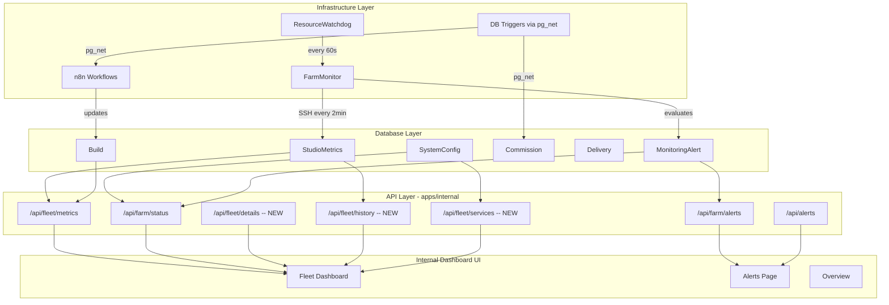

# Frontend Dashboard Improvements

## Current State

The infrastructure (farm-monitor, n8n, Supabase triggers, resource-watchdog) collects rich data, but the frontend only surfaces a fraction of it. The internal dashboard has skeleton components but several critical data paths are broken or incomplete.

## Architecture: Infrastructure-to-Frontend Data Flow

## Identified Gaps (Infrastructure outputs vs. Frontend consumption)

### Gap 1: Collected but not exposed to frontend

- **Container count, worker status, restart count** -- farm-monitor's `ResourceCollector` returns `containerCount`, `n8nWorkerRunning`, `workerRestartCount` ([packages/farm-monitor/src/collectors/resource.ts](packages/farm-monitor/src/collectors/resource.ts)) but these fields don't exist in `StudioMetrics` schema or the `/api/fleet/metrics` response
- **API health status** -- `ApiHealthCollector` checks Kimi/Supabase/GitHub latency, but no API route exposes this to the dashboard
- **Security events** -- `SecurityScanner` detects SSH failures, outbound anomalies, credential expiry, but only routes to alerts (no dedicated security view)

### Gap 2: Schema exists but no data flows

- **networkIn/networkOut** -- `StudioMetrics` has these fields but no collector populates them
- **Queue depth chart** -- `QueueDepthChart` receives `data={[]}` hardcoded empty array in [fleet-dashboard.tsx](apps/internal/src/components/fleet/fleet-dashboard.tsx) line 72, despite the API returning `queueHistory`

### Gap 3: Missing from both schema and UI

- **Hardware specs per studio** -- no table stores M4 Max/48GB, M2 Ultra/64GB; studio roles (control-plane vs worker) aren't visible
- **Docker service roster** -- which services (n8n-main, Redis, Postgres, etc.) run on which studio
- **Online/offline detection** -- `StudioCard` hardcodes "Online" status; no heartbeat or staleness check
- **Historical metric trends** -- only latest reading shown, no sparklines or time-series
- **Build log viewer** -- `Build.errorLogs` exists but no UI to inspect logs

### Gap 4: Client-facing dashboard

- **No real-time project updates** -- dashboard is fully server-rendered
- **No build progress visibility** -- clients cannot see build stage/progress
- **No delivery tracking page** -- `Delivery` table exists but no client route

---

## Plan

### Phase 1: Fix broken data paths and extend the schema

**1a. Extend `StudioMetrics` with operational fields**

In [packages/db/prisma/schema.prisma](packages/db/prisma/schema.prisma), add to `StudioMetrics`:

- `containerCount Int @default(0)`
- `workerRunning Boolean @default(false)`
- `workerRestartCount Int @default(0)`

Create a migration and update the farm-monitor `ResourceCollector` to persist these fields alongside the existing metrics via Supabase insert.

**1b. Add `ApiHealthSnapshot` model**

New Prisma model to store periodic API health readings:

- `id`, `provider` (kimi/supabase/github), `status` (healthy/degraded/down), `latencyMs`, `details` (Json), `createdAt`

Update `ApiHealthCollector` to write snapshots to this table.

**1c. Add static fleet config**

Create a `FLEET_CONFIG` constant in [packages/shared/src/constants.ts](packages/shared/src/constants.ts) with per-studio hardware specs:

- studio-1: M4 Max, 48GB RAM, Control Plane, services list
- studio-2: M2 Ultra, 64GB RAM, Worker, concurrency 25
- studio-3: M2 Ultra, 64GB RAM, Worker, concurrency 25

This avoids needing a DB table for static hardware specs.

### Phase 2: New and enhanced internal API routes

**2a. `GET /api/fleet/details`** (new)

Returns per-studio:

- Static hardware specs (from `FLEET_CONFIG`)
- Latest `StudioMetrics` including new operational fields
- Online/offline status (derived from `StudioMetrics.createdAt` staleness > 5 min = offline)
- Running services (from `FLEET_CONFIG` + worker health from metrics)

**2b. `GET /api/fleet/history`** (new)

Returns time-series metrics for sparklines:

- Query `StudioMetrics` for last N hours (configurable via `?hours=6`)
- Return arrays of `{timestamp, cpu, ram, disk, queueDepth}` per studio
- Used for trend visualization

**2c. `GET /api/fleet/services`** (new)

Returns API health status:

- Latest `ApiHealthSnapshot` per provider
- Aggregated service health (all healthy / some degraded / critical)

**2d. Fix existing `/api/fleet/metrics`**

- Include `containerCount`, `workerRunning`, `workerRestartCount` in response
- Fix the `queueHistory` data that is already returned but not passed to `QueueDepthChart`

### Phase 3: Internal dashboard -- Fleet page overhaul

Enhance [apps/internal/src/app/fleet/page.tsx](apps/internal/src/app/fleet/page.tsx) and its components:

**3a. Enhanced `StudioCard`**

- Add hardware spec display (chip, RAM, role) from `FLEET_CONFIG`
- Dynamic online/offline badge based on metric staleness
- Container count and worker status indicators
- Worker restart count with warning threshold
- Sparkline trend lines for CPU/RAM/disk (from `/api/fleet/history`)

**3b. Fix `QueueDepthChart`**

- Pass `queueHistory` from `useFleetMetrics` hook response into the chart (currently hardcoded to `[]`)
- The API already returns this data; just needs to be wired through

**3c. New `ServiceHealthBar` component**

- Horizontal bar showing API provider health (Kimi, Supabase, GitHub)
- Green/amber/red indicators with latency numbers
- Active provider indicator (from `SystemConfig.active_ai_provider`)
- GitHub pause status

**3d. New `FleetOverviewHeader` component**

- Aggregate stats: total CPU/RAM across fleet, total queue depth, active builds
- Alert summary badges (P0 count, P1 count)
- Last metric refresh timestamp

**3e. New `BuildLogDrawer` component**

- Slide-out panel to view `Build.errorLogs` for any build
- Accessible from active build items in `StudioCard`

### Phase 4: Internal dashboard -- Alerts page improvements

Enhance [apps/internal/src/app/alerts/page.tsx](apps/internal/src/app/alerts/page.tsx):

- Filterable by priority (P0/P1/P2) and category (RESOURCE/API/BUILD/SECURITY/BACKUP)
- Resolve action button (calls existing `PATCH /api/farm/alerts`)
- Alert detail expansion with `details` JSON display
- Security events section showing recent SSH failures and anomalies
- Credential expiry warnings

### Phase 5: Client-facing dashboard improvements

**5a. Real-time project status** in [apps/web/src/app/dashboard/page.tsx](apps/web/src/app/dashboard/page.tsx):

- Add Supabase Realtime subscription for `Project` table changes (reuse the pattern from internal's `RealtimeProvider`)
- Client-side wrapper that refreshes project list on updates

**5b. New `/project/[id]/status` route** (client-facing build progress):

- Visual pipeline showing stages: Spec -> Contracted -> Building -> Testing -> Delivered
- Current stage highlighted with progress indicator
- Estimated delivery time (from existing `/api/predictions/[id]` logic, adapted)
- Minimalist design: thin progress bar, monochrome stages, subtle animations

**5c. New `/project/[id]/delivery` route** (delivery tracking):

- Delivery status (pending/transferring/complete)
- Verification results (secret scan, BMAD checks, contract check)
- Repository link, deployment URL
- Hosting transfer status if applicable

### Design Language

All new components adhere to the established minimalist system:

- **Colors**: White background (`#FFFFFF`), black foreground (`#000`), grays (`#f5f5f4`, `#737373`, `#e5e5e5`) -- from [globals.css](apps/web/src/app/globals.css)
- **Typography**: System font stack, `text-sm`/`text-xs` for data, `font-semibold` for headings
- **Spacing**: `gap-4`, `p-5`, `mb-6` rhythm from existing components
- **Cards**: `border border-gray-200 rounded-lg bg-white p-5` (from `StudioCard`)
- **Status indicators**: Small colored dots/pills (`bg-green-50 text-green-700 border-green-200`)
- **Charts**: recharts with minimal chrome, gray backgrounds (`#f3f4f6`), semantic colors only for thresholds (green < 70, amber 70-90, red > 90)
- **No decorative elements**: Data-dense, clean whitespace, no shadows or gradients
