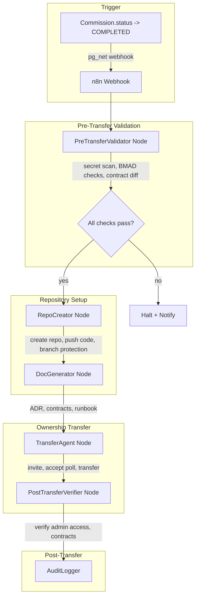
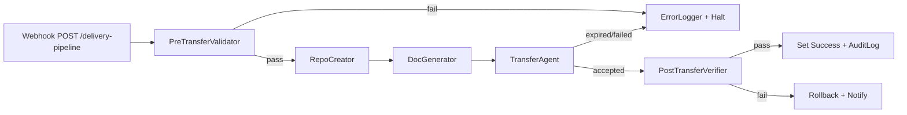

# GitHub Automation Delivery Pipeline

## Current State

The codebase has **planning-only stubs** that need to become real automation:

- [packages/ai/src/verification/ip-transfer.ts](packages/ai/src/verification/ip-transfer.ts) -- returns static transfer plans, no GitHub API calls
- [apps/web/src/app/api/pipeline/seed/route.ts](apps/web/src/app/api/pipeline/seed/route.ts) -- has `// TODO: GitHub API integration` on line 43
- [apps/web/src/app/api/delivery/transfer/route.ts](apps/web/src/app/api/delivery/transfer/route.ts) -- calls `planTransfer()` which is mock-only
- [packages/ai/src/verification/checklist.ts](packages/ai/src/verification/checklist.ts) -- simulated verification (returns hardcoded "passed")
- Existing DB trigger `notify_n8n_commission_completed` in [migration.sql](packages/db/prisma/migrations/20260228000003_triggers/migration.sql) fires webhook when Commission becomes COMPLETED -- this is the "build_success" event trigger

**Reusable pieces already built:**

- Secret scanner: [packages/ai/src/code-review/secret-scanner.ts](packages/ai/src/code-review/secret-scanner.ts) (real regex-based scanning)
- GitHub PR creation pattern: [packages/ai/src/repo-surgery/review-generator.ts](packages/ai/src/repo-surgery/review-generator.ts) (raw `fetch` to GitHub API)
- Template file generator: [packages/templates/src/file-generator.ts](packages/templates/src/file-generator.ts) (README, CI, .env.example)
- n8n node pattern: [packages/n8n-nodes/nodes/DevOpsAgent/DevOpsAgent.node.ts](packages/n8n-nodes/nodes/DevOpsAgent/DevOpsAgent.node.ts) (HTTP call to microservice)
- Existing `Credential` model stores encrypted tokens per commission/service
- Existing `Build` model tracks `githubUrl`, `vercelUrl`, `status`

---

## Architecture




---

## 1. Prisma Schema: Delivery Model

**File:** [packages/db/prisma/schema.prisma](packages/db/prisma/schema.prisma)

Add `Delivery` model and `DeliveryStatus` enum after the existing `RepoSurgery` model:

```prisma
enum DeliveryStatus {
  VALIDATING
  CREATING_REPO
  GENERATING_DOCS
  TRANSFERRING
  AWAITING_ACCEPTANCE
  VERIFYING
  COMPLETED
  FAILED
  ROLLBACK
}

model Delivery {
  id                  String         @id @default(cuid())
  commissionId        String
  buildId             String
  repoName            String
  githubOrg           String
  clientGithubUsername String?
  clientGithubOrg     String?
  status              DeliveryStatus @default(VALIDATING)
  repoUrl             String?
  transferredRepoUrl  String?
  inviteId            Int?
  inviteRetryCount    Int            @default(0)
  secretScanPassed    Boolean        @default(false)
  bmadChecksPassed    Boolean        @default(false)
  contractCheckPassed Boolean        @default(false)
  deliverables        Json?
  auditLog            Json           @default("[]")
  errorMessage        String?
  createdAt           DateTime       @default(now())
  updatedAt           DateTime       @updatedAt

  commission Commission @relation(fields: [commissionId], references: [id])
  build      Build      @relation(fields: [buildId], references: [id])
}
```

Add `deliveries Delivery[]` to both `Commission` and `Build` models. Run `prisma migrate dev`.

---

## 2. Core Library: GitHub Automation Client

**File:** `packages/ai/src/delivery/github-client.ts`

A class wrapping the GitHub REST API (raw `fetch`, same pattern as `review-generator.ts`):

- `createRepo(org, name, options)` -- `POST /orgs/{org}/repos` with description, private, auto_init, license_template, gitignore_template
- `pushTreeCommit(owner, repo, files, message)` -- Uses Git Trees API (create tree -> create commit -> update ref) to push all build output + BMAD docs in one commit
- `setupBranchProtection(owner, repo, branch)` -- `PUT /repos/{owner}/{repo}/branches/{branch}/protection` with required reviews, no force pushes
- `createBranch(owner, repo, branchName, fromRef)` -- Create `development` branch from main
- `inviteCollaborator(owner, repo, username, permission)` -- `PUT /repos/{owner}/{repo}/collaborators/{username}` with admin permission
- `checkInviteStatus(owner, repo, invitationId)` -- `GET /repos/{owner}/{repo}/invitations` to check if accepted
- `transferRepo(owner, repo, newOwner)` -- `POST /repos/{owner}/{repo}/transfer` with `new_owner`
- `verifyAdminAccess(owner, repo, username)` -- `GET /repos/{owner}/{repo}/collaborators/{username}/permission`
- `createFromTemplate(templateOwner, templateRepo, newOwner, newName)` -- `POST /repos/{templateOwner}/{templateRepo}/generate`
- `createTag(owner, repo, tag, sha)` -- Create `v1.0.0` tag on final commit

All methods return typed results and throw on non-2xx responses with descriptive errors.

---

## 3. Pre-Transfer Validator

**File:** `packages/ai/src/delivery/pre-transfer-validator.ts`

Orchestrates three validation gates before any GitHub operations:

- **Secret scan gate**: Calls existing `scanForSecrets()` from `packages/ai/src/code-review/secret-scanner.ts` against all files in the build workspace. Fails on any `critical` or `high` match.
- **BMAD acceptance gate**: Verifies PRD acceptance criteria are met by checking Build status, all GSD tasks resolved (query from `Build.executionIds`), and commission status is COMPLETED.
- **Contract diff gate**: Compares extracted `api_contracts.json` against actual implemented routes to detect drift. Leverages the existing contract-checker pattern from [packages/contract-checker/src/index.ts](packages/contract-checker/src/index.ts).
- **.env file gate**: Scans file list for `.env`, `.env.local`, `.env.production` -- any present = hard fail.

Returns: `{ secretScanPassed, bmadChecksPassed, contractCheckPassed, envScanPassed, blockers: string[] }`

---

## 4. BMAD Documentation Generator

**File:** `packages/ai/src/delivery/doc-generator.ts`

Generates the four BMAD handoff documents from build artifacts:

- `**architecture_decision_record.md`**: Uses PRD's `archTemplate`, stack choices, and build metadata. LLM-assisted (via existing `generateObject` pattern) to produce structured ADR with context/decision/consequences sections.
- `**api_contracts.json`**: Machine-readable interface definitions extracted from the built codebase (API routes, request/response types). Reuses contract extraction logic from repo-surgery's `ContractExtractor`.
- `**data_boundary_documentation.md**`: Maps what data resides where (client DB, third-party APIs, cookies, localStorage). Derived from PRD's `dataBoundaries` field.
- `**operational_runbook.md**`: How to deploy, monitor, troubleshoot, rotate secrets, scale. Generated from the DevOps agent output (Vercel config, env requirements).
- `**hosting_contract.json**`: SLA terms, backup policy, monitoring access, scaling limits from PRD constraints.

---

## 5. Transfer Agent

**File:** `packages/ai/src/delivery/transfer-agent.ts`

Replaces the planning-only `ip-transfer.ts` with real execution:

- `executeTransfer(config)` method that:
  1. Calls `GitHubClient.createRepo()` under agency org (`mismo-agency/{repoName}`)
  2. Calls `GitHubClient.pushTreeCommit()` with build output + BMAD docs
  3. Calls `GitHubClient.setupBranchProtection('main')` + `createBranch('development')`
  4. Creates `v1.0.0` tag
  5. Calls `GitHubClient.inviteCollaborator()` -- admin access
  6. Polls `checkInviteStatus()` every 4 hours for 24 hours (GSD retry logic: max 3 retries with regenerated invitations)
  7. On acceptance: calls `transferRepo()` to client's account
  8. Calls `verifyAdminAccess()` to confirm transfer succeeded
  9. If transfer expires after 3 retries: marks delivery as FAILED with rollback info
- Each step logged to `Delivery.auditLog` (JSON array of timestamped events)
- Template repo support: if Commission has `archetypeId`, use `createFromTemplate()` instead of fresh create

---

## 6. Post-Transfer Verifier

**File:** `packages/ai/src/delivery/post-transfer-verifier.ts`

Automated verification after ownership transfer:

- Confirms client has admin permission via GitHub API
- Verifies repo is accessible at new URL
- Validates that environment variable contract matches (list of required vars documented in `hosting_contract.json` vs what exists in repo's `.env.example`)
- Optionally: if the build includes a deployed URL, runs a health check against it
- Returns pass/fail with rollback plan if critical checks fail (transfer back to agency, debug, re-transfer)

---

## 7. Five New n8n Nodes

Same pattern as [DevOpsAgent.node.ts](packages/n8n-nodes/nodes/DevOpsAgent/DevOpsAgent.node.ts): each node calls an internal API microservice endpoint.


| Node                 | n8n Name               | Input                                             | Output                             |
| -------------------- | ---------------------- | ------------------------------------------------- | ---------------------------------- |
| PreTransferValidator | `preTransferValidator` | buildId, commissionId, workspaceDir               | validationResult (gates, blockers) |
| RepoCreator          | `repoCreator`          | buildId, repoName, org, workspaceDir, templateId? | repoUrl, repoOwner                 |
| DocGenerator         | `docGenerator`         | buildId, commissionId, prdJson                    | documentPaths, deliverables        |
| TransferAgent        | `transferAgent`        | deliveryId, clientGithubUsername, repoUrl         | transferStatus, transferredUrl     |
| PostTransferVerifier | `postTransferVerifier` | deliveryId, transferredUrl, clientUsername        | verificationResult                 |


Register all 5 in [packages/n8n-nodes/package.json](packages/n8n-nodes/package.json) under `n8n.nodes`.

---

## 8. n8n Delivery Workflow

**File:** `packages/n8n-nodes/workflows/delivery-pipeline.json`




Triggered by `notify_n8n_commission_completed` DB trigger (already exists in migration). Each node wrapped with `GsdRetryWrapper`. `ErrorLogger` node on all failures.

---

## 9. Internal API Routes

New routes in `apps/internal/src/app/api/delivery/`:

- **POST `/api/delivery/validate`** -- Run pre-transfer validation
- **POST `/api/delivery/create-repo`** -- Create repo + push code
- **POST `/api/delivery/generate-docs`** -- Generate BMAD documentation
- **POST `/api/delivery/transfer`** -- Execute transfer protocol
- **POST `/api/delivery/verify`** -- Run post-transfer verification
- **POST `/api/delivery/pipeline`** -- Run full end-to-end pipeline

Each route follows the existing pattern from [apps/internal/src/app/api/n8n/pipeline/route.ts](apps/internal/src/app/api/n8n/pipeline/route.ts).

---

## 10. Update Existing Files

- **[packages/ai/src/verification/ip-transfer.ts](packages/ai/src/verification/ip-transfer.ts)**: Refactor to import and delegate to the new `TransferAgent` for real execution while keeping `planTransfer()` as a dry-run option
- **[apps/web/src/app/api/pipeline/seed/route.ts](apps/web/src/app/api/pipeline/seed/route.ts)**: Replace TODO with real `GitHubClient.createRepo()` + `pushTreeCommit()` calls
- **[apps/web/src/app/api/delivery/transfer/route.ts](apps/web/src/app/api/delivery/transfer/route.ts)**: Add `execute: boolean` parameter; when true, calls real transfer instead of plan
- **[packages/ai/src/verification/index.ts](packages/ai/src/verification/index.ts)**: Re-export new delivery modules
- **[.env.example](.env.example)**: Add `GITHUB_DELIVERY_ORG=mismo-agency`
- **[packages/n8n-nodes/package.json](packages/n8n-nodes/package.json)**: Register 5 new node paths

---

## 11. Supabase Audit Logging

All delivery steps logged to the `Delivery.auditLog` JSON column with structure:

```typescript
interface AuditEntry {
  timestamp: string
  step: string
  status: 'started' | 'completed' | 'failed' | 'retrying'
  details: string
  durationMs?: number
}
```

The existing Supabase Realtime setup (from the RLS migration) means the web app can subscribe to delivery status changes in real-time.

---

## Key Design Decisions

- **No Octokit dependency**: Follow the existing pattern in `review-generator.ts` using raw `fetch` to the GitHub API. Keeps the dependency footprint small.
- **Polling for invite acceptance**: n8n's cron/schedule capabilities handle the 4-hour polling intervals for the 24-hour acceptance window. Three retry cycles with fresh invitations.
- **Template repos**: When `Commission.archetypeId` maps to a known archetype, use GitHub's template repository feature instead of pushing from scratch.
- **Rollback**: On any post-transfer failure, the pipeline can transfer the repo back to the agency org using the same `transferRepo()` call in reverse.

