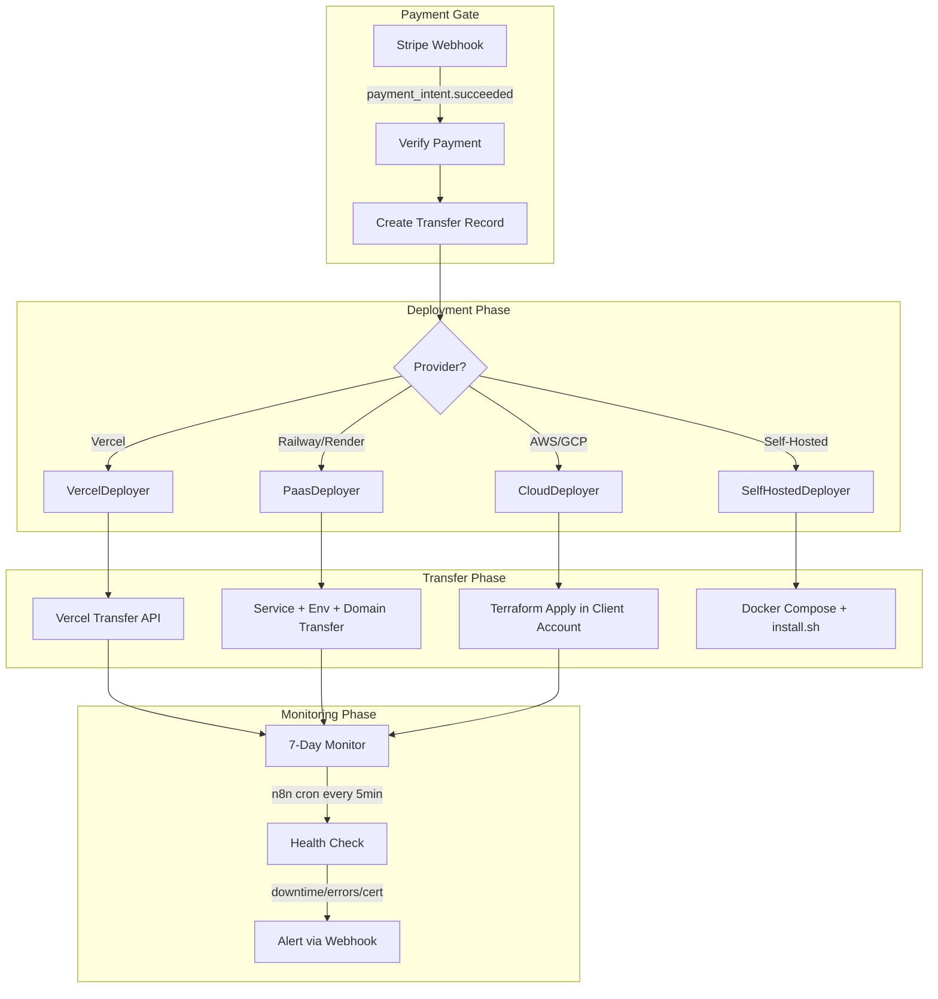
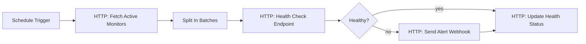

# Hosting Deployment and Ownership Transfer Pipeline

## Architecture

Core logic in `packages/ai/src/hosting-transfer/`, API routes in `apps/web/src/app/api/delivery/`, Prisma model for transfer state in `packages/db/`, Stripe webhook integration for payment gating, and a scheduled n8n workflow for post-transfer monitoring.




---

## 1. Prisma Schema: HostingTransfer Model

**File:** [packages/db/prisma/schema.prisma](packages/db/prisma/schema.prisma)

Add new enum and model:

```prisma
enum TransferStatus {
  PENDING_PAYMENT
  PAYMENT_CONFIRMED
  DEPLOYING
  DEPLOYED
  TRANSFERRING
  COMPLETED
  FAILED
  MONITORING
}

enum HostingProvider {
  VERCEL
  RAILWAY
  RENDER
  AWS
  GCP
  SELF_HOSTED
}

model HostingTransfer {
  id                String          @id @default(cuid())
  commissionId      String
  buildId           String?
  provider          HostingProvider
  status            TransferStatus  @default(PENDING_PAYMENT)
  
  // Payment gating
  stripePaymentIntentId  String?   @unique
  paymentConfirmedAt     DateTime?
  
  // Deployment details
  deploymentUrl     String?
  deploymentConfig  Json?           // Provider-specific config (vercel.json, terraform vars, etc.)
  deploymentOutput  Json?           // URLs, resource IDs, etc.
  
  // Transfer details
  clientAccountId   String?         // Vercel account ID, AWS account ID, etc.
  clientCredentials Json?           // Encrypted reference to Credential records
  transferOutput    Json?           // Transfer result details
  
  // Monitoring
  monitoringEnabled Boolean         @default(false)
  monitoringUntil   DateTime?       // 7 days after transfer
  lastHealthCheck   DateTime?
  healthStatus      Json?           // { uptime, errorRate, certExpiry }
  
  // Error tracking
  errorLogs         Json?
  failureCount      Int             @default(0)
  retryCount        Int             @default(0)
  
  // Idempotency
  idempotencyKey    String?         @unique
  
  createdAt         DateTime        @default(now())
  updatedAt         DateTime        @updatedAt
  
  commission        Commission      @relation(fields: [commissionId], references: [id])
  build             Build?          @relation(fields: [buildId], references: [id])
}
```

Add `hostingTransfers HostingTransfer[]` to `Commission` model. Add `hostingTransfer HostingTransfer?` to `Build` model. Run `npx prisma migrate dev`.

---

## 2. Core Logic: Zod Schemas and Types

**File:** `packages/ai/src/hosting-transfer/schema.ts`

Define Zod schemas for:

- `TransferRequest` -- commissionId, buildId, provider, clientAccountId, clientCredentials, idempotencyKey
- `VercelTransferConfig` -- vercelAccountId, vercelTeamId?, projectName, framework, buildCommand, outputDir, envVars
- `PaasTransferConfig` -- provider (railway/render), serviceConfig, envVars (encrypted references), customDomains
- `CloudTransferConfig` -- provider (aws/gcp), region, terraformVars, clientAwsAccessKey/clientGcpServiceAccount, resources (s3, cloudfront, rds, ec2/cloud-run)
- `SelfHostedConfig` -- serverIp?, domain, email (for Let's Encrypt), backupSchedule
- `HealthCheckResult` -- url, status, responseTime, errorRate, certExpiry, checkedAt
- `MonitorAlert` -- transferId, alertType (downtime/error_rate/cert_expiry), details, severity

---

## 3. Provider Deployers

### 3a. Vercel Deployer

**File:** `packages/ai/src/hosting-transfer/providers/vercel.ts`

- `VercelDeployer` class:
  - `deploy(config)` -- Uses Vercel REST API (`POST /v13/deployments`) to deploy build output to Mismo's Vercel account
  - `transfer(projectId, targetAccountId)` -- `POST /v9/projects/{id}/transfer` with target account
  - `exportConfig(projectId)` -- Fallback: exports `vercel.json` + env template for manual import if transfer API fails
  - Uses `VERCEL_API_TOKEN` env var (Mismo's account token)
  - Creates project via `POST /v10/projects` with framework detection

### 3b. PaaS Deployer (Railway / Render)

**File:** `packages/ai/src/hosting-transfer/providers/paas.ts`

- `PaasDeployer` class:
  - `deployRailway(config)` -- Railway API: create project, service, link GitHub repo, set env vars, add custom domain
  - `deployRender(config)` -- Render API: create service from blueprint, set env vars, add custom domain
  - `transferRailway(projectId, targetTeamId)` -- Railway API project transfer
  - `transferRender(serviceId, targetOwnerId)` -- Render API ownership transfer
  - Both include: service config, encrypted env vars, custom domain migration
  - Encrypted env vars: reads from `Credential` model, decrypts via pgsodium, re-encrypts for target

### 3c. Cloud Deployer (AWS / GCP)

**File:** `packages/ai/src/hosting-transfer/providers/cloud.ts`

- `CloudDeployer` class:
  - `deployAws(config)` -- Executes Terraform (generated during build phase or generated here):
    - Resources: S3 bucket, CloudFront distribution, RDS instance, EC2/ECS
    - Uses client's AWS credentials (from `Credential` model) via `AWS_ACCESS_KEY_ID`/`AWS_SECRET_ACCESS_KEY` env injection
    - `terraform init && terraform plan && terraform apply -auto-approve`
  - `deployGcp(config)` -- Same pattern with GCP provider:
    - Resources: Cloud Storage, Cloud CDN, Cloud SQL, Cloud Run
    - Uses client's GCP service account JSON
  - `generateTerraform(provider, resources)` -- Generates `.tf` files if not already present from build phase
  - Post-deployment: if Mismo created a sub-account, packages root credentials for secure handoff

### 3d. Self-Hosted Deployer

**File:** `packages/ai/src/hosting-transfer/providers/self-hosted.ts`

- `SelfHostedDeployer` class:
  - `generateDockerCompose(config)` -- Produces `docker-compose.yml` with:
    - App service (from build output Dockerfile)
    - Traefik reverse proxy (with automatic HTTPS via Let's Encrypt)
    - PostgreSQL (if needed)
    - Redis (if needed)
    - Backup service (restic to S3-compatible storage)
  - `generateInstallScript(config)` -- Produces `install.sh`:
    - Checks prerequisites (Docker, Docker Compose, curl)
    - Sets up directory structure
    - Pulls images
    - Generates `.env` from template
    - Starts services
    - Configures Traefik SSL
    - Sets up cron for automated backups
  - `generateTraefikConfig(domain, email)` -- Traefik static + dynamic config with Let's Encrypt ACME
  - `generateBackupConfig(schedule)` -- Restic backup script + cron entry
  - Returns all files as artifacts (no remote execution)

---

## 4. Transfer Orchestrator

**File:** `packages/ai/src/hosting-transfer/orchestrator.ts`

- `HostingTransferOrchestrator` class:
  - `initiate(request: TransferRequest)` -- Creates `HostingTransfer` record with `PENDING_PAYMENT` status, returns transfer ID
  - `onPaymentConfirmed(paymentIntentId: string)` -- Idempotent handler: finds transfer by `stripePaymentIntentId`, updates to `PAYMENT_CONFIRMED`, starts deployment
  - `deploy(transferId)` -- Routes to correct provider deployer, updates status through `DEPLOYING` -> `DEPLOYED`
  - `transfer(transferId)` -- Executes ownership transfer for the provider, updates to `TRANSFERRING` -> `COMPLETED` or `MONITORING`
  - `enableMonitoring(transferId)` -- Sets `monitoringEnabled: true`, `monitoringUntil: now + 7 days`
  - `checkHealth(transferId)` -- Runs health check, updates `healthStatus`, triggers alerts if needed
  - Error handling: updates `errorLogs`, increments `failureCount`, sets `FAILED` after 3 retries

---

## 5. Stripe Payment Gating

**File:** Modify [apps/web/src/app/api/billing/webhook/route.ts](apps/web/src/app/api/billing/webhook/route.ts)

Extend the existing webhook handler to handle `payment_intent.succeeded`:

```typescript
case 'payment_intent.succeeded': {
  const paymentIntent = event.data.object
  const { transferId } = paymentIntent.metadata ?? {}
  if (transferId) {
    const orchestrator = new HostingTransferOrchestrator()
    await orchestrator.onPaymentConfirmed(paymentIntent.id)
  }
  break
}
```

Key requirements:

- Idempotency: `onPaymentConfirmed` checks if already processed via `stripePaymentIntentId` unique constraint
- The `payment_intent.succeeded` event metadata must include `transferId` (set when creating the PaymentIntent during the checkout flow)
- Store transfer state transitions in `HostingTransfer` for audit trail

---

## 6. API Routes

**Directory:** `apps/web/src/app/api/delivery/`

### 6a. POST /api/delivery/deploy

**File:** `apps/web/src/app/api/delivery/deploy/route.ts`

- Validates request body (Zod)
- Creates `HostingTransfer` record
- If payment already confirmed (e.g., prepaid), starts deployment immediately
- Returns `{ transferId, status, paymentRequired: boolean }`

### 6b. GET /api/delivery/deploy/[id]/status

**File:** `apps/web/src/app/api/delivery/deploy/[id]/status/route.ts`

- Returns current transfer status, deployment URL, health status
- Used for polling from the frontend

### 6c. POST /api/delivery/deploy/[id]/retry

**File:** `apps/web/src/app/api/delivery/deploy/[id]/retry/route.ts`

- Retries a failed deployment/transfer
- Only allowed if status is `FAILED` and `retryCount < 3`

---

## 7. Post-Transfer Monitoring (n8n Cron Workflow)

**File:** `packages/n8n-nodes/workflows/hosting-monitor.json`

n8n scheduled workflow that runs every 5 minutes:




Nodes:

1. **Schedule Trigger** -- every 5 minutes
2. **HTTP Request** -- `GET /api/delivery/monitors/active` (returns all transfers with `monitoringEnabled: true` and `monitoringUntil > now`)
3. **Split In Batches** -- process each monitor
4. **HTTP Request** -- `GET {deploymentUrl}/health` or TCP check
5. **IF Node** -- Check: downtime > 5min, error rate > 1%, cert expiry < 7 days
6. **HTTP Request** -- POST alert to Slack webhook / email

### Supporting API routes:

- `GET /api/delivery/monitors/active` -- Returns active monitors for the n8n workflow
- `POST /api/delivery/monitors/[id]/check` -- Runs a single health check, stores result
- `POST /api/delivery/monitors/[id]/alert` -- Sends alert (Slack, email)

Health check logic:

- **Uptime**: HTTP GET to deployment URL, track response time and status code
- **Error rate**: If the deployment exposes `/health` or similar, parse error metrics
- **Certificate expiry**: TLS handshake to check certificate `notAfter` date
- Auto-disable monitoring after `monitoringUntil` date passes

---

## 8. Environment Variables

Add to [.env.example](.env.example):

```
# Hosting Transfer
VERCEL_API_TOKEN=
VERCEL_TEAM_ID=
RAILWAY_API_TOKEN=
RENDER_API_KEY=
AWS_ACCESS_KEY_ID=        # Mismo's AWS account (for sub-account creation)
AWS_SECRET_ACCESS_KEY=
GCP_SERVICE_ACCOUNT_JSON=
TERRAFORM_BINARY_PATH=/usr/local/bin/terraform
SLACK_ALERT_WEBHOOK_URL=  # Already referenced in n8n-alert webhook
```

---

## 9. Exports and Integration

**File:** Modify [packages/ai/src/index.ts](packages/ai/src/index.ts)

Add `export * from './hosting-transfer'` to expose:

- `HostingTransferOrchestrator`
- All provider deployers
- Schemas and types
- Health check utilities

---

## Key Integration Points

- **Existing `ip-transfer.ts`**: The current `planTransfer()` remains for planning; the new module executes the actual transfer. Orchestrator can call `planTransfer()` to determine which steps apply based on age/tier.
- **Existing `DevOps agent`**: The `vercel.json` generation in `packages/agents/devops` is reused by `VercelDeployer` for project configuration.
- **Existing `Credential` model**: Client credentials (Vercel tokens, AWS keys, GCP service accounts) stored encrypted via pgsodium.
- **Existing Stripe webhook**: Extended (not replaced) with `payment_intent.succeeded` handler.
- **Existing `Build` model**: `HostingTransfer.buildId` references the build whose output is being deployed.
- **Existing error-logger**: Failed transfers can forward errors to the error-logger service for circuit breaker behavior.

---

## Files to Create (13 new)


| File                                                        | Purpose                                |
| ----------------------------------------------------------- | -------------------------------------- |
| `packages/ai/src/hosting-transfer/schema.ts`                | Zod schemas and types                  |
| `packages/ai/src/hosting-transfer/orchestrator.ts`          | Transfer orchestration + state machine |
| `packages/ai/src/hosting-transfer/providers/vercel.ts`      | Vercel deploy + transfer               |
| `packages/ai/src/hosting-transfer/providers/paas.ts`        | Railway/Render deploy + transfer       |
| `packages/ai/src/hosting-transfer/providers/cloud.ts`       | AWS/GCP Terraform deploy               |
| `packages/ai/src/hosting-transfer/providers/self-hosted.ts` | Docker Compose + install.sh generation |
| `packages/ai/src/hosting-transfer/monitoring.ts`            | Health check + alerting logic          |
| `packages/ai/src/hosting-transfer/index.ts`                 | Barrel export                          |
| `apps/web/src/app/api/delivery/deploy/route.ts`             | POST: initiate deployment              |
| `apps/web/src/app/api/delivery/deploy/[id]/status/route.ts` | GET: transfer status                   |
| `apps/web/src/app/api/delivery/deploy/[id]/retry/route.ts`  | POST: retry failed transfer            |
| `apps/web/src/app/api/delivery/monitors/active/route.ts`    | GET: active monitors for n8n           |
| `packages/n8n-nodes/workflows/hosting-monitor.json`         | n8n monitoring cron workflow           |


## Files to Modify (4)


| File                                            | Change                                                                 |
| ----------------------------------------------- | ---------------------------------------------------------------------- |
| `packages/db/prisma/schema.prisma`              | Add `TransferStatus`, `HostingProvider` enums, `HostingTransfer` model |
| `apps/web/src/app/api/billing/webhook/route.ts` | Add `payment_intent.succeeded` handler                                 |
| `packages/ai/src/index.ts`                      | Export hosting-transfer module                                         |
| `.env.example`                                  | Add hosting transfer env vars                                          |


