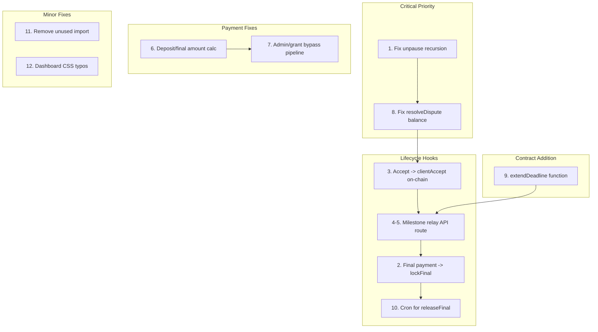

# Hybrid Flow: Functional and Security Patches

After reviewing every file in the Decidendi implementation, I found **12 issues** that prevent the hybrid flow from being fully functional and secure. They range from a critical smart contract bug to missing lifecycle hooks.

---

## 1. CRITICAL: `unpause()` infinite recursion in DecidendiEscrow.sol

In [packages/decidendi/contracts/DecidendiEscrow.sol](packages/decidendi/contracts/DecidendiEscrow.sol), the `unpause()` function calls itself instead of the inherited `_unpause()`:

```solidity
function unpause() external onlyArbiter {
    unpause(); // BUG: infinite recursion, should be _unpause()
}
```

Once the arbiter pauses the contract via `emergencyPause()`, it can **never be unpaused**. This is a bricking bug.

**Fix:** Change `unpause()` to `_unpause()`.

---

## 2. Missing: Final payment does not trigger `lockFinal()` + `releaseFinal()` on-chain

In [apps/web/src/lib/commission-lifecycle.ts](apps/web/src/lib/commission-lifecycle.ts), when `advanceCommissionPaymentState()` transitions `PARTIAL -> FINAL`, it only updates the DB:

```typescript
if (commission.paymentState === 'PARTIAL') {
    await prisma.commission.update({ ... data: { paymentState: 'FINAL' } })
    // Nothing calls relayer.lockFinal() or schedules releaseFinal()
}
```

**Fix:** Add a `lockFinalOnChain(commissionId)` helper that:

- Calls `relayer.lockFinal(commissionId, finalUsdc)` to lock USDC
- Calls `relayer.recordFinalized(commissionId)` on registry
- Schedules `releaseFinal()` after the grace period (via a new `/api/decidendi/release-final` cron endpoint or a delayed job)

---

## 3. Missing: `/api/delivery/accept` does not relay `clientAccept()` on-chain

In [apps/web/src/app/api/delivery/accept/route.ts](apps/web/src/app/api/delivery/accept/route.ts), when the client accepts, the route updates `clientAcceptedAt` in the DB but never calls the Decidendi relayer:

```typescript
if (accepted) {
    await prisma.commission.update({ ... data: { clientAcceptedAt: new Date() } })
    // Missing: relayer.clientAccept(commissionId)
    // Missing: relayer.recordAccepted(commissionId)
}
```

**Fix:** After the DB update, call `createRelayerFromEnv()` and, if non-null, invoke `relayer.clientAccept()` and `relayer.recordAccepted()`.

---

## 4. Missing: Build completion not relayed on-chain

When the n8n build pipeline completes successfully, nothing calls `relayer.completeMilestone(commissionId, Milestone.BUILD_COMPLETE)` or `relayer.recordBuildComplete(commissionId)`.

The relayer methods exist but are not wired into any pipeline callback. The existing n8n trigger `notify_n8n_commission_completed` fires when `Commission.status -> COMPLETED`, but there is no hook for `Build.status -> COMPLETED`.

**Fix:** Create a new helper `onBuildCompleted(commissionId)` in `commission-lifecycle.ts` that:

- Calls `relayer.completeMilestone(commissionId, Milestone.BUILD_COMPLETE)`
- Calls `relayer.recordBuildComplete(commissionId)`
- Expose it via a new internal API route `POST /api/decidendi/milestone` that the n8n pipeline or existing build-completion logic can call.

---

## 5. Missing: Delivery completion not relayed on-chain

Same gap as build: when `Delivery.status -> COMPLETED`, nothing calls `relayer.completeMilestone(commissionId, Milestone.DELIVERED)` or `relayer.recordDelivered(commissionId, deliveryHash)`.

**Fix:** Extend the same `POST /api/decidendi/milestone` route to accept `{ commissionId, milestone: 'BUILD_COMPLETE' | 'DELIVERED', deliveryHash? }` and dispatch to the correct relayer method.

---

## 6. Checkout route charges full price regardless of phase

In [apps/web/src/app/api/billing/checkout/route.ts](apps/web/src/app/api/billing/checkout/route.ts), the amount is always `tierConfig.amount` (the full price):

```typescript
amount: tierConfig.amount, // Always full price
```

When `phase === 'DEPOSIT'`, it should charge 40% of the total. When `phase === 'FINAL'`, it should charge 60%.

**Fix:** Apply the deposit ratio from `DECIDENDI_DEPOSIT_RATIO` env var:

```typescript
const depositRatio = parseFloat(process.env.DECIDENDI_DEPOSIT_RATIO || '0.40')
const amount =
  phase === 'DEPOSIT'
    ? Math.round(tierConfig.amount * depositRatio)
    : phase === 'FINAL'
      ? Math.round(tierConfig.amount * (1 - depositRatio))
      : tierConfig.amount
```

---

## 7. Admin bypass and grant bypass skip build pipeline and Decidendi

In the checkout route, admin bypass and grant bypass both set `paymentState: 'FINAL'` directly and return immediately, bypassing `advanceCommissionPaymentState()`. This means:

- No build pipeline is triggered
- No Decidendi escrow is created

**Fix:** After creating the payment record for admin/grant, call `advanceCommissionPaymentState(commissionId)` instead of directly setting `paymentState: 'FINAL'`. Call it twice (for deposit then final) to simulate the full lifecycle for grants/admin bypasses.

---

## 8. `resolveDispute` balance check is unsafe with multiple concurrent escrows

In `DecidendiEscrow.sol`, `resolveDispute()` uses:

```solidity
uint256 held = usdc.balanceOf(address(this));
uint256 escrowBalance = held < total ? held : total;
```

When multiple commissions are active, `balanceOf` returns the aggregate USDC held for ALL commissions. The `min(held, total)` check still caps refunds, but during high-contention periods a refund for one commission could theoretically drain funds earmarked for another.

**Fix:** Remove the `balanceOf` check entirely and use the tracked per-commission amounts directly:

```solidity
uint256 escrowBalance = c.depositAmount + (finalLocked[commissionId] ? c.finalAmount : 0);
```

The contract already knows exactly how much USDC it holds per commission from `depositAmount` + `finalAmount`.

---

## 9. No `extendDeadline()` function in escrow contract

The plan states "Mismo can extend deadline (requires client wallet signature or relayer consent)" but no such function exists.

**Fix:** Add `extendDeadline(bytes32 commissionId, uint256 newDeadline)` gated by `onlyOperator`, requiring `newDeadline > c.deadlineAt`.

---

## 10. No scheduled trigger for `releaseFinal()` after grace period

After `lockFinal()`, the 3-day grace period must elapse before `releaseFinal()` can be called. Nothing automatically triggers this.

**Fix:** Create a Next.js API cron route `GET /api/cron/decidendi-release` that:

- Queries commissions where `paymentState === 'FINAL'`, `clientAcceptedAt` is set, and `clientAcceptedAt + 3 days < now()`
- For each, calls `relayer.releaseFinal(commissionId)` and `relayer.recordFinalized(commissionId)`
- Can be triggered by Vercel Cron or an external scheduler every hour

---

## 11. Unused import in relayer.ts

`toHex` is imported from viem but never used.

**Fix:** Remove the unused import.

---

## 12. Escrow dashboard CSS typos

In [apps/web/src/components/web3/escrow-dashboard.tsx](apps/web/src/components/web3/escrow-dashboard.tsx):

- Loading skeleton: `div.h-32` should be just `h-32`
- Voided badge: `dark:zinc-300` should be `dark:text-zinc-300`

---

## Implementation Order



Patches 1 and 8 are the most critical (smart contract bugs). Patches 2-5 and 10 complete the on-chain lifecycle. Patch 6-7 fix the traditional payment path. Patch 9 adds the missing deadline extension. Patches 11-12 are cleanup.
