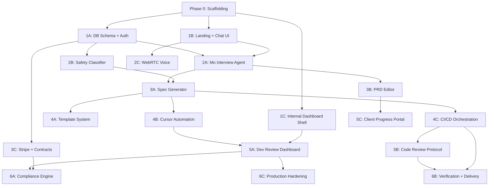

# Mismo Platform Implementation Plan

## Technology Decisions

- **Monorepo**: Turborepo with pnpm workspaces
- **Frontend**: Next.js 15 (App Router) + Tailwind CSS + shadcn/ui
- **Database**: Supabase (Postgres) with Prisma ORM + row-level security
- **Auth**: Supabase Auth (supports age-gated flows, OAuth, magic link)
- **Real-time**: Supabase Realtime (PRD collaboration) + LiveKit (WebRTC voice for Mo)
- **AI**: Vercel AI SDK for streaming LLM responses (supports OpenAI, Anthropic, DeepSeek, etc.)
- **Payments**: Stripe (Checkout, Subscriptions, Identity for KYC)
- **Contracts**: DocuSign eSignature API
- **CI/CD**: GitHub Actions + Vercel
- **Containerized Agents**: Docker + GitHub Actions self-hosted runners (for Cursor CLI execution)
- **Security Scanning**: StackHawk (DAST), Snyk (SCA), Playwright (E2E)
- **Legal**: Iubenda API for TOS generation

## Monorepo Structure

```
mismo/
  apps/
    web/              # Next.js 15 - main client-facing app (Mo, PRD editor, dashboards)
    internal/         # Next.js 15 - internal dev team dashboard
  packages/
    db/               # Prisma schema, migrations, seed data
    ai/               # Mo agent logic, safety classifier, spec generator
    templates/        # Pre-audited architectural templates
    shared/           # Shared types, utils, constants
    ui/               # Shared UI components (shadcn/ui based)
  docker/
    cursor-agent/     # Dockerfile for headless Cursor CLI execution
  docs/
    plans/            # Implementation plans
```

---

## Phase 0: Project Scaffolding (Week 1)

**Goal:** Establish the monorepo, CI, and deploy an empty shell to Vercel.

- Initialize Turborepo with pnpm workspaces
- Scaffold `apps/web` (Next.js 15, Tailwind, shadcn/ui)
- Scaffold `apps/internal` (Next.js 15, same stack)
- Create `packages/db` with Prisma + Supabase connection
- Create `packages/shared` (TypeScript types, constants)
- Create `packages/ui` (shadcn/ui component library)
- Create `packages/ai` (stub)
- Set up ESLint, Prettier, TypeScript strict mode across workspace
- Set up GitHub Actions: lint, type-check, build on PR
- Deploy `apps/web` to Vercel (empty shell)
- Add `.gitignore`, `.env.example`, `README.md`
- **Commit:** `chore: initialize monorepo with turborepo`

---

## Phase 1: Core Data Model + Auth + Landing Page (Weeks 2-3)

Three parallel workstreams:

### Workstream 1A: Database Schema + Auth

Design and implement the core Prisma schema in `packages/db`:

```prisma
model User {
  id            String   @id @default(cuid())
  email         String   @unique
  name          String?
  role          Role     @default(CLIENT)
  ageVerified   Boolean  @default(false)
  stripeCustomerId String?
  createdAt     DateTime @default(now())
  projects      Project[]
  sessions      InterviewSession[]
}

enum Role { CLIENT, ENGINEER, ADMIN }

model Project {
  id              String        @id @default(cuid())
  name            String
  status          ProjectStatus @default(DISCOVERY)
  tier            ServiceTier
  safetyScore     SafetyTier    @default(GREEN)
  prdId           String?       @unique
  prd             PRD?
  userId          String
  user            User          @relation(fields: [userId], references: [id])
  assignedEngId   String?
  contractSigned  Boolean       @default(false)
  createdAt       DateTime      @default(now())
  updatedAt       DateTime      @updatedAt
}

enum ProjectStatus { DISCOVERY, REVIEW, CONTRACTED, DEVELOPMENT, VERIFICATION, DELIVERED, CANCELLED }
enum ServiceTier { VIBE, VERIFIED, FOUNDRY }
enum SafetyTier { GREEN, YELLOW, RED }

model PRD {
  id              String   @id @default(cuid())
  projectId       String   @unique
  project         Project  @relation(fields: [projectId], references: [id])
  content         Json     // Structured PRD content
  userStories     Json     // Gherkin acceptance criteria
  apiSpec         Json?    // OpenAPI spec
  dataModel       String?  // Mermaid.js diagram source
  archTemplate    ArchTemplate
  ambiguityScore  Float    @default(0)
  lockedAt        DateTime?
  comments        PRDComment[]
}

enum ArchTemplate { SERVERLESS_SAAS, MONOLITHIC_MVP, MICROSERVICES_SCALE }

model InterviewSession {
  id          String   @id @default(cuid())
  userId      String
  user        User     @relation(fields: [userId], references: [id])
  projectId   String?
  state       Json     // State machine current state + context
  transcript  Json     // Full conversation history
  startedAt   DateTime @default(now())
  completedAt DateTime?
  expiresAt   DateTime // 15-min hard limit
}
```

Additional models: `PRDComment`, `ReviewTask`, `BuildLog`, `Contract`.

- Configure Supabase Auth (email/password, Google OAuth, magic link)
- Implement Supabase RLS policies per role
- Seed data for development/testing
- **Test:** Prisma migration runs cleanly, seed populates dev DB

### Workstream 1B: Landing Page + Mo Chat UI Shell

Build the public-facing landing page at `apps/web`:

- Hero section with value proposition ("Technical Co-Founder as a Service")
- Pricing cards for Vibe / Verified / Foundry tiers
- "Start Building" CTA that opens Mo chat interface
- Mo chat interface shell (text input, message list, voice toggle button)
- Responsive design, dark/light mode
- **No AI integration yet** -- mock responses for UI development
- **Test:** Playwright smoke test for landing page render + chat UI opens

### Workstream 1C: Internal Dashboard Shell

Build the dev team dashboard at `apps/internal`:

- Auth-gated (engineer/admin roles only)
- Sidebar navigation: Review Queue, Projects, Monitoring
- Empty state pages for each section
- **Test:** Auth redirect works, layout renders

---

## Phase 2: Mo Interview System + Safety Classifier (Weeks 4-6)

The core product differentiator. Two parallel workstreams:

### Workstream 2A: Mo Interview Agent (`packages/ai`)

Implement the state-machine interview protocol:

```
States: GREETING -> PROBLEM_DEFINITION -> TARGET_USERS -> 
        FEATURE_EXTRACTION -> TECHNICAL_TRADEOFFS -> 
        MONETIZATION -> COMPLIANCE_CHECK -> SUMMARY -> COMPLETE
```

- Use Vercel AI SDK (`ai` package) for streaming LLM responses
- Each state has:
  - A system prompt template with extraction goals
  - Convergent question types (multiple-choice where possible)
  - Transition conditions (required fields extracted before advancing)
  - Maximum time/turn budget per state
- 15-minute hard limit enforced server-side via `InterviewSession.expiresAt`
- Extract structured data at each state transition (not free-form)
- Store full transcript + extracted data in `InterviewSession.state`
- API routes in `apps/web/app/api/interview/` (Next.js Route Handlers):
  - `POST /api/interview/start` -- create session
  - `POST /api/interview/message` -- send message, get streaming response
  - `GET /api/interview/session/[id]` -- get session state
- **Test:** Unit tests for state transitions, integration test for full interview flow with mock LLM

### Workstream 2B: Safety Classifier

Implement the 3-tier risk scoring system in `packages/ai/safety`:

- Rule-based layer: regex patterns for prohibited keywords (HIPAA terms, gambling, unlicensed financial services)
- LLM-based layer: structured output classification prompt that scores project description against prohibited categories
- Combined scoring: `GREEN` (proceed), `YELLOW` (human review required), `RED` (auto-reject with referral)
- Runs automatically at the end of Mo interview (`COMPLIANCE_CHECK` state)
- API route: `POST /api/safety/classify`
- **Test:** Unit tests with known-good and known-bad project descriptions

### Workstream 2C: WebRTC Voice Integration

- Integrate LiveKit for voice input/output with Mo
- Speech-to-text (Whisper API or LiveKit's built-in) for user voice input
- Text-to-speech for Mo responses (ElevenLabs or similar)
- Fallback to text-only if WebRTC fails
- **Test:** Manual testing; voice toggle works, transcription appears in chat

---

## Phase 3: PRD Generation + Client Review Portal (Weeks 7-9)

### Workstream 3A: Specification Generator

Build the PRD generation pipeline in `packages/ai/spec-generator`:

- Input: Structured data from completed `InterviewSession`
- Output: Structured `PRD` record with:
  - **User stories** with Gherkin-syntax acceptance criteria (Given/When/Then)
  - **OpenAPI contract spec** (JSON schema) for any API endpoints identified
  - **Mermaid.js data model diagram** source string
  - **Architecture template selection** (one of 3 pre-vetted options, selected based on interview answers)
  - **Ambiguity score** (percentage of fields marked TBD)
- LLM-powered generation with structured output (Zod schemas for validation)
- API route: `POST /api/prd/generate` (triggered after interview completion)
- **Test:** Snapshot tests for PRD output structure, ambiguity scoring accuracy

### Workstream 3B: Collaborative PRD Editor

Build a Notion-like PRD review interface at `apps/web/app/project/[id]/prd`:

- Render PRD sections: Overview, User Stories, Data Model (Mermaid diagram rendered), API Spec, Architecture
- Client can add inline comments (comment-only permissions, no direct edits)
- Real-time comment sync via Supabase Realtime
- Ambiguity highlighting (TBD sections flagged visually)
- "Approve PRD" button triggers contract flow
- If ambiguity score > 20%, show banner: "A project manager will reach out to clarify requirements"
- **Test:** Playwright E2E for comment flow, approval flow

### Workstream 3C: Contracting + Stripe Integration

- Stripe Checkout integration for tier-based pricing (Vibe $2k, Verified $8k, Foundry $25k)
- Age verification flow:
  - Users declare their age after payment is completed.
  - Service is strictly restricted to users 18 and older (no service for minors).
- DocuSign API integration for e-signature on Technical Services Agreement
- Contract acknowledgments: IP ownership, age verification, AUP
- API routes: `POST /api/billing/checkout`, `POST /api/contracts/send`, webhook handlers
- **Test:** Stripe test mode checkout flow, DocuSign sandbox signature flow

---

## Phase 4: Development Pipeline + Automation (Weeks 10-13)

The automated code generation engine. This is the most complex phase.

### Workstream 4A: Template Seeding System

Build pre-audited project templates in `packages/templates`:

- **Serverless SaaS**: Next.js + Prisma + Supabase + Stripe + Auth + Vercel
- **Monolithic MVP**: Next.js + SQLite + simple auth + Vercel
- **Microservices Scale**: Next.js frontend + separate API services + Docker Compose + Postgres

Each template includes:

- Complete boilerplate code (working app skeleton)
- `.cursorrules` file with security linting rules, forbidden patterns
- `playwright.config.ts` + example E2E tests
- CI/CD config (GitHub Actions)
- Mandatory `.env.example`

API route: `POST /api/pipeline/seed` -- creates GitHub repo from template via GitHub API

### Workstream 4B: Cursor Automation Stack

Build the headless Cursor execution system in `docker/cursor-agent`:

- Dockerfile: Node.js base + Cursor CLI + Git + security tools
- Orchestrator service (`packages/ai/cursor-orchestrator`):
  - Takes PRD + seeded repo as input
  - Breaks PRD into feature-sized tasks (one per user story)
  - Executes `cursor agent` CLI per task with:
    - PRD context injected as system prompt
    - `.cursorrules` enforcement
  - Monitors execution: captures build output
  - Intervention triggers: >3 clarifications or >3 consecutive build failures -> flag for human takeover
- Progress reporting: writes `BuildLog` records every 30 minutes
- Fallback: if Cursor exceeds constraints, queue task for Kimi Code or human dev
- **Test:** Integration test with a simple template + trivial PRD

### Workstream 4C: CI/CD Orchestration

- GitHub Actions workflow generation from PRD acceptance criteria:
  - Playwright E2E test generation (one test per Gherkin scenario)
  - StackHawk DAST scan configuration
  - Snyk dependency check
  - Lighthouse audit (>90 score gate)
- Vercel preview deployment per PR
- Build status reporting back to dev dashboard
- **Test:** Generated workflow runs on a template repo

---

## Phase 5: Human Oversight + Internal Tooling (Weeks 14-16)

### Workstream 5A: Dev Team Review Dashboard

Flesh out `apps/internal` with functional pages:

- **Review Queue**: List of projects awaiting human review, sorted by SLA deadline (2hr for spec, 2 business days for code)
- **Project Detail**: PRD view, code diff viewer (GitHub API), build logs
- **Intervention Panel**: Manual takeover controls, reassignment, escalation
- **Monitoring**: Aggregate metrics (projects in pipeline, avg completion time)
- Real-time updates via Supabase Realtime
- **Test:** Playwright E2E for review workflow (claim -> review -> approve/reject)

### Workstream 5B: Code Review Protocol

- Automated pre-checks before human review:
  - Secret scanning (detect hardcoded API keys, passwords)
  - N+1 query detection (static analysis on Prisma queries)
  - Race condition patterns (async/await misuse)
- Human review checklist UI (architecture validation, security audit items)
- Approve/reject with comments -> triggers next pipeline stage or revision
- **Test:** Unit tests for automated checks against known-bad code samples

### Workstream 5C: Client Progress Portal

Add client-facing project tracking at `apps/web/app/project/[id]/status`:

- Timeline view of project stages (Discovery -> Review -> Development -> Verification -> Delivered)
- Current stage highlighted with estimated completion
- Vercel preview link when available
- Revision request form (2 free cycles)
- **Test:** Playwright E2E for status page rendering

---

## Phase 6: Compliance, Delivery, and Production Hardening (Weeks 17-20)

### Workstream 6A: Compliance Engine

- Iubenda API integration for auto-generated TOS per client app
- GDPR compliance tooling for managed hosting apps (data export, deletion endpoints)
- OSS license scanner: auto-generate attribution docs for all dependencies
- Safety audit trail: log all classifier decisions with reasoning for legal protection
- **Test:** License scanner against template repos, GDPR endpoint tests

### Workstream 6B: Verification + Delivery Pipeline

- Automated verification checklist:
  - Lighthouse audit (performance > 90, accessibility > 90)
  - Zero critical/high Snyk vulnerabilities
  - All Playwright E2E tests passing
  - StackHawk DAST scan clean
- Client acceptance testing: 3-day window with Vercel preview
- IP transfer automation:
  - GitHub API: transfer repository ownership to client
  - Vercel: transfer project or provide deployment guide
  - Managed Hosting Option: Mismo retains hosting under our name for simplicity, set up subscription billing ($50-200/mo)
  - Full Transfer Option: Full transfer of IP and deployment, one-time delivery
- Technical debt ledger generation (L1/L2/L3 scoring) with transparency report
- **Test:** E2E for transfer flow with GitHub API sandbox

### Workstream 6C: Production Hardening

- Rate limiting on all API routes (Upstash Redis)
- Error monitoring (Sentry)
- Logging (structured JSON logs, Vercel Log Drains)
- Database connection pooling (Supabase PGBouncer)
- Edge caching for static assets
- Load testing (k6 scripts for interview + PRD generation flows)
- Incident runbook documentation

---

## Dependency Graph




---

## Parallelization Strategy

Within each phase, workstreams labeled A/B/C are independent and can be dispatched to parallel sub-agents. Cross-phase parallelization:

- **Phase 3C** (Stripe/Contracts) depends only on Phase 1A, so it can start as early as Week 4 alongside Phase 2
- **Phase 5C** (Client Progress Portal) depends on Phase 3B, so it can start in Week 10 alongside Phase 4
- **Phase 6A** (Compliance) can begin partial work in Week 14 alongside Phase 5

## Key Risks and Mitigations

- **Cursor CLI headless execution is undocumented/unstable**: Mitigate by building the orchestrator with a pluggable agent interface; swap Cursor for Claude Code CLI or similar if needed
- **WebRTC voice adds complexity**: Defer to Phase 2C (non-blocking); text-only Mo is the MVP
- **DocuSign API complexity**: Consider simpler alternatives (Dropbox Sign, or even in-app checkbox acknowledgment for MVP)

## MVP Definition (End of Phase 3, ~Week 9)

A functional MVP includes:

1. Landing page with Mo text chat (voice optional)
2. Structured interview that produces a PRD
3. Safety classification
4. Client PRD review with comments
5. Stripe checkout for tier selection
6. Basic contract signing

This is sufficient to onboard first clients and validate the business model before investing in the heavy automation pipeline (Phase 4+).