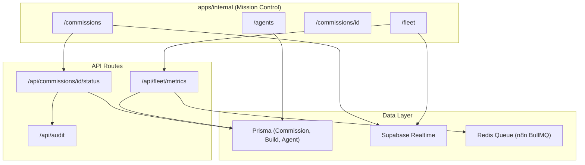

# Mission Control Dashboard

## Architecture

Extend the existing [apps/internal](apps/internal) Next.js 16 app. Reuse existing Supabase auth (ADMIN/ENGINEER role gate), Prisma DB access, and Tailwind styling. Add new routes, components, API endpoints, and a Prisma schema migration.




## Phase 1 Scope

- **Fleet Status View**: Studio grid with system metrics placeholders, active builds from DB, queue depth from Redis
- **Commission Pipeline**: Kanban board (Interview, Queued, Building, Testing, Delivered), drag-and-drop status changes, detail view
- **Agent Performance**: Success rate per type, average build time, error heatmap, quality scores
- **Realtime Skeleton**: Supabase Realtime subscriptions for Build and Commission table changes
- **Audit Logging**: All status changes logged with user, action, timestamp

## Phase 2 Scope (deferred, outlined only)

- Financial Telemetry (Stripe revenue, cost per build, profit margins)
- GSD Dependency Graph (DAG visualization with critical path)
- BMAD Feasibility Warnings and Risk Panel
- Contract Verification Status display
- Alerting Logic (blocked critical path, architecture drift, cycle detection)
- Predictive Features (ETA prediction, parallelization suggestions)

---

## Schema Migration

New file: `packages/db/prisma/migrations/20260302100000_mission_control/migration.sql`

Add two new models and extend Commission:

```prisma
model StudioMetrics {
  id         String   @id @default(cuid())
  studioId   String   // "studio-1", "studio-2", "studio-3"
  studioName String   // "Main", "Build", "QA"
  cpuPercent Float
  ramPercent Float
  diskPercent Float
  networkIn  Float    // bytes/sec
  networkOut Float    // bytes/sec
  queueDepth Int      @default(0)
  createdAt  DateTime @default(now())

  @@index([studioId, createdAt])
}

model AuditLog {
  id         String   @id @default(cuid())
  userId     String
  action     String   // "commission.status_changed", "build.retried"
  resource   String   // "commission", "build"
  resourceId String
  metadata   Json?
  createdAt  DateTime @default(now())

  @@index([resource, resourceId])
  @@index([createdAt])
}
```

Extend Commission with optional fields for Phase 2 readiness:

```sql
ALTER TABLE "Commission" ADD COLUMN "feasibilityScore" FLOAT;
ALTER TABLE "Commission" ADD COLUMN "riskAssessment" JSONB;
```

---

## Dependencies

Add to [apps/internal/package.json](apps/internal/package.json):

- `recharts` -- charting library for gauges, bar charts, heatmap
- `@dnd-kit/core` + `@dnd-kit/sortable` + `@dnd-kit/utilities` -- drag-and-drop for kanban (React 19 compatible)

---

## File Structure

```
apps/internal/src/
  app/
    fleet/
      page.tsx                    # Fleet Status View
    commissions/
      page.tsx                    # Kanban Board
      [id]/
        page.tsx                  # Commission Detail
    agents/
      page.tsx                    # Agent Performance
    api/
      commissions/[id]/status/
        route.ts                  # PATCH commission status + audit
      fleet/metrics/
        route.ts                  # GET studio metrics + queue
      audit/
        route.ts                  # POST audit event
  components/
    fleet/
      studio-card.tsx             # Per-studio card with metric gauges
      metric-gauge.tsx            # Recharts RadialBarChart gauge
      queue-depth-chart.tsx       # Recharts AreaChart for queue over time
      build-progress.tsx          # Active build progress bars
    commissions/
      kanban-board.tsx            # dnd-kit DndContext + columns
      kanban-column.tsx           # Droppable column
      kanban-card.tsx             # Draggable commission card
    agents/
      success-rate-chart.tsx      # BarChart per agent type
      build-time-chart.tsx        # BarChart avg time per archetype
      error-heatmap.tsx           # Recharts heatmap (stage x agent)
      quality-score-card.tsx      # Design audit pass rate display
    shared/
      stat-card.tsx               # Reusable metric card
      alert-banner.tsx            # Alert notification component
      realtime-provider.tsx       # Supabase Realtime context provider
  hooks/
    use-realtime-subscription.ts  # Generic Supabase channel hook
    use-fleet-metrics.ts          # Polling hook for fleet data
  lib/
    audit.ts                      # Audit log helper function
```

---

## Key Implementation Details

### Sidebar Update

Update [apps/internal/src/components/sidebar.tsx](apps/internal/src/components/sidebar.tsx) to add navigation items:

- Fleet Status (`/fleet`)
- Commissions (`/commissions`)
- Agent Performance (`/agents`)
- Keep existing: Overview, Projects, Settings

### Fleet Status Page (`/fleet`)

Server component fetches latest `StudioMetrics` per studio + active `Build` records. Client sub-components for Recharts gauges and Supabase Realtime subscription on `Build` table.

Data sources:

- `StudioMetrics` -- latest per studioId (seed with mock data initially)
- `Build` where status = "RUNNING" -- active builds grouped by studioAssignment
- Redis queue depth -- fetched via `/api/fleet/metrics` which connects to Redis at `REDIS_URL`

### Commission Kanban (`/commissions`)

Maps `CommissionStatus` to kanban columns:

- DRAFT/DISCOVERY -> "Interview"
- IN_PROGRESS -> "Building" (further subdivided by Build.status)
- COMPLETED -> "Delivered"
- ESCALATED -> "Testing"

Server component loads all active commissions. Client kanban uses dnd-kit. On drop, PATCH `/api/commissions/[id]/status` updates status + writes AuditLog.

Each card shows: client email, archetype name, payment state badge, latest build status.

### Agent Performance (`/agents`)

Server component queries:

- `Build` grouped by agent type -> success rate (status=SUCCESS / total)
- `Build` grouped by archetype -> avg build duration (updatedAt - createdAt)
- `BuildLog` grouped by stage + status=FAILED -> error counts for heatmap
- `Build` where designAuditScore exists -> quality scores

Uses Recharts BarChart, custom heatmap grid, and stat cards.

### Realtime Provider

Wrap layout children in a `RealtimeProvider` that creates a Supabase channel subscribing to:

- `Build` table changes (INSERT, UPDATE)
- `Commission` table changes (UPDATE)

Expose via React context. Fleet and Commission pages consume updates to refresh data without full page reload.

### Audit Logging

Utility in `lib/audit.ts`:

```typescript
export async function logAudit(params: {
  userId: string
  action: string
  resource: string
  resourceId: string
  metadata?: Record<string, unknown>
}) {
  await prisma.auditLog.create({ data: params })
}
```

Called from every mutation API route.

### Mobile Responsive

All grid layouts use Tailwind responsive classes:

- Fleet: `grid-cols-1 md:grid-cols-3`
- Kanban: horizontal scroll on mobile, stacked columns option
- Charts: responsive container via Recharts `ResponsiveContainer`

---

## Phase 2 Outline (for future planning)

1. **Financial Telemetry** (`/financials`): Add Stripe SDK to internal app, create `/api/financials/revenue` route, build cost-per-build calculator from TokenUsage + infrastructure constants, Recharts line/bar charts for margins
2. **GSD Dependency Graph** (`/commissions/[id]/graph`): Use `reactflow` or `d3-dag` to render DAG from `@mismo/gsd-dependency` output stored in Build.executionIds, color nodes by status, highlight critical path
3. **BMAD Warnings**: Read `Commission.feasibilityScore` and `riskAssessment`, show warning badges on kanban cards, expandable risk panel in commission detail
4. **Contract Verification**: Display `Delivery.contractCheckPassed` / `bmadChecksPassed` / `secretScanPassed` as status indicators in commission detail
5. **Alerting**: Background polling or Supabase Realtime triggers -> alert-banner component for: build failures, critical path blocks >15min, architecture drift, cost overruns
6. **Predictive Features**: Historical build time aggregation, linear regression for ETA prediction, parallelization suggestions from GSD dependency analysis

