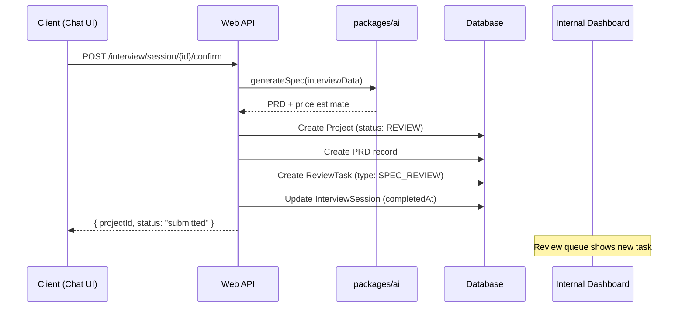

# Mo Text Chat Feature Implementation

## Provider API Research Summary

All four providers are OpenAI-compatible and work with the Vercel AI SDK:

- **DeepSeek** (default): `@ai-sdk/deepseek` (first-party package), base URL `https://api.deepseek.com`, models: `deepseek-chat`, `deepseek-reasoner`
- **Kimi (Moonshot)**: OpenAI-compatible via `@ai-sdk/openai-compatible`, base URL `https://api.moonshot.ai/v1`, models: `kimi-k2`, `kimi-k2.5`
- **MiniMax**: OpenAI-compatible via `@ai-sdk/openai-compatible`, base URL `https://api.minimax.chat/v1`, models: `MiniMax-M2.5`, `MiniMax-M2`
- **Z.ai (Zhipu)**: OpenAI-compatible via `@ai-sdk/openai-compatible`, base URL `https://api.z.ai/api/paas/v4/`, models: `glm-5`, `glm-4.5`

---

## Workstream 1: Multi-Provider LLM Infrastructure (packages/ai)

### 1a. Install dependencies

In [packages/ai/package.json](packages/ai/package.json), add:

- `@ai-sdk/deepseek` (first-party DeepSeek support)
- `@ai-sdk/openai-compatible` (for Kimi, MiniMax, Z.ai)

Remove the direct `@ai-sdk/openai` dependency from `apps/web` since all AI logic should flow through `packages/ai`.

### 1b. Create provider registry

New file `packages/ai/src/providers/index.ts`:

- Define a `ModelProvider` type with id, name, baseURL, models array, and `getModel()` factory
- Create provider configs for all four:

```typescript
const PROVIDERS = {
  deepseek: {
    id: 'deepseek',
    name: 'DeepSeek',
    models: [
      { id: 'deepseek-chat', name: 'DeepSeek V3 Chat', default: true },
      { id: 'deepseek-reasoner', name: 'DeepSeek Reasoner' },
    ],
    createModel: (modelId, apiKey) => {
      const provider = createDeepSeek({ apiKey });
      return provider(modelId);
    },
  },
  kimi: {
    id: 'kimi',
    name: 'Kimi (Moonshot)',
    models: [{ id: 'kimi-k2', name: 'Kimi K2', default: true }],
    createModel: (modelId, apiKey) => {
      const provider = createOpenAICompatible({
        name: 'kimi',
        apiKey,
        baseURL: 'https://api.moonshot.ai/v1',
      });
      return provider(modelId);
    },
  },
  // ... MiniMax, Z.ai similarly
}
```

- Export `getActiveModel(config?: { providerId, modelId })` that reads from DB config (falling back to env `DEFAULT_MO_PROVIDER=deepseek` / `DEFAULT_MO_MODEL=deepseek-chat`), selects the correct provider, and returns a Vercel AI SDK `LanguageModel`
- Export `getProviderList()` for the dashboard UI to enumerate options
- Export `checkProviderHealth(providerId)` for status indicators

### 1c. Environment variables

Add to [.env](.env) and `.env.example`:

```
# AI Providers (existing)
DEEPSEEK_API_KEY=
OPENAI_API_KEY=

# AI Providers (new)
KIMI_API_KEY=
MINIMAX_API_KEY=
ZAI_API_KEY=

# Mo defaults (env fallback when no DB config)
DEFAULT_MO_PROVIDER=deepseek
DEFAULT_MO_MODEL=deepseek-chat
```

---

## Workstream 2: Database Changes (packages/db)

### 2a. SystemConfig model

Add to [packages/db/prisma/schema.prisma](packages/db/prisma/schema.prisma):

```prisma
model SystemConfig {
  id        String   @id @default(cuid())
  key       String   @unique
  value     Json
  updatedAt DateTime @updatedAt
  updatedBy String?
}
```

Used for storing `mo.provider` and `mo.model` config keys. The `getActiveModel()` function queries `SystemConfig` for these, falling back to env vars.

### 2b. Extend InterviewSession for checkpointing

The existing `InterviewSession.state` (Json) already stores the interview context. Extend the schema of this Json to include a `checkpoints` array:

```typescript
interface PersistedSessionState {
  context: InterviewContext;
  checkpoints: Array<{
    messageIndex: number;
    context: InterviewContext;
    timestamp: string;
  }>;
}
```

No Prisma schema change needed since `state` is already `Json`. The checkpoint logic lives in the API routes.

### 2c. Migration

Run `prisma migrate dev` to add the `SystemConfig` table.

---

## Workstream 3: Enhanced System Prompt + Interview Logic (packages/ai)

### 3a. Rewrite Mo's system prompt

Replace the terse per-state prompts in [packages/ai/src/interview/states.ts](packages/ai/src/interview/states.ts) with a comprehensive persona prompt. The base prompt (prepended to all state-specific prompts):

```
You are Mo, Mismo's AI project consultant. Your role is to help people 
turn their ideas into real software products — whether that's a web 
page, a startup app, a custom internal tool, an agentic AI pipeline, 
or a modification to an existing system.

PERSONALITY:
- Warmly professional — like a knowledgeable friend who happens to be 
  a tech expert
- Patient and encouraging — the person you're talking to may have zero 
  technical knowledge
- Concise but thorough — respect their time while gathering everything 
  you need

COMMUNICATION STYLE:
- Ask qualitative, easy-to-answer questions
- When presenting choices, use labeled options (A, B, C, D) that the 
  user can click or type
- Never use jargon without explaining it in plain language
- Frame technical trade-offs as real-world analogies
- Acknowledge and validate the user's ideas before probing deeper

INTERNAL SCORING:
After each exchange, silently assess your readiness score (0-100) — 
your confidence that you have enough information to generate a complete 
technical specification. Include this as a JSON block at the end of 
your response: {"readiness": <number>, "missing": ["list of gaps"]}

You will NOT show this JSON to the user. It will be parsed and removed 
before display.
```

Each state prompt will be enhanced to be more conversational and include specific question templates that map to the multiple-choice GUI.

### 3b. Structured choice output format

Define a convention where Mo's responses can include structured choice blocks that the frontend parses and renders as clickable cards:

```
[CHOICES]
A: Individual consumers — everyday people using your app
B: Small businesses — teams of 5-50 people  
C: Enterprise companies — large organizations with complex needs
D: I'm not sure yet — let's figure it out together
[/CHOICES]
```

The frontend strips these blocks and renders them as interactive `<ChoiceCard>` components.

### 3c. Readiness scoring and state machine updates

Modify the state machine to:

- Track a `readinessScore` (0-100) in `InterviewContext.extractedData`
- Parse Mo's hidden JSON readiness block from each response
- Allow early transition to SUMMARY if readiness >= 85 (Mo is confident)
- Add a new `FEASIBILITY_ASSESSMENT` state between SUMMARY and COMPLETE:
  - Mo internally evaluates difficulty (1-5 scale), feasibility, estimated timeline
  - Generates a price estimate range within tier boundaries

### 3d. New interview states

Update the state flow to include price/feasibility:

```
GREETING -> PROBLEM_DEFINITION -> TARGET_USERS -> 
FEATURE_EXTRACTION -> TECHNICAL_TRADEOFFS -> 
MONETIZATION -> COMPLIANCE_CHECK -> SUMMARY -> 
FEASIBILITY_AND_PRICING -> CONFIRMATION -> COMPLETE
```

- **FEASIBILITY_AND_PRICING**: Mo presents a plain-language summary of difficulty, timeline, and a price range. Mo internally runs a pricing function that considers: feature count, architecture complexity, compliance requirements, estimated dev hours.
- **CONFIRMATION**: Client reviews and confirms. "Yes, let's proceed" triggers spec generation + handoff.

### 3e. Price estimation logic

New file `packages/ai/src/interview/pricing.ts`:

```typescript
interface PriceEstimate {
  tierRecommendation: ServiceTier;
  priceRange: { min: number; max: number };
  breakdown: {
    basePrice: number;
    featureComplexity: number;
    architectureMultiplier: number;
    complianceAddon: number;
    hostingMonthly: { min: number; max: number };
  };
  estimatedTimeline: { min: number; max: number }; // weeks
  difficultyScore: number; // 1-5
  feasibilityNotes: string[];
}
```

Pricing algorithm:

- Base price from tier (Vibe $2k, Verified $8k, Foundry $25k)
- Feature count multiplier: each feature beyond 3 adds 10-15% to base
- Architecture complexity: Serverless 1.0x, Monolithic 1.1x, Microservices 1.4x
- Compliance add-ons: HIPAA/financial +20%, children's data +15%
- Price is calculated toward the upper end of ranges (maximize margins)
- Present to client as a range: "Based on what you've described, this would be in the $X,XXX - $Y,YYY range"

---

## Workstream 4: Conversation Persistence API (apps/web)

### 4a. Session CRUD routes

Rewrite and extend `apps/web/src/app/api/interview/`:

- `**POST /api/interview/start**`: Create `InterviewSession` in Prisma (not in-memory), return `sessionId`
- `**POST /api/interview/message**`: Accept `sessionId` + `message`, load session from DB, process, save checkpoint, stream response, save updated state to DB
- `**GET /api/interview/session/[id]**`: Load session from DB with full checkpoint history
- `**POST /api/interview/session/[id]/rewind**`: Rewind to a specific checkpoint (for message editing). Accepts `{ checkpointIndex: number }`, restores that checkpoint's context, truncates messages after that point
- `**POST /api/interview/session/[id]/stop**`: Server-side abort (cleanup)
- `**POST /api/interview/session/[id]/confirm**`: Client confirms spec + pricing; triggers spec generation and creates ReviewTask for internal dashboard

### 4b. Checkpoint strategy

After each successful message exchange (user message + complete assistant response):

1. Snapshot the current `InterviewContext`
2. Push to `checkpoints[]` array with `messageIndex` and `timestamp`
3. Save to DB

When user edits message N:

1. Load checkpoint at message index N (the state *before* that user message)
2. Discard messages from index N onward
3. Send the edited message as if it were new
4. New checkpoints are created from that point forward (branching)

---

## Workstream 5: Chat UI Overhaul (apps/web)

### 5a. Component architecture

Break the monolithic [apps/web/src/app/chat/page.tsx](apps/web/src/app/chat/page.tsx) (~254 lines) into:

```
apps/web/src/app/chat/
  page.tsx              # Orchestrator: session management, API calls
  components/
    MessageList.tsx     # Scrollable message container
    MessageBubble.tsx   # Individual message with edit/hover actions
    ChatInput.tsx       # Input field with send/stop buttons
    ChoiceSelector.tsx  # Renders [CHOICES] blocks as clickable cards
    ReadinessBar.tsx    # Visual progress indicator (Mo's confidence)
    PriceCard.tsx       # Displays price estimate when available
    TypingIndicator.tsx # Three-dot animation (already exists)
```

### 5b. Stop generation

- Use `AbortController` on the fetch call to `/api/interview/message`
- When streaming, show a "Stop" button (square icon) in place of the send button
- On click: `abortController.abort()`, truncate the partial response, mark as complete
- Partial responses are still saved (checkpoint includes what was received)

### 5c. Message editing

- Each user message has a subtle edit icon (pencil) on hover
- Clicking edit: replaces the message content with an editable input, pre-filled with original text
- Submitting the edit: calls `/api/interview/session/[id]/rewind` to checkpoint, then sends the new message
- Messages below the edit point fade out and are replaced with the new branch

### 5d. Multiple-choice selector GUI

- Parse assistant messages for `[CHOICES]...[/CHOICES]` blocks
- Render as a horizontal row of pill-shaped cards below the message text
- Each card shows the option letter and description
- Clicking a card fills the input with the option text and auto-submits
- Cards use the design system: `rounded-xl border border-gray-200 hover:bg-gray-50 transition-colors`

### 5e. Readiness bar

- Thin progress bar at the top of the chat (below header)
- Fills based on Mo's parsed `readiness` score (0-100)
- Color transitions: gray (0-30) -> amber-to-green gradient (30-70) -> green (70-100)
- Tooltip on hover shows "Mo is X% confident in understanding your project"

### 5f. Price card

- When Mo reaches the FEASIBILITY_AND_PRICING state, render a styled card
- Shows: price range, estimated timeline, difficulty rating (1-5 dots)
- "Proceed" and "I have questions" buttons
- Matches design system: `rounded-2xl` card with subtle gradient accent border

### 5g. Session persistence in UI

- On page load, check for existing active session (via URL param `?session=<id>` or from user's latest unfinished session)
- Load full conversation from DB and render
- Show "Continue conversation" or "Start new" if prior session exists
- Auto-save happens server-side (every message exchange is persisted)

---

## Workstream 6: Internal Dashboard - Model Configuration

### 6a. Settings page update

Update [apps/internal/src/app/settings/page.tsx](apps/internal/src/app/settings/page.tsx) to add a "Mo Configuration" section:

- **Active Provider**: Dropdown of providers (DeepSeek, Kimi, MiniMax, Z.ai)
- **Active Model**: Dropdown of models for the selected provider
- **Status indicators**: Green dot if API key is configured, red if missing
- **Test button**: Sends a simple prompt to verify the provider works
- **Save**: Writes to `SystemConfig` table via new API route

### 6b. New API route for config

`apps/internal/src/app/api/config/route.ts`:

- `GET /api/config?key=mo.provider` -- read config
- `PUT /api/config` -- update config (admin only)

### 6c. Review queue enhancement

When a client confirms their spec + pricing (CONFIRMATION state), a `ReviewTask` is created and appears in the internal dashboard's review queue. The review task links to the full interview transcript, generated spec, and price estimate.

---

## Workstream 7: Spec Generation + Handoff

### 7a. Trigger flow

When client clicks "Proceed" in the CONFIRMATION state:




### 7b. Enhanced spec generator

Update [packages/ai/src/spec-generator/generator.ts](packages/ai/src/spec-generator/generator.ts) to include:

- Difficulty assessment (1-5)
- Feasibility notes (potential blockers, risks)
- Price estimate breakdown
- Estimated timeline in weeks
- Recommended service tier with justification

---

## File Change Summary

**New files (~15):**

- `packages/ai/src/providers/index.ts` - Provider registry
- `packages/ai/src/providers/deepseek.ts` - DeepSeek config
- `packages/ai/src/providers/kimi.ts` - Kimi config
- `packages/ai/src/providers/minimax.ts` - MiniMax config
- `packages/ai/src/providers/zai.ts` - Z.ai config
- `packages/ai/src/interview/pricing.ts` - Price estimation
- `packages/ai/src/interview/prompts.ts` - Enhanced system prompts
- `apps/web/src/app/chat/components/MessageList.tsx`
- `apps/web/src/app/chat/components/MessageBubble.tsx`
- `apps/web/src/app/chat/components/ChatInput.tsx`
- `apps/web/src/app/chat/components/ChoiceSelector.tsx`
- `apps/web/src/app/chat/components/ReadinessBar.tsx`
- `apps/web/src/app/chat/components/PriceCard.tsx`
- `apps/web/src/app/api/interview/session/[id]/rewind/route.ts`
- `apps/web/src/app/api/interview/session/[id]/confirm/route.ts`
- `apps/internal/src/app/api/config/route.ts`

**Modified files (~10):**

- `packages/ai/package.json` - Add provider deps
- `packages/ai/src/interview/states.ts` - Enhanced prompts, new states
- `packages/ai/src/interview/state-machine.ts` - Checkpointing, readiness score
- `packages/ai/src/index.ts` - Export new modules
- `packages/db/prisma/schema.prisma` - Add SystemConfig model
- `packages/shared/src/types.ts` - Add new types (PriceEstimate, etc.)
- `packages/shared/src/constants.ts` - Add pricing constants
- `apps/web/src/app/chat/page.tsx` - Major rewrite with component architecture
- `apps/web/src/app/api/interview/message/route.ts` - DB persistence, provider switch
- `apps/web/src/app/api/interview/start/route.ts` - DB persistence
- `apps/internal/src/app/settings/page.tsx` - Add Mo config section
- `.env` / `.env.example` - New API key vars

---

## Parallelization Strategy

```mermaid
gantt
    title Mo Chat Implementation
    dateFormat X
    axisFormat %s

    section serial
    DB Migration + SystemConfig          :s1, 0, 1

    section parallel_1
    Provider registry (packages/ai)      :p1, 1, 3
    Enhanced prompts + pricing (ai)      :p2, 1, 4
    Chat UI components (web)             :p3, 1, 4

    section parallel_2
    API routes + persistence (web)       :p4, 3, 6
    Internal dashboard settings          :p5, 3, 5

    section serial_2
    Spec handoff + review queue          :s2, 6, 8
    Integration testing                  :s3, 8, 9
```




- **Phase A (serial):** DB migration for SystemConfig
- **Phase B (parallel):** Provider registry, enhanced prompts + pricing logic, chat UI components -- all independent
- **Phase C (parallel):** API routes (depends on providers + prompts), internal dashboard settings (depends on provider registry)
- **Phase D (serial):** Spec handoff wiring, integration testing

