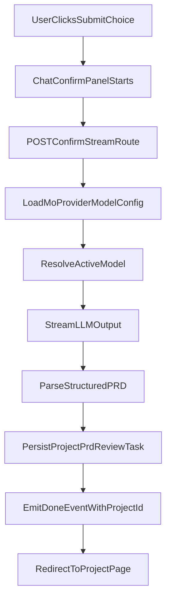

# Mo Confirm Pipeline + Responsive UX Plan

## What Is Broken

- Confirm submission currently uses template generation in `[/Users/youwen/Projects/mismo/apps/web/src/app/api/interview/session/[id]/confirm/route.ts](/Users/youwen/Projects/mismo/apps/web/src/app/api/interview/session/[id]/confirm/route.ts)`, so users see “generating” language without true LLM execution.
- Active provider/model saved by settings is not consumed in runtime model resolution in `[/Users/youwen/Projects/mismo/packages/ai/src/providers/index.ts](/Users/youwen/Projects/mismo/packages/ai/src/providers/index.ts)`, creating config/runtime mismatch.
- Frontend confirm flow in `[/Users/youwen/Projects/mismo/apps/web/src/app/chat/page.tsx](/Users/youwen/Projects/mismo/apps/web/src/app/chat/page.tsx)` has limited progress visibility and weak async chaining around submit choice handling.

## Target Architecture

## Implementation Steps

### 1) Make provider/model selection runtime-correct

- Add runtime config loader for `mo.provider` and `mo.model` (DB first, env fallback) and wire it into Mo API usage.
- Primary files:
  - `[/Users/youwen/Projects/mismo/packages/ai/src/providers/index.ts](/Users/youwen/Projects/mismo/packages/ai/src/providers/index.ts)`
  - `[/Users/youwen/Projects/mismo/apps/web/src/app/api/interview/message/route.ts](/Users/youwen/Projects/mismo/apps/web/src/app/api/interview/message/route.ts)`
  - `[/Users/youwen/Projects/mismo/apps/web/src/app/api/interview/session/[id]/confirm/route.ts](/Users/youwen/Projects/mismo/apps/web/src/app/api/interview/session/[id]/confirm/route.ts)`
- Add explicit error handling/logging around model resolution so “never dispatched” can be diagnosed quickly.

### 2) Convert confirm endpoint to real LLM-backed generation + stream events

- Replace blocking JSON confirm response with streaming events from confirm route (SSE or NDJSON text stream).
- During confirm:
  - Emit human-friendly status events (`"Reviewing your answers"`, `"Drafting your project plan"`, `"Finalizing details"`).
  - Stream live LLM tokens/chunks for the “underneath” output panel.
  - On completion, parse structured result into PRD payload and persist `Project`, `PRD`, `ReviewTask`, session completion, onboarding flag.
- Use transaction boundaries to avoid partial writes.
- Keep deterministic fallback path if model output is invalid.
- Primary files:
  - `[/Users/youwen/Projects/mismo/apps/web/src/app/api/interview/session/[id]/confirm/route.ts](/Users/youwen/Projects/mismo/apps/web/src/app/api/interview/session/[id]/confirm/route.ts)`
  - `[/Users/youwen/Projects/mismo/packages/ai/src/spec-generator/generator.ts](/Users/youwen/Projects/mismo/packages/ai/src/spec-generator/generator.ts)`
  - `[/Users/youwen/Projects/mismo/packages/ai/src/index.ts](/Users/youwen/Projects/mismo/packages/ai/src/index.ts)`

### 3) Fix submit-choice orchestration and resilient confirm UX

- Refactor submit choice flow from `.then()` chaining to `async/await` + guarded error handling to ensure confirm always runs or fails visibly.
- Add confirm-only UI state machine (`idle | submitting | streaming | finalizing | error | done`) in chat page.
- Primary file:
  - `[/Users/youwen/Projects/mismo/apps/web/src/app/chat/page.tsx](/Users/youwen/Projects/mismo/apps/web/src/app/chat/page.tsx)`

### 4) Add new confirm-only status + streaming panel (minimalist design)

- Create a dedicated component styled similarly to choice cards:
  - top message box with plain-language status copy,
  - subtle streaming output box beneath it,
  - bottom-to-top gradient treatment: fully transparent at bottom, becoming opaque toward top in the same background shade.
- Show only while confirm is active; hide in normal chat turns.
- Likely files:
  - `[/Users/youwen/Projects/mismo/apps/web/src/app/chat/components/SubmissionStatusPanel.tsx](/Users/youwen/Projects/mismo/apps/web/src/app/chat/components/SubmissionStatusPanel.tsx)` (new)
  - `[/Users/youwen/Projects/mismo/apps/web/src/app/chat/page.tsx](/Users/youwen/Projects/mismo/apps/web/src/app/chat/page.tsx)`
  - Optional shared style adjustments in existing components for spacing harmony.

### 5) Validation and guardrails

- Verify that when readiness reaches summary/confirmation and user submits, backend actually resolves model and emits stream events.
- Validate both success and failure UX:
  - missing API key/provider misconfig,
  - provider timeout/error,
  - malformed model output fallback.
- Run focused checks:
  - web typecheck/lint for modified files,
  - manual happy-path confirm from chat to project redirect,
  - manual failure-path messaging quality.

## Acceptance Criteria

- Confirm flow always triggers a backend request that resolves active provider/model from configured source (DB config + env fallback).
- User sees a clear, non-technical status message box during confirm generation.
- User sees live streaming LLM text in a subtle panel under the status box.
- Streaming panel has the requested bottom-transparent to top-opaque gradient effect.
- On success, project/PRD/review task/session updates complete atomically and redirect occurs.
- On failure, user receives actionable, calm messaging with retry path (no silent hang).
