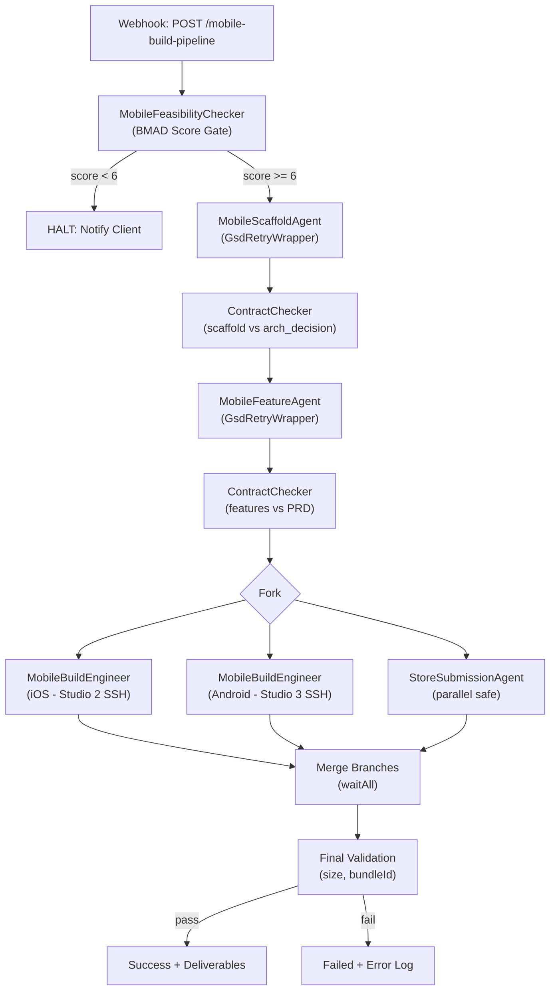

# Mobile Build Pipeline Implementation

## Architecture Overview

Extends the existing GSD-orchestrated build pipeline with mobile-specific agents, n8n nodes, and a BMAD feasibility gate. Follows identical patterns to the web pipeline: Express microservices with `/generate` and `/health`, n8n `INodeType` nodes proxying to agents, `GsdRetryWrapper` for resilience, and contract checks between stages.




## Key Design Decisions

- **Agent ports**: Scaffold (3005), Feature (3006), Build Engineer (3007), Store Submission (3008)
- **Component library**: React Native Paper by default, Tamagui as opt-in via `architecture_decision`
- **State management**: Auto-selected -- Zustand for apps with <= 5 screens/simple state, Redux Toolkit for complex apps
- **Build machines**: Physical Macs -- agents SSH into Studio 2 (iOS) and Studio 3 (Android) via credentials in env
- **Feasibility threshold**: Score < 6 halts the pipeline with a client-facing explanation

---

## 1. BMAD Feasibility Checker

**New file**: `[packages/n8n-nodes/nodes/MobileFeasibilityChecker/MobileFeasibilityChecker.node.ts](packages/n8n-nodes/nodes/MobileFeasibilityChecker/MobileFeasibilityChecker.node.ts)`

Standalone n8n node (no backing microservice -- logic is self-contained since it's pure scoring).

**Scoring algorithm** (from user spec):

```typescript
interface FeasibilityScore {
  score: number; // 1-10
  breakdown: { category: string; points: number; reason: string }[];
  recommendation: 'proceed' | 'halt' | 'review';
  architectureDecision: {
    platform_strategy: 'expo-managed' | 'expo-bare' | 'fully-native';
    justification: string;
    native_modules_required: string[];
    certificate_strategy: 'client-provided' | 'agency-managed-transfer';
    risk_mitigation: string[];
  };
}
```

Positive factors (each +2): clear archetype (pure RN), no complex hardware, Apple Dev account confirmed, Google Play confirmed, app size < 100MB.
Negative factors: push notifications (-3), background location (-3), custom native modules (-5).

**Output**: `mobile_architecture_decision.json` attached to build record.

---

## 2. Agent Microservices

All four agents follow the established pattern in `[packages/agents/db-architect/src/index.ts](packages/agents/db-architect/src/index.ts)`: Express server, `POST /generate`, `GET /health`, Zod validation, error logging to `Build.errorLogs`.

### 2a. Mobile Scaffold Agent

**Package**: `packages/agents/mobile-scaffold/`


| Field  | Value                                                                                                                |
| ------ | -------------------------------------------------------------------------------------------------------------------- |
| Port   | 3005                                                                                                                 |
| Input  | `projectName`, `bundleId`, `designDna`, `prd`, `architectureDecision`                                                |
| Output | `projectStructure`, `appJson`, `navigationConfig`, `packageJson`, `nativewindConfig`, `stateSetup`, `supabaseConfig` |


**Generation logic**:

- Expo SDK 52 project structure (app/, components/, lib/, assets/)
- `app.json` with `ios.bundleIdentifier`, `android.package`, icon/splash placeholders
- Expo Router file-based navigation from PRD screen list
- NativeWind setup (tailwind.config.js, babel plugin, metro config)
- State management: score complexity from PRD (`screens.length`, `dataModels.length`, presence of real-time features) -- Zustand if simple, RTK if complex
- Supabase client in `lib/supabase.ts`

### 2b. Mobile Feature Agent

**Package**: `packages/agents/mobile-feature/`


| Field  | Value                                                               |
| ------ | ------------------------------------------------------------------- |
| Port   | 3006                                                                |
| Input  | `scaffoldOutput`, `prd`, `designDna`, `screens`, `componentLibrary` |
| Output | `screens[]`, `components[]`, `nativePermissions[]`, `apiClient`     |


**Generation logic**:

- Screen components from PRD user stories
- React Native Paper components (default) with Design DNA token mapping
- Native permission configs: Camera (`expo-camera`), Location (`expo-location`), Notifications (`expo-notifications`)
- Typed Supabase API client from data contracts
- Validates no `any` types in generated code (same as web Frontend agent)

### 2c. Mobile Build Engineer Agent

**Package**: `packages/agents/mobile-build-engineer/`


| Field  | Value                                                                      |
| ------ | -------------------------------------------------------------------------- |
| Port   | 3007                                                                       |
| Input  | `projectPath`, `platform`, `credentials`, `buildProfile`                   |
| Output | `buildId`, `platform`, `artifactUrl`, `buildLog`, `status`, `uploadResult` |


**Key behavior**:

- SSH into Studio 2 (macOS) for iOS via `STUDIO_2_SSH_HOST`, `STUDIO_2_SSH_KEY`
- SSH into Studio 3 for Android via `STUDIO_3_SSH_HOST`, `STUDIO_3_SSH_KEY`
- Executes `eas build --platform <platform> --profile <profile> --non-interactive`
- Polls build status with 30-minute timeout
- iOS post-build: `eas submit --platform ios` to TestFlight (stops at "Ready for Review")
- Android post-build: `eas submit --platform android` to Play Console Internal track
- Returns build artifacts URL and full build log

### 2d. Store Submission Agent

**Package**: `packages/agents/store-submission/`


| Field  | Value                                     |
| ------ | ----------------------------------------- |
| Port   | 3008                                      |
| Input  | `prd`, `platform`, `appInfo`, `designDna` |
| Output | `storeListing`, `screenshots`, `metadata` |


**Generation logic**:

- Store listing: title (30 chars), subtitle (30 chars), description (4000 chars), keywords, category
- Privacy policy URL from PRD
- Screenshot automation via Maestro flows (run on simulator)
- Metadata JSON format compatible with `fastlane deliver` (iOS) and `fastlane supply` (Android)

---

## 3. N8N Node Proxies

**Location**: `[packages/n8n-nodes/nodes/](packages/n8n-nodes/nodes/)`

Five new nodes following the pattern in `[packages/n8n-nodes/nodes/DbArchitectAgent/DbArchitectAgent.node.ts](packages/n8n-nodes/nodes/DbArchitectAgent/DbArchitectAgent.node.ts)`:


| Node                       | Env Var                     | Backing Service            |
| -------------------------- | --------------------------- | -------------------------- |
| `MobileFeasibilityChecker` | (self-contained)            | None -- inline scoring     |
| `MobileScaffoldAgent`      | `MOBILE_SCAFFOLD_URL`       | mobile-scaffold:3005       |
| `MobileFeatureAgent`       | `MOBILE_FEATURE_URL`        | mobile-feature:3006        |
| `MobileBuildEngineer`      | `MOBILE_BUILD_ENGINEER_URL` | mobile-build-engineer:3007 |
| `StoreSubmissionAgent`     | `STORE_SUBMISSION_URL`      | store-submission:3008      |


Register all in `[packages/n8n-nodes/package.json](packages/n8n-nodes/package.json)` under `n8n.nodes`.

---

## 4. Contract Checker Extensions

**Modify**: `[packages/contract-checker/src/index.ts](packages/contract-checker/src/index.ts)`

Add three new check functions:

- `POST /check-mobile-architecture`: Validates build output matches `architecture_decision` (if `expo-managed`, reject any native code in output)
- `POST /check-app-size`: Verifies app size <= 100MB (from build artifact metadata); rejects with re-architect recommendation if exceeded
- `POST /check-bundle-id`: Confirms bundle ID in build output matches client's Apple Team ID / Google Play package name

Add a corresponding `MobileContractChecker` n8n node or extend the existing `ContractChecker` node with a `checkMobile` operation.

---

## 5. GSD Dependency Extensions

**Modify**: `[packages/gsd-dependency/src/index.ts](packages/gsd-dependency/src/index.ts)`

Add mobile task types to the PRD parser:

- `mobile-scaffold` (no dependencies, parallel safe)
- `mobile-feature` (depends on: `mobile-scaffold`, Design DNA approval)
- `mobile-native-config` (depends on: `mobile-scaffold`, blocks build)
- `mobile-build-ios` (depends on: `mobile-feature`, `mobile-native-config`; long duration flag)
- `mobile-build-android` (depends on: `mobile-feature`, `mobile-native-config`; can parallel with iOS)
- `store-metadata` (no dependencies, parallel safe)

---

## 6. Mobile Build Pipeline Workflow

**New file**: `[packages/n8n-nodes/workflows/mobile-build-pipeline.json](packages/n8n-nodes/workflows/mobile-build-pipeline.json)`

Follows the structure of `[packages/n8n-nodes/workflows/build-pipeline.json](packages/n8n-nodes/workflows/build-pipeline.json)`.

**Trigger**: `POST /mobile-build-pipeline` with body `{ buildId, prdJson, credentials }`

**Flow**:

1. Webhook receives `{ buildId, prdJson, credentials }`
2. `MobileFeasibilityChecker` scores and outputs `architecture_decision`
3. IF score < 6: Set "halted" status, return explanation to client, END
4. `GsdDependencyChecker` (parsePrd) sorts mobile tasks
5. `GsdRetryWrapper` -> `MobileScaffoldAgent`
6. `ContractChecker` (checkMobile) validates scaffold vs `architecture_decision`
7. `GsdRetryWrapper` -> `MobileFeatureAgent`
8. `ContractChecker` (checkMobile) validates features vs PRD
9. **Fork** into three parallel branches:
  - Branch A: `GsdRetryWrapper` -> `MobileBuildEngineer` (iOS, Studio 2)
  - Branch B: `GsdRetryWrapper` -> `MobileBuildEngineer` (Android, Studio 3)
  - Branch C: `StoreSubmissionAgent` (metadata generation)
10. **Merge** (waitAll)
11. Final validation: app size check, bundle ID check
12. Success/failure notification

---

## 7. API Routes

**New routes in** `[apps/internal/src/app/api/](apps/internal/src/app/api/)`:

- `mobile/build/route.ts` -- POST: Triggers mobile build pipeline via n8n webhook
- `mobile/status/route.ts` -- GET: Returns build status for a given `buildId` (polls n8n execution)

---

## 8. Environment Variables

Add to `[.env.example](.env.example)`:

```
# Mobile Pipeline - Agent URLs
MOBILE_SCAFFOLD_URL=http://localhost:3005
MOBILE_FEATURE_URL=http://localhost:3006
MOBILE_BUILD_ENGINEER_URL=http://localhost:3007
STORE_SUBMISSION_URL=http://localhost:3008

# Build Machines (SSH)
STUDIO_2_SSH_HOST=
STUDIO_2_SSH_KEY=
STUDIO_3_SSH_HOST=
STUDIO_3_SSH_KEY=

# Apple Developer
APPLE_TEAM_ID=
APPLE_API_KEY_ID=
APPLE_API_ISSUER_ID=
APPLE_API_KEY_PATH=

# Google Play
GOOGLE_PLAY_SERVICE_ACCOUNT_KEY_PATH=

# EAS
EXPO_TOKEN=
```

---

## 9. Scripts and Documentation

- `scripts/start-mobile-pipeline.sh` -- Starts all 4 mobile agent microservices (follows pattern of existing `start-build-pipeline.sh`)
- `scripts/stop-mobile-pipeline.sh` -- Stops all 4 agents
- `docs/mobile-build-pipeline.md` -- Architecture doc covering feasibility scoring, agent responsibilities, build flow, and limitations

---

## File Summary


| Action | Path                                                                                 |
| ------ | ------------------------------------------------------------------------------------ |
| Create | `packages/agents/mobile-scaffold/package.json`                                       |
| Create | `packages/agents/mobile-scaffold/src/index.ts`                                       |
| Create | `packages/agents/mobile-scaffold/tsconfig.json`                                      |
| Create | `packages/agents/mobile-feature/package.json`                                        |
| Create | `packages/agents/mobile-feature/src/index.ts`                                        |
| Create | `packages/agents/mobile-feature/tsconfig.json`                                       |
| Create | `packages/agents/mobile-build-engineer/package.json`                                 |
| Create | `packages/agents/mobile-build-engineer/src/index.ts`                                 |
| Create | `packages/agents/mobile-build-engineer/tsconfig.json`                                |
| Create | `packages/agents/store-submission/package.json`                                      |
| Create | `packages/agents/store-submission/src/index.ts`                                      |
| Create | `packages/agents/store-submission/tsconfig.json`                                     |
| Create | `packages/n8n-nodes/nodes/MobileFeasibilityChecker/MobileFeasibilityChecker.node.ts` |
| Create | `packages/n8n-nodes/nodes/MobileScaffoldAgent/MobileScaffoldAgent.node.ts`           |
| Create | `packages/n8n-nodes/nodes/MobileFeatureAgent/MobileFeatureAgent.node.ts`             |
| Create | `packages/n8n-nodes/nodes/MobileBuildEngineer/MobileBuildEngineer.node.ts`           |
| Create | `packages/n8n-nodes/nodes/StoreSubmissionAgent/StoreSubmissionAgent.node.ts`         |
| Create | `packages/n8n-nodes/workflows/mobile-build-pipeline.json`                            |
| Modify | `packages/n8n-nodes/package.json` (register 5 new nodes)                             |
| Modify | `packages/contract-checker/src/index.ts` (add mobile checks)                         |
| Modify | `packages/gsd-dependency/src/index.ts` (add mobile task types)                       |
| Create | `apps/internal/src/app/api/mobile/build/route.ts`                                    |
| Create | `apps/internal/src/app/api/mobile/status/route.ts`                                   |
| Modify | `.env.example` (add mobile env vars)                                                 |
| Create | `scripts/start-mobile-pipeline.sh`                                                   |
| Create | `scripts/stop-mobile-pipeline.sh`                                                    |
| Create | `docs/mobile-build-pipeline.md`                                                      |


