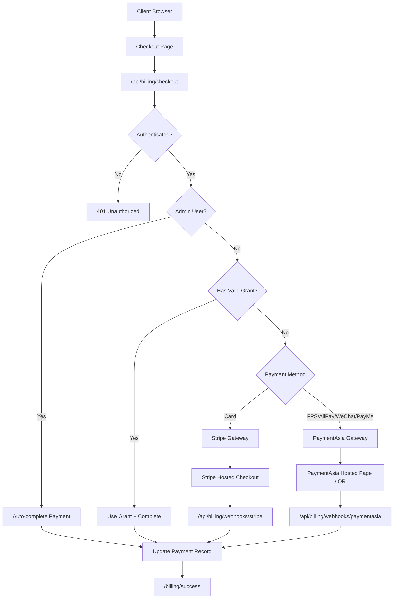

# Payment System Overhaul and Admin Whitelist Implementation

## Critical Assessment Summary

The current implementation has **3 compilation/runtime bugs**, **7 security vulnerabilities**, **4 architectural issues**, and significant missing functionality. Below is the diagnosis and fix plan.

---

## Phase 1: Critical Bug Fixes

### 1.1 Router Type Mismatch (Runtime Crash)

In `[packages/payment/src/core/router.ts](packages/payment/src/core/router.ts)`, `getGatewayForMethod()` returns a `PaymentGatewayAdapter` object, but `processPayment()` uses the result as a dictionary key:

```34:40:packages/payment/src/core/router.ts
  async processPayment(request: PaymentRequest): Promise<PaymentResponse> {
    // ...
    const gatewayName = this.getGatewayForMethod(request.method);  // returns PaymentGatewayAdapter
    const gateway = this.gateways[gatewayName];  // BUG: uses object as key -> undefined
```

**Fix:** Change `processPayment` to use the returned adapter directly, or split into two methods (`resolveGateway` returning the adapter, and a private method returning the gateway name). The cleanest fix: use the returned adapter directly in `processPayment` and add a separate `getGatewayNameForMethod` for cases needing the string.

### 1.2 Pricing Constants Mismatch

Two independent pricing bugs:

- `[packages/shared/src/constants.ts](packages/shared/src/constants.ts)` line 4-8: `SERVICE_TIER_PRICING` uses USD values (2000, 8000, 25000) with no currency indicator
- `[apps/web/src/app/api/billing/checkout/route.ts](apps/web/src/app/api/billing/checkout/route.ts)` lines 9-13: `TIER_PRICES` claims HKD but uses the same USD values as cents (HK$2,000 instead of HK$15,600)

**Fix:** Update constants to use the new HKD pricing from the strategy:

- Vibe: 1,560,000 cents (HK$15,600)
- Verified: 6,240,000 cents (HK$62,400)
- Foundry: 19,500,000 cents (HK$195,000)

Add tier names (Source/Deploy/Onsite) and their sub-components. Move all pricing to a single source of truth in `constants.ts`.

### 1.3 Stripe Webhook Not Updating Payment Table

`[apps/web/src/app/api/billing/webhook/route.ts](apps/web/src/app/api/billing/webhook/route.ts)` (the existing Stripe handler) has a `TODO` comment and never updates the `Payment` model. When Stripe payments complete, the `Payment` record stays `PENDING` forever.

**Fix:** Update the Stripe webhook handler to look up and update `Payment` records by `transactionId + gateway`, mirroring the PaymentAsia handler's logic.

---

## Phase 2: Security Hardening

### 2.1 No Authentication on Billing Endpoints (CRITICAL)

Both `[checkout/route.ts](apps/web/src/app/api/billing/checkout/route.ts)` and `[status/[paymentId]/route.ts](apps/web/src/app/api/billing/status/[paymentId]/route.ts)` have **zero auth checks**. Any unauthenticated request can:

- Create payment sessions for any commission
- Query any payment's status and metadata

**Fix:** Add `getSessionUser()` call at the top of both handlers. Verify the authenticated user owns the commission before proceeding. Return 401/403 appropriately.

### 2.2 PaymentAsia Webhook Signature Bypass (CRITICAL)

In `[paymentasia.ts](packages/payment/src/gateways/paymentasia.ts)` lines 108-114, signature verification is **completely skipped** when `webhookSecret` is empty (which is the default from `.env.example`):

```108:114:packages/payment/src/gateways/paymentasia.ts
    if (this.config.webhookSecret) {   // <-- falsy empty string skips verification
      const computedSig = this.computeSignature(body);
      if (computedSig !== signature) {
        throw new Error('Invalid webhook signature');
      }
    }
```

An attacker can forge webhook events to mark payments as completed without paying.

**Fix:** Make webhook secret **mandatory** -- throw an error if it's not configured when `verifyWebhook` is called. Never skip signature verification.

### 2.3 Feature Flags Default to Enabled

In `[types.ts](packages/payment/src/types.ts)` line 125, `isPaymentMethodEnabled` returns `true` when the env var is `undefined`:

```typescript
return flag === 'true' || flag === '1' || flag === undefined // Default to enabled if not set
```

This means PaymentAsia methods (FPS, AliPayHK, etc.) appear "enabled" even when PaymentAsia isn't configured, leading to confusing errors at runtime.

**Fix:** Default to `false` for all methods except `card` (Stripe, which is the established gateway). Require explicit opt-in.

### 2.4 Internal Error Message Leakage

Multiple endpoints return raw `error.message` to clients:

```typescript
const message = error instanceof Error ? error.message : 'Failed to create checkout session'
return NextResponse.json({ error: message }, { status: 500 })
```

This can leak internal details (API keys in URLs, database connection strings, etc.).

**Fix:** Create a `sanitizeError()` utility that maps known error types to safe messages and logs the full error server-side. Return generic messages to clients.

### 2.5 No Webhook Idempotency

Neither webhook handler checks if an event has already been processed. Gateway retries could cause double-processing.

**Fix:** Add an `idempotencyKey` or check `Payment.status` before updating -- skip if already in a terminal state (COMPLETED, FAILED, REFUNDED).

### 2.6 FPS QR Code Not Signed

`generateFPSQRData` in `[paymentasia.ts](packages/payment/src/gateways/paymentasia.ts)` creates an unsigned base64 blob. A client could decode it, change the amount to 0, re-encode, and present it.

**Fix:** Add HMAC-SHA256 signature to the QR data using a server-side secret. Verify the signature when the payment callback arrives. (Note: this is moot if PaymentAsia generates the QR server-side, which is the recommended flow.)

### 2.7 No Duplicate Payment Prevention

The checkout endpoint doesn't check if a payment already exists for the same commission in a non-terminal state. A user could create unlimited pending payment sessions.

**Fix:** Before creating a new `Payment` record, check for existing `PENDING` payments for the same `commissionId`. Return the existing checkout URL if one is still valid (not expired).

---

## Phase 3: Admin System

### 3.1 Admin Whitelist with Hashed Emails

The existing system in `[apps/web/src/lib/auth.ts](apps/web/src/lib/auth.ts)` already implements SHA-256 email hashing and checks `ADMIN_EMAIL_HASHES` from env vars. This needs to be extended to:

1. **Store whitelist in DB** (via `SystemConfig` model, key: `admin.emailHashes`) in addition to env vars
2. **Seed with the SHA-256 hash of `youwenshao@gmail.com`**
3. **Update `isWhitelistedAdmin`** to check both env and DB sources

Approach:

- Compute `hashEmail("youwenshao@gmail.com")` and add to `ADMIN_EMAIL_HASHES` in `.env.example`
- Add a `SystemConfig` record with key `admin.emailHashes` containing an array of hashes
- Modify `isWhitelistedAdmin` to accept DB-stored hashes as well

### 3.2 Admin Payment Bypass

When an admin creates a commission (or is creating one for testing), skip the payment flow entirely.

**Implementation:**

- In the checkout API route, check if the user is an admin
- If admin, immediately mark the `Payment` as `COMPLETED` with `gateway: 'STRIPE'`, `method: 'CARD'`, `amount: 0`, and a special metadata flag `{ adminBypass: true }`
- Update `Commission.paymentState` to `FINAL`
- Return a direct success redirect instead of a checkout URL

### 3.3 Admin Whitelist Management UI

The settings page at `[apps/internal/src/app/settings/page.tsx](apps/internal/src/app/settings/page.tsx)` already has a placeholder:

```232:234:apps/internal/src/app/settings/page.tsx
      <section className="mb-8">
        <h2 className="text-sm font-medium mb-1">Admin Whitelist</h2>
        <p className="text-sm text-gray-400">Whitelist management coming soon</p>
```

**Implementation:**

- New API routes: `GET/POST/DELETE /api/admin/whitelist` (in the internal app)
- UI: List current hashed emails (showing partial hash for identification), add new email (hash on client before sending), remove hash
- All changes update `SystemConfig` record `admin.emailHashes`

### 3.4 Free Trial Granting System

Admins can grant specific users one of three trial types:

| Trial Type                   | Effect                                                            |
| ---------------------------- | ----------------------------------------------------------------- |
| 7-day unlimited (non-Onsite) | User can commission Source or Deploy projects for free for 7 days |
| 1 free Source                | User gets 1 Source-tier commission at no charge                   |
| 1 free Source or Deploy      | User gets 1 Source or Deploy commission at no charge              |

**Implementation:**

- New Prisma model `UserGrant`:

```prisma
enum GrantType {
  UNLIMITED_7DAY
  FREE_SOURCE
  FREE_SOURCE_OR_DEPLOY
}

model UserGrant {
  id          String    @id @default(cuid())
  userId      String
  grantType   GrantType
  usedAt      DateTime?
  expiresAt   DateTime?
  grantedBy   String
  createdAt   DateTime  @default(now())

  user        User      @relation(fields: [userId], references: [id])
  grantedByUser User    @relation("GrantedBy", fields: [grantedBy], references: [id])
}
```

- Admin UI in internal app: search user by email, select grant type, create grant
- Checkout API: before processing payment, check for valid unused grants matching the commission tier. If found, auto-complete the payment and mark the grant as used.

---

## Phase 4: Payment System Completion

### 4.1 Unify Webhook Handlers

- Move Stripe webhook from `/api/billing/webhook/` to `/api/billing/webhooks/stripe/` for consistency
- Both handlers should follow the same pattern: verify signature, look up `Payment` by `transactionId`, update status, trigger side-effects
- Keep old path as a redirect for backward compatibility during transition

### 4.2 Singleton Payment Router

Replace `createPaymentRouter()` (which uses `require()` and creates new instances per call) with a module-level singleton:

```typescript
let _router: PaymentRouter | null = null
export function getPaymentRouter(): PaymentRouter {
  if (!_router) {
    _router = createPaymentRouter()
  }
  return _router
}
```

### 4.3 Add Deploy and Onsite Tier Pricing

Update pricing constants and checkout route to support all tiers and sub-tiers:

- **Source**: Vibe (HK$15,600), Verified (HK$62,400), Foundry (HK$195,000)
- **Deploy**: Source price + 25% base, plus monthly retainer selection
- **Onsite**: Hardware package pricing (Small HK$24,900, Medium HK$26,900, Large HK$36,900) plus monthly retainer

The checkout flow needs to support one-time project fees and separate retainer subscriptions.

### 4.4 Frontend Implementation

- **Checkout page** (`/billing/checkout`): Payment method selector with Stripe card form and PaymentAsia wallet buttons (FPS, AliPayHK, WeChat Pay, PayMe), showing fees per method
- **Success page** (`/billing/success`): Confirmation with payment details, next steps
- **Cancel page** (`/billing/cancel`): Return to commission with option to retry
- **FPS QR component**: Display QR code from PaymentAsia response with countdown timer
- **PriceCard update**: Update to show HKD pricing with tier names (Source/Deploy/Onsite)

Design language: match existing minimal style (rounded-2xl borders, gray-200 borders, gray-50 backgrounds, rounded-full buttons, text-sm typography).

### 4.5 Update Billing Runbook

Update `[docs/ops/runbooks/billing-and-refunds.md](docs/ops/runbooks/billing-and-refunds.md)` to cover:

- PaymentAsia refund procedures
- Admin bypass audit trail
- Free trial grant tracking
- Multi-gateway troubleshooting

---

## Architecture Diagram



---

## File Change Summary

| File                                                         | Action                                          |
| ------------------------------------------------------------ | ----------------------------------------------- |
| `packages/payment/src/core/router.ts`                        | Fix type mismatch, add singleton                |
| `packages/payment/src/types.ts`                              | Fix feature flag defaults                       |
| `packages/payment/src/gateways/paymentasia.ts`               | Enforce webhook secret, fix QR signing          |
| `packages/payment/src/gateways/stripe.ts`                    | Minor cleanup                                   |
| `packages/payment/src/__tests__/router.test.ts`              | Update tests for fixed API                      |
| `packages/shared/src/constants.ts`                           | Add HKD pricing, tier names, add-on rates       |
| `packages/db/prisma/schema.prisma`                           | Add `UserGrant` model, `GrantType` enum         |
| `apps/web/src/lib/auth.ts`                                   | Extend whitelist to check DB                    |
| `apps/web/src/app/api/billing/checkout/route.ts`             | Add auth, admin bypass, grant check, fix prices |
| `apps/web/src/app/api/billing/status/[paymentId]/route.ts`   | Add auth check                                  |
| `apps/web/src/app/api/billing/webhook/route.ts`              | Migrate to new path, update Payment model       |
| `apps/web/src/app/api/billing/webhooks/stripe/route.ts`      | New unified Stripe webhook                      |
| `apps/web/src/app/api/billing/webhooks/paymentasia/route.ts` | Add idempotency, error sanitization             |
| `apps/web/src/app/billing/checkout/page.tsx`                 | New checkout UI                                 |
| `apps/web/src/app/billing/success/page.tsx`                  | New success page                                |
| `apps/web/src/app/billing/cancel/page.tsx`                   | New cancel page                                 |
| `apps/internal/src/app/settings/page.tsx`                    | Admin whitelist UI, grant management            |
| `apps/internal/src/app/api/admin/whitelist/route.ts`         | New whitelist API                               |
| `apps/internal/src/app/api/admin/grants/route.ts`            | New grants API                                  |
| `.env.example`                                               | Add admin hash, document new vars               |
| `docs/ops/runbooks/billing-and-refunds.md`                   | Update for multi-gateway                        |
