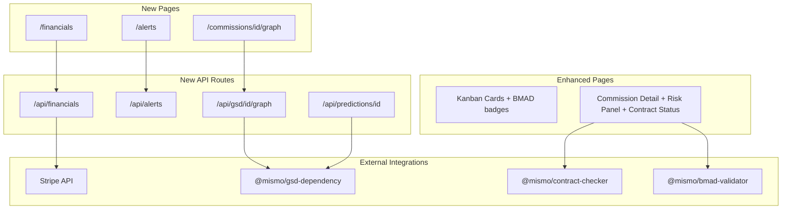

# Phase 2: Mission Control Dashboard

## Architecture Overview

Phase 2 adds three new pages (`/financials`, `/commissions/[id]/graph`, `/alerts`), enhances two existing pages (kanban cards, commission detail), and introduces a background alert-evaluation system.




---

## 1. Financial Telemetry (`/financials`)

### New dependency

Add `stripe` to [apps/internal/package.json](apps/internal/package.json).

### New files

- `apps/internal/src/lib/stripe.ts` -- Stripe client (same pattern as [apps/web/src/lib/stripe.ts](apps/web/src/lib/stripe.ts))
- `apps/internal/src/app/financials/page.tsx` -- Server component, fetches revenue + cost data
- `apps/internal/src/components/financials/revenue-chart.tsx` -- Recharts LineChart: monthly revenue
- `apps/internal/src/components/financials/cost-breakdown.tsx` -- Recharts stacked BarChart: Kimi API cost vs infrastructure per build
- `apps/internal/src/components/financials/profit-by-archetype.tsx` -- Recharts BarChart: profit margin per archetype
- `apps/internal/src/components/financials/cost-alert-card.tsx` -- Displays builds exceeding 3x cost estimate
- `apps/internal/src/app/api/financials/route.ts` -- GET: aggregates revenue from Stripe, costs from Build.kimiqTokensUsed

### Data model

No new schema needed. Compute from existing data:

- **Revenue**: Query Stripe `checkout.sessions.list` filtered by `metadata.projectId`, or approximate from `Commission.paymentState` + `SERVICE_TIER_PRICING` from [packages/shared/src/constants.ts](packages/shared/src/constants.ts) (VIBE=$2k, VERIFIED=$8k, FOUNDRY=$25k). The second approach avoids needing live Stripe calls for the MVP -- use tier pricing from `Commission -> archetype -> Project.tier`.
- **Cost per build**: `Build.kimiqTokensUsed * COST_PER_KIMI_TOKEN` (define constant, e.g. $0.002/1k tokens) + infrastructure overhead constant per studio-hour.
- **Profit margin per archetype**: Group commissions by archetype, sum revenue and costs.
- **Cost alert**: Compare `Build.kimiqTokensUsed` against `TOKEN_BUDGET_PER_FEATURE * feature_count` from `Commission.prdJson.features.length`. Alert when actual > 3x estimate.

### Sidebar update

Add `{ label: 'Financials', href: '/financials', section: 'mission' }` to the nav array in [apps/internal/src/components/sidebar.tsx](apps/internal/src/components/sidebar.tsx).

---

## 2. GSD Dependency Graph (`/commissions/[id]/graph`)

### New dependency

Add `@xyflow/react` to [apps/internal/package.json](apps/internal/package.json) (maintained successor to reactflow).

### Data source

The GSD task graph comes from `Commission.prdJson.gsd_decomposition.tasks`, which contains:

```typescript
interface GsdTask {
  id: string
  type: string          // "database", "backend", "frontend", "devops", etc.
  dependencies: string[]
  input?: Record<string, unknown>
  config?: Record<string, unknown>
}
```

From [packages/gsd-dependency/src/index.ts](packages/gsd-dependency/src/index.ts): topological sort via Kahn's algorithm with cycle detection.

Task status is derived from `Build.executionIds` (JSON array of completed task IDs) and `Build.status`:

- Task ID in `executionIds` and build RUNNING -> Blue (In Progress, approximate based on position)
- Task ID completed (earlier in sorted order than current execution point) -> Green
- Task ID not yet reached -> Gray (Waiting)
- Build FAILED and task was next in sequence -> Red

### New files

- `apps/internal/src/app/commissions/[id]/graph/page.tsx` -- Server component, loads commission + builds + prd
- `apps/internal/src/components/gsd/dependency-graph.tsx` -- Client component, `@xyflow/react` canvas rendering DAG
- `apps/internal/src/components/gsd/task-node.tsx` -- Custom React Flow node with color coding and task metadata
- `apps/internal/src/app/api/gsd/[id]/graph/route.ts` -- GET: parses PRD into graph structure, returns nodes + edges + status for a commission
- `apps/internal/src/lib/gsd-graph.ts` -- Utility: transforms `GsdTask[]` + `Build` into React Flow nodes/edges with status colors

### Critical path

Compute longest path through the DAG (sum of estimated durations or equal weights). Highlight edges/nodes on critical path with a distinct stroke. Use a simple BFS/longest-path algorithm on the DAG in the `gsd-graph.ts` utility.

### Link from commission detail

Add a "View Dependency Graph" link in [apps/internal/src/app/commissions/[id]/page.tsx](apps/internal/src/app/commissions/[id]/page.tsx) next to the PRD Summary section.

---

## 3. BMAD Feasibility Warnings

### Kanban card enhancement

In [apps/internal/src/components/commissions/kanban-card.tsx](apps/internal/src/components/commissions/kanban-card.tsx):

- Extend `CommissionCardData` with `feasibilityScore: number | null`
- Show a yellow warning icon when `feasibilityScore` is not null and `feasibilityScore < 80` (the BMAD validator uses a 0-100 scale per [packages/bmad-validator/src/index.ts](packages/bmad-validator/src/index.ts))
- Pass `feasibilityScore` from the server in [apps/internal/src/app/commissions/page.tsx](apps/internal/src/app/commissions/page.tsx)

### Commission detail risk panel

In [apps/internal/src/app/commissions/[id]/page.tsx](apps/internal/src/app/commissions/[id]/page.tsx):

- Add expandable "Risk Assessment" section after the metadata grid
- Read `commission.riskAssessment` (JSON `{ items: string[] }`)
- Render as a collapsible panel with risk items listed
- Show yellow warning bar if `feasibilityScore < 80`

### Token usage warning

In the commission detail, compare `totalTokens` against `TOKEN_BUDGET_PER_FEATURE * (prd.features?.length ?? 1)`. If > 80% of estimate, show an amber alert inline.

---

## 4. Contract Verification Status

### Commission detail enhancement

In [apps/internal/src/app/commissions/[id]/page.tsx](apps/internal/src/app/commissions/[id]/page.tsx):

- Add a "Verification Status" section after Build History
- For each delivery associated with the commission, display three status indicators:
  - Secret Scan: `delivery.secretScanPassed` -> green check or red X
  - BMAD Checks: `delivery.bmadChecksPassed` -> green check or red X
  - Contract Check: `delivery.contractCheckPassed` -> green check or red X
- Already loading deliveries via `builds -> deliveries`; extend the select to include `secretScanPassed`, `bmadChecksPassed`, `contractCheckPassed`, `errorMessage`

### New component

- `apps/internal/src/components/commissions/verification-status.tsx` -- Renders the three check indicators with pass/fail styling

---

## 5. Alerting System

### Alert evaluation API

- `apps/internal/src/app/api/alerts/route.ts` -- GET: evaluates current system state and returns active alerts
- `apps/internal/src/lib/alert-evaluator.ts` -- Pure function that checks alert conditions

### Alert conditions (from plan)


| Alert                       | Condition                                                               | Severity |
| --------------------------- | ----------------------------------------------------------------------- | -------- |
| Critical path blocked       | Build RUNNING for >15 min with no progress (same `executionIds` length) | error    |
| Expected risk materializing | `feasibilityScore < 80` AND latest build FAILED                         | warning  |
| Architecture drift          | Any `Delivery.contractCheckPassed === false`                            | error    |
| Cycle detected              | GSD dependency sort returns cycle error (should never happen)           | error    |
| Cost overrun                | Build tokens > 3x estimate                                              | warning  |


### Integration

- Wire alerts into the layout via a new `AlertBar` client component in [apps/internal/src/app/layout.tsx](apps/internal/src/app/layout.tsx) that polls `/api/alerts` every 30s
- Reuse the existing [apps/internal/src/components/shared/alert-banner.tsx](apps/internal/src/components/shared/alert-banner.tsx)
- Add `/alerts` page for full alert history

### New files

- `apps/internal/src/app/alerts/page.tsx` -- Alert history page
- `apps/internal/src/components/alerts/alert-bar.tsx` -- Client component that polls and renders `AlertBanner`
- `apps/internal/src/lib/alert-evaluator.ts` -- Evaluates all alert conditions
- `apps/internal/src/app/api/alerts/route.ts` -- GET endpoint returning current alerts

### Sidebar update

Add `{ label: 'Alerts', href: '/alerts', section: 'mission' }` to the nav.

---

## 6. Predictive Features

### ETA prediction

- `apps/internal/src/app/api/predictions/[id]/route.ts` -- GET: for a commission, compute predicted delivery ETA
- `apps/internal/src/lib/eta-predictor.ts` -- Logic:
  1. Load historical builds for same archetype
  2. Compute average completion time per GSD task type
  3. For current commission, sum critical path task durations using historical averages
  4. Subtract elapsed time from build start
  5. Return `estimatedCompletionAt: Date`

### Display

- In commission detail page, show "Estimated Delivery" card using the prediction endpoint
- `apps/internal/src/components/commissions/eta-card.tsx` -- Shows predicted ETA, slippage warning if behind schedule

### Parallelization suggestions

In the GSD dependency graph view, identify tasks that could start earlier if blocking dependencies were approved:

- `apps/internal/src/lib/parallelization-analyzer.ts` -- Analyzes DAG to find tasks with only one blocking dependency where that dependency is a manual approval step
- Display suggestions as info banners in the graph view

---

## File Structure Summary

```
apps/internal/src/
  app/
    financials/
      page.tsx                          # Financial Telemetry page
    commissions/[id]/graph/
      page.tsx                          # GSD Dependency Graph page
    alerts/
      page.tsx                          # Alert history page
    api/
      financials/
        route.ts                        # Revenue + cost aggregation
      gsd/[id]/graph/
        route.ts                        # Graph data for a commission
      alerts/
        route.ts                        # Active alert evaluation
      predictions/[id]/
        route.ts                        # ETA prediction for a commission
  components/
    financials/
      revenue-chart.tsx
      cost-breakdown.tsx
      profit-by-archetype.tsx
      cost-alert-card.tsx
    gsd/
      dependency-graph.tsx              # @xyflow/react DAG canvas
      task-node.tsx                     # Custom node component
    commissions/
      verification-status.tsx           # Contract check indicators
      eta-card.tsx                      # Predicted delivery ETA
    alerts/
      alert-bar.tsx                     # Layout-level polling alert bar
  lib/
    stripe.ts                           # Stripe client instance
    gsd-graph.ts                        # GSD task -> React Flow nodes/edges
    alert-evaluator.ts                  # Alert condition checker
    eta-predictor.ts                    # ETA prediction logic
    parallelization-analyzer.ts         # DAG parallelization suggestions
```

### Modified existing files

- [apps/internal/src/components/sidebar.tsx](apps/internal/src/components/sidebar.tsx) -- Add Financials, Alerts nav items
- [apps/internal/src/app/layout.tsx](apps/internal/src/app/layout.tsx) -- Add AlertBar above main content
- [apps/internal/src/components/commissions/kanban-card.tsx](apps/internal/src/components/commissions/kanban-card.tsx) -- Add `feasibilityScore` field, warning badge
- [apps/internal/src/app/commissions/page.tsx](apps/internal/src/app/commissions/page.tsx) -- Pass `feasibilityScore` to cards
- [apps/internal/src/app/commissions/[id]/page.tsx](apps/internal/src/app/commissions/[id]/page.tsx) -- Add Risk Panel, Contract Verification, Graph link, ETA card, token usage warning

