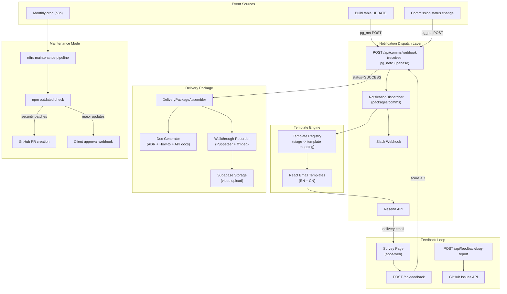

# Automated Project Lifecycle Communication System

## Current State

The codebase already has:

- **Supabase Realtime** enabled for `Build` table via `supabase_realtime` publication ([migration](packages/db/prisma/migrations/20260228000002_rls_realtime/migration.sql))
- **Postgres triggers** on Build failures (escalation at 3 failures) and Commission completion (pg_net webhook) ([triggers migration](packages/db/prisma/migrations/20260228000003_triggers/migration.sql))
- **Slack alerting** via webhook in [n8n-alert route](apps/web/src/app/api/webhooks/n8n-alert/route.ts)
- **n8n build pipeline** with stage-by-stage execution ([build-pipeline.json](packages/n8n-nodes/workflows/build-pipeline.json))
- **Delivery routes** for verify/transfer ([apps/web/src/app/api/delivery/](apps/web/src/app/api/delivery/))
- **GitHub integration** via raw fetch in [review-generator.ts](packages/ai/src/repo-surgery/review-generator.ts)

**Missing**: No email service (Resend), no client-facing notifications, no feedback system, no delivery packaging, no maintenance automation, no i18n templates.

---

## Architecture




---

## Part 1: Database Schema Extensions

Add to [schema.prisma](packages/db/prisma/schema.prisma):

```prisma
enum NotificationChannel {
  EMAIL
  SLACK
}

enum NotificationEvent {
  BUILD_STARTED
  BUILD_PROGRESS
  BUILD_COMPLETE
  TRANSFER_READY
  SUPPORT_REQUIRED
  FEEDBACK_REQUEST
  MAINTENANCE_REPORT
}

model ClientPreference {
  id              String   @id @default(cuid())
  commissionId    String   @unique
  locale          String   @default("en")  // "en" | "zh"
  slackWebhookUrl String?
  maintenanceOptIn Boolean @default(false)
  commission      Commission @relation(fields: [commissionId], references: [id])
}

model Notification {
  id           String             @id @default(cuid())
  commissionId String
  event        NotificationEvent
  channel      NotificationChannel
  subject      String
  bodySnapshot String
  metadata     Json?
  sentAt       DateTime           @default(now())
  commission   Commission         @relation(fields: [commissionId], references: [id])
}

model DeliveryPackage {
  id           String   @id @default(cuid())
  buildId      String   @unique
  githubUrl    String
  hostingUrl   String?
  adrDocument  String
  howToGuide   String
  apiDocs      String?
  videoUrl     String?
  assembledAt  DateTime @default(now())
  build        Build    @relation(fields: [buildId], references: [id])
}

model Feedback {
  id           String   @id @default(cuid())
  commissionId String
  rating       Int
  comment      String?
  createdAt    DateTime @default(now())
  commission   Commission @relation(fields: [commissionId], references: [id])
}

model MaintenancePlan {
  id              String   @id @default(cuid())
  commissionId    String   @unique
  githubUrl       String
  lastCheckAt     DateTime?
  nextCheckAt     DateTime?
  dependencyState Json?
  createdAt       DateTime @default(now())
  updatedAt       DateTime @updatedAt
  commission      Commission @relation(fields: [commissionId], references: [id])
}
```

Add corresponding relations to `Commission` and `Build` models. New Supabase migration to add `Build` stage-change trigger using `pg_net` (extending the pattern from the existing `notify_n8n_commission_completed` trigger).

---

## Part 2: New Package `packages/comms`

New workspace package for all communication logic. Dependencies: `resend`, `@react-email/components`, `@slack/webhook`.

### Structure

```
packages/comms/
  src/
    index.ts                    # Public API
    dispatcher.ts               # NotificationDispatcher class
    channels/
      resend.ts                 # Resend email sender
      slack.ts                  # Slack webhook sender
    templates/
      registry.ts               # Event -> template mapping
      components/
        Layout.tsx              # Shared email layout (header, footer)
        ProgressBar.tsx         # Visual progress component
      en/
        build-started.tsx
        build-progress.tsx
        build-complete.tsx
        transfer-ready.tsx
        support-required.tsx
        feedback-request.tsx
      zh/
        build-started.tsx
        build-progress.tsx
        build-complete.tsx
        transfer-ready.tsx
        support-required.tsx
        feedback-request.tsx
    delivery/
      package-assembler.ts      # Orchestrates delivery package creation
      doc-generator.ts          # Generates ADR, how-to guide, API docs
      walkthrough-recorder.ts   # Puppeteer + ffmpeg video capture
    feedback/
      survey-handler.ts         # Process ratings, trigger support workflow
      bug-report.ts             # GitHub issue creation
    maintenance/
      dependency-checker.ts     # npm outdated wrapper
      pr-creator.ts             # Automated PR for patches
    i18n/
      strings.ts                # Shared copy strings (EN + CN)
```

### Key Design Decisions

- **Template content**: Each email template receives structured data (not free text). Example for `build-progress`:

```typescript
  interface BuildProgressData {
    clientName: string
    projectName: string
    stage: string           // "Frontend Development"
    progressPercent: number  // 60
    progressDetail: string   // "6/10 screens complete"
    nextStep: string         // "Testing authentication flows"
    estimatedCompletion?: string
  }
  

```

- **Stage-to-notification mapping** (in `dispatcher.ts`):
  - Build status changes to `RUNNING` with stage `DB_ARCHITECT` -> "Build Started" email
  - Build stage changes to `FRONTEND` -> "50% Progress" email (calculated from pipeline position)
  - Build status changes to `SUCCESS` -> "Build Complete" email + trigger delivery package assembly
  - Commission status changes to `COMPLETED` -> "Transfer Ready" email + feedback request (delayed 24h)
  - Commission status changes to `ESCALATED` -> "Support Required" email
- **Resend with SMTP fallback**: Try Resend first; on failure, fall back to SMTP config from Commission credentials.
- **Slack**: If `ClientPreference.slackWebhookUrl` is set, send a parallel Slack message with the same content (adapted to Slack Block Kit format).

---

## Part 3: Supabase Trigger + Webhook Route

### New Postgres Trigger (migration)

Extend the trigger pattern from the existing `notify_n8n_commission_completed`:

```sql
CREATE OR REPLACE FUNCTION notify_build_stage_change()
RETURNS TRIGGER AS $body$
BEGIN
  IF NEW.status IS DISTINCT FROM OLD.status THEN
    PERFORM net.http_post(
      url := current_setting('app.comms_webhook_url', true),
      body := jsonb_build_object(
        'type', 'build_stage_change',
        'build_id', NEW.id,
        'commission_id', NEW."commissionId",
        'old_status', OLD.status,
        'new_status', NEW.status,
        'github_url', NEW."githubUrl",
        'vercel_url', NEW."vercelUrl",
        'failure_count', NEW."failureCount"
      ),
      headers := '{"Content-Type": "application/json"}'::jsonb
    );
  END IF;
  RETURN NEW;
END;
$body$ LANGUAGE plpgsql;
```

### API Route: `apps/web/src/app/api/comms/webhook/route.ts`

Receives the pg_net POST, looks up `ClientPreference` + `Commission`, resolves the correct template + locale, dispatches via `NotificationDispatcher`.

---

## Part 4: Delivery Package Assembly

Triggered when build reaches `SUCCESS`. Orchestrated by `DeliveryPackageAssembler`:

1. **Doc generation** (`doc-generator.ts`): Uses the existing `@mismo/ai` package (LLM) to generate:
  - ADR from PRD + build artifacts (architecture decisions, trade-offs)
  - "How to modify" guide (plain language, targeted at non-technical clients)
  - API documentation from backend output (OpenAPI/route list)
2. **Walkthrough video** (`walkthrough-recorder.ts`):
  - Launches Puppeteer against `Build.vercelUrl`
  - Navigates key routes (extracted from PRD `userStories`)
  - ffmpeg captures the browser viewport to MP4
  - Uploads to Supabase Storage bucket `walkthrough-videos`
  - Stores public URL in `DeliveryPackage.videoUrl`
3. Saves assembled `DeliveryPackage` to database and triggers the "Transfer Ready" email.

---

## Part 5: Feedback Loop

### Survey Page: `apps/web/src/app/feedback/[commissionId]/page.tsx`

- Displays 1-10 rating (pre-filled from email click if inline rating used)
- Optional comment text area
- Bug report form (title + description + steps to reproduce)

### API Routes

- `POST /api/feedback` - saves `Feedback` record; if `rating < 7`, updates Commission status to `ESCALATED` and sends "Support Required" notification
- `POST /api/feedback/bug-report` - creates GitHub issue using the existing fetch-based GitHub API pattern (from [review-generator.ts](packages/ai/src/repo-surgery/review-generator.ts)) with a structured bug report template

### Email Integration

The "Feedback Request" email includes:

- 10 clickable number buttons (1-10), each linking to `/feedback/[commissionId]?rating=N`
- A "Report a Bug" CTA linking to `/feedback/[commissionId]?tab=bug`

---

## Part 6: Maintenance Mode (n8n Workflow)

### New Workflow: `packages/n8n-nodes/workflows/maintenance-pipeline.json`

- **Trigger**: n8n Schedule node (monthly cron)
- **Step 1**: Query all `MaintenancePlan` records where `maintenanceOptIn = true`
- **Step 2**: For each repo, clone and run `npm outdated --json`
- **Step 3**: Classify updates:
  - **Security patches** (patch version): Auto-create PR via GitHub API
  - **Minor updates**: Auto-create PR, add "needs-review" label
  - **Major updates**: Create issue requesting client approval, send email notification
- **Step 4**: Update `MaintenancePlan.dependencyState` and `lastCheckAt`
- **Step 5**: Send monthly maintenance report email to client

### New n8n Node: `MaintenanceChecker`

Follows the existing node pattern (see [ErrorLogger.node.ts](packages/n8n-nodes/nodes/ErrorLogger/ErrorLogger.node.ts)):

- Input: `githubUrl`, `branch`
- Output: `{ outdated: [...], securityIssues: [...], recommendations: [...] }`

---

## Part 7: Environment Variables

Add to [.env.example](.env.example):

```
# Communication System
RESEND_API_KEY=
RESEND_FROM_EMAIL=updates@mismo.dev
SMTP_HOST=                    # Fallback SMTP
SMTP_PORT=587
SMTP_USER=
SMTP_PASS=
COMMS_WEBHOOK_SECRET=         # Verify pg_net webhook authenticity
```

Set Supabase app setting for the webhook URL:

```sql
ALTER DATABASE postgres SET app.comms_webhook_url = 'https://your-app.com/api/comms/webhook';
```

---

## Email Template Tone Examples

**Build Started (EN)**:

> "Hi [Name], your project [Project Name] is now being built. We've started with the database architecture -- expect your first progress update within the hour."

**Build Progress (EN)**:

> "Good news -- [Project Name] is 60% complete. We've finished 6 of 10 screens in the frontend. Currently working on authentication flows. Estimated completion: [time]."

**Build Started (CN)**:

> "[Name] 您好，您的项目 [Project Name] 已开始构建。我们正在进行数据库架构设计，预计一小时内发送首次进度更新。"

---

## Dependencies to Add


| Package                                      | Where            | Purpose                     |
| -------------------------------------------- | ---------------- | --------------------------- |
| `resend`                                     | `packages/comms` | Email delivery              |
| `@react-email/components`                    | `packages/comms` | Email template components   |
| `@slack/webhook`                             | `packages/comms` | Slack integration           |
| `puppeteer`                                  | `packages/comms` | Walkthrough video recording |
| `fluent-ffmpeg` + `@ffmpeg-installer/ffmpeg` | `packages/comms` | Video encoding              |
| `@supabase/storage-js`                       | `packages/comms` | Video upload                |


