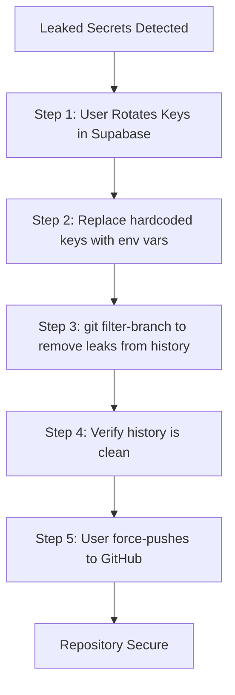

1.  **Advise Immediate Secret Rotation**: I will inform you that the Supabase Service Role Key and Anon Key must be rotated immediately in your Supabase dashboard.
2.  **Clean Current Test Scripts**: I will replace the hardcoded secrets in `create-test-user.sh` and `create-test-auth-session.mjs` with references to environment variables.
3.  **Purge History**: I will use `git filter-branch` to entirely remove the versions of these files that contained secrets from the repository's history.
    - Since the files were only introduced in commit `ab6c14a`, I will rewrite history from that point forward.
    - I will verify that the secrets are no longer searchable in the git history.
4.  **Final Restoration**: I will re-add the "clean" versions of the test scripts to the current commit.
5.  **GitHub Cleanup**: You will need to force-push the rewritten history to your GitHub repository to complete the process.

**Warning**: Rewriting history is a destructive operation. If others are working on this repository, they will need to re-clone or reset their local branches.

