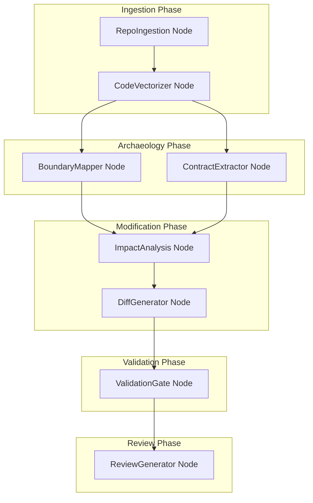
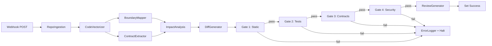

# Repo Surgery + BMAD-Archaeology Pipeline

## Architecture

Hybrid approach: core logic in `packages/ai/src/repo-surgery/`, orchestrated by n8n custom nodes following the existing GSD Build Pipeline pattern.




**Data flow through n8n:** Each node calls core logic from `@mismo/ai` and passes structured JSON to the next node. Qdrant serves as the shared vector store across phases.

---

## 1. Schema and Types

**File:** [packages/ai/src/repo-surgery/schema.ts](packages/ai/src/repo-surgery/schema.ts)

Zod schemas for:

- `RepoSurgeryRequest` - repoUrl, branch, changeRequest, forbiddenFiles, prdJson
- `IngestionResult` - cloneDir, clocStats, dependencies (outdated/current), recentActivity, astData (functions, routes, schemas)
- `VectorizationResult` - collectionName, chunkCount, embeddingModel
- `BoundaryMap` - zones: `{ core: string[], shell: string[], adapter: string[], safeToModify: string[] }`
- `ExtractedContracts` - apiContracts, dataContracts, interfaceContracts
- `ImpactReport` - filesToTouch, filesToAvoid, riskLevel, reasoning
- `GeneratedDiff` - diffs (file, hunks, unified diff string), newTests
- `ValidationResult` - gates array: `{ name, passed, details, blockers }`
- `ReviewOutput` - prUrl, confidenceScore, riskSummary, rollbackBranch

**Prisma model addition** in [packages/db/prisma/schema.prisma](packages/db/prisma/schema.prisma):

```prisma
enum RepoSurgeryStatus {
  INGESTING
  VECTORIZING
  ANALYZING
  MODIFYING
  VALIDATING
  REVIEWING
  COMPLETED
  FAILED
  HALTED
}

model RepoSurgery {
  id              String              @id @default(cuid())
  commissionId    String?
  repoUrl         String
  branch          String              @default("main")
  surgeryBranch   String?
  status          RepoSurgeryStatus   @default(INGESTING)
  changeRequest   String
  boundaryMap     Json?
  contracts       Json?
  impactReport    Json?
  validationGates Json?
  confidenceScore Float?
  prUrl           String?
  cloneDir        String?
  qdrantCollection String?
  errorLogs       Json?
  failureCount    Int                 @default(0)
  humanReview     Boolean             @default(false)
  createdAt       DateTime            @default(now())
  updatedAt       DateTime            @updatedAt

  commission      Commission?         @relation(fields: [commissionId], references: [id])
}
```

Also add `repoSurgeries RepoSurgery[]` to the `Commission` model.

---

## 2. Qdrant + Vectorization Engine

**File:** [packages/ai/src/repo-surgery/vectorization.ts](packages/ai/src/repo-surgery/vectorization.ts)

Extends the existing Qdrant pattern from [packages/ai/src/design-enforcement/reference-system.ts](packages/ai/src/design-enforcement/reference-system.ts) but with real embeddings.

- `**CodeChunker`** class:
  - Reads files, splits into 100-line chunks with 20-line overlap
  - Preserves metadata: filePath, language, startLine, endLine, functionContext
  - Skips binary files, node_modules, .git, vendor, dist
- `**CodeEmbedder`** class:
  - Uses OpenAI `text-embedding-3-large` (3072 dimensions) via the existing provider system
  - Batches embeddings (max 100 per request to stay within API limits)
  - Falls back to `text-embedding-3-small` (1536 dims) if configured
- `**CodeVectorStore`** class:
  - Creates per-surgery Qdrant collection: `repo_surgery_{surgeryId}`
  - Stores points with payload: `{ filePath, language, startLine, endLine, content, functionName?, className? }`
  - `search(query: string, limit: number, filter?: { language?, filePath? })` - semantic search
  - `cleanup(surgeryId: string)` - deletes collection after 30 days

---

## 3. Ingestion Engine

**File:** [packages/ai/src/repo-surgery/ingestion.ts](packages/ai/src/repo-surgery/ingestion.ts)

- `**RepoIngestion`** class:
  - `clone(repoUrl, branch, workspaceDir)` - `git clone --branch {branch} --depth=100` into isolated workspace dir (default: `/tmp/mismo-surgery/{surgeryId}`)
  - `analyzeComplexity(dir)` - Runs `cloc` via child_process, parses JSON output
  - `analyzeDependencies(dir)` - Reads `package.json`/`requirements.txt`/`go.mod`, checks for outdated packages via `npm outdated --json` / `pip list --outdated --format=json`
  - `analyzeActivity(dir)` - `git log --oneline -50 --format=json`, extracts recent contributors, hot files, last modified dates
  - `parseAST(dir)` - Delegates to AST parser

**File:** [packages/ai/src/repo-surgery/ast-parser.ts](packages/ai/src/repo-surgery/ast-parser.ts)

- `**ASTParser`** class:
  - TypeScript/JavaScript: Uses `ts-morph` to extract function signatures, class definitions, exports, API route handlers (Next.js `app/api/**/route.ts` pattern, Express `router.`* pattern)
  - Python: Uses `tree-sitter-python` for function defs, class defs, Flask/FastAPI route decorators
  - SQL/Prisma: Regex-based extraction of CREATE TABLE, model definitions
  - Returns `ASTData`: `{ functions: FunctionSignature[], routes: APIRoute[], schemas: DatabaseSchema[] }`

**Dependencies to add:** `ts-morph`, `tree-sitter`, `tree-sitter-python` (to `packages/ai/package.json`)

---

## 4. BMAD Archaeology: Boundary Mapper + Contract Extractor

**File:** [packages/ai/src/repo-surgery/boundary-mapper.ts](packages/ai/src/repo-surgery/boundary-mapper.ts)

Uses LLM + heuristics to classify every file/directory into BMAD zones:

- **Heuristic pass** (fast, rule-based):
  - `Core`: Database migrations, auth modules, core business logic (files with many dependents)
  - `Shell`: API routes, webhook handlers, external service clients
  - `Adapter`: Middleware, serializers, DTOs, mappers
  - `SafeToModify`: Isolated features, utilities with few dependents, UI components
- **LLM refinement pass**: Sends the heuristic classification + AST data to LLM for refinement. Uses `generateObject` (same as [packages/ai/src/n8n/generator.ts](packages/ai/src/n8n/generator.ts) pattern) to produce final `BoundaryMap`.
- **Dependency graph**: Builds import graph from AST data to calculate "blast radius" of each file.

**File:** [packages/ai/src/repo-surgery/contract-extractor.ts](packages/ai/src/repo-surgery/contract-extractor.ts)

- **API contract extraction**: Parses route files for HTTP methods, paths, request/response shapes (from TypeScript types, Zod schemas, or JSDoc)
- **Data contract extraction**: Parses Prisma schemas, SQL migrations, Mongoose models, TypeORM entities
- **Interface contract extraction**: Finds external API calls (fetch, axios, SDK usage) and documents expected request/response formats
- Output: `ExtractedContracts` with structured JSON per contract type

---

## 5. Impact Analysis + Diff Generation

**File:** [packages/ai/src/repo-surgery/impact-analysis.ts](packages/ai/src/repo-surgery/impact-analysis.ts)

- `**ImpactAnalysisAgent`** class:
  - Input: `changeRequest` (e.g., "Add OAuth"), `BoundaryMap`, `ExtractedContracts`
  - Queries Qdrant with semantic search: "Find all auth-related code", "Find all login/session code"
  - Cross-references results against boundary map to classify:
    - Files to touch (in `safeToModify` or `adapter` zones)
    - Files to avoid (in `core` zone, or marked `forbidden` in PRD)
    - Risk assessment per file (low/medium/high based on zone + dependency count)
  - LLM synthesizes final `ImpactReport` with reasoning

**File:** [packages/ai/src/repo-surgery/diff-generator.ts](packages/ai/src/repo-surgery/diff-generator.ts)

- `**DiffGenerationAgent`** class:
  - Input: `ImpactReport`, current file contents (from Qdrant chunks + full file reads), `changeRequest`, `ExtractedContracts`
  - Generates changes file-by-file using LLM with structured output:
    - Produces unified diff format (`--- a/path\n+++ b/path\n@@ ... @@`)
    - Constraint enforcement: refuses to modify forbidden files, validates against contracts
  - **Test generation**: For each modified file, generates corresponding test file
  - Implementation rules:
    - Never modify `core` files (BMAD enforcement)
    - Changes must satisfy existing contracts (API responses match old schema)
    - New features go in `adapter` layer when possible
    - Database migrations: additive only (new columns, new tables), never destructive

---

## 6. Validation Gates

**File:** [packages/ai/src/repo-surgery/validation-gates.ts](packages/ai/src/repo-surgery/validation-gates.ts)

Four sequential gates, each returns `{ passed: boolean, details: string, blockers?: string[] }`:

- **Gate 1: Static Analysis**
  - Runs ESLint (`npx eslint --format=json`), TypeScript type-check (`npx tsc --noEmit`), or pylint
  - Optionally runs SonarQube scan via Docker (`SONARQUBE_URL` env var)
  - Pass criteria: No new errors introduced (compares before/after)
- **Gate 2: Regression Testing**
  - Detects test runner: Jest (`jest.config`), Pytest (`pytest.ini`/`conftest.py`), Go test
  - Runs existing test suite, captures results JSON
  - Runs newly generated tests
  - Pass criteria: All existing tests pass, new tests pass
- **Gate 3: Contract Validation**
  - Leverages existing [packages/contract-checker](packages/contract-checker/src/index.ts) pattern
  - Compares extracted contracts (from Phase 2) against modified code
  - API responses must match old schema structure
  - Pass criteria: No contract violations
- **Gate 4: Security Scan**
  - `npm audit --json` / `pip-audit --format=json` for dependency vulnerabilities
  - Scans diffs for hardcoded secrets (regex patterns from existing [packages/ai/src/code-review](packages/ai/src/code-review/) secret scanner)
  - Pass criteria: No high/critical vulnerabilities, no secrets in diff

**Halt behavior:** If any gate fails, pipeline status -> `HALTED`, `humanReview` -> true, returns specific failure context.

---

## 7. Review Generator

**File:** [packages/ai/src/repo-surgery/review-generator.ts](packages/ai/src/repo-surgery/review-generator.ts)

- `**ReviewGenerator`** class:
  - Creates feature branch: `surgery/{surgeryId}/{change-slug}`
  - Applies diffs via `git apply`
  - Commits with detailed message
  - Pushes branch (never to main)
  - Creates GitHub PR via Octokit (`@octokit/rest`):
    - Title: "[Repo Surgery] {changeRequest summary}"
    - Body: Impact report, boundary analysis, validation gate results, files changed
    - Labels: `repo-surgery`, risk level (`low-risk`/`medium-risk`/`high-risk`)
  - **Confidence scoring**: Weighted formula:
    - All 4 gates pass: +40%
    - Only `safeToModify`/`adapter` files touched: +25%
    - No `core` files near blast radius: +15%
    - All new tests pass: +10%
    - Low dependency count on changed files: +10%
  - Outputs: `>= 85%` -> "Safe to merge", `60-84%` -> "Review recommended", `< 60%` -> "Manual review required"
  - Keeps original branch reference in `RepoSurgery.branch` for 30-day rollback

---

## 8. n8n Custom Nodes

Eight new nodes in [packages/n8n-nodes/nodes/](packages/n8n-nodes/nodes/), following the pattern from [GsdDependencyChecker.node.ts](packages/n8n-nodes/nodes/GsdDependencyChecker/GsdDependencyChecker.node.ts):


| Node              | n8n Name            | Input                                              | Output                                           |
| ----------------- | ------------------- | -------------------------------------------------- | ------------------------------------------------ |
| RepoIngestion     | `repoIngestion`     | repoUrl, branch, surgeryId                         | IngestionResult (cloneDir, clocStats, astData)   |
| CodeVectorizer    | `codeVectorizer`    | cloneDir, surgeryId                                | VectorizationResult (collectionName, chunkCount) |
| BoundaryMapper    | `boundaryMapper`    | astData, surgeryId                                 | BoundaryMap (core, shell, adapter, safe)         |
| ContractExtractor | `contractExtractor` | cloneDir, astData, surgeryId                       | ExtractedContracts                               |
| ImpactAnalysis    | `impactAnalysis`    | changeRequest, boundaryMap, contracts, surgeryId   | ImpactReport                                     |
| DiffGenerator     | `diffGenerator`     | impactReport, contracts, forbiddenFiles, surgeryId | GeneratedDiff                                    |
| ValidationGate    | `validationGate`    | cloneDir, diffs, contracts, gate (1-4)             | ValidationResult                                 |
| ReviewGenerator   | `reviewGenerator`   | diffs, validationResults, impactReport, surgeryId  | ReviewOutput (prUrl, confidence)                 |


Each node calls core logic via internal API routes (same HTTP pattern as GSD nodes calling microservices).

Register all 8 in [packages/n8n-nodes/package.json](packages/n8n-nodes/package.json) under `n8n.nodes`.

---

## 9. n8n Workflow JSON

**File:** [packages/n8n-nodes/workflows/repo-surgery-pipeline.json](packages/n8n-nodes/workflows/repo-surgery-pipeline.json)




Webhook trigger expects: `{ repoUrl, branch, changeRequest, forbiddenFiles?, prdJson?, commissionId? }`

Uses `GsdRetryWrapper` around each node for resilience. Uses `ErrorLogger` node on failures.

---

## 10. API Routes

New routes in [apps/internal/src/app/api/repo-surgery/](apps/internal/src/app/api/repo-surgery/):

- `**POST /api/repo-surgery/ingest**` - Clone + analyze a repo, return ingestion result
- `**POST /api/repo-surgery/analyze**` - Run boundary mapping + contract extraction on ingested repo
- `**POST /api/repo-surgery/modify**` - Run impact analysis + diff generation
- `**POST /api/repo-surgery/validate**` - Run validation gates on generated diffs
- `**POST /api/repo-surgery/pipeline**` - Run full end-to-end pipeline (calls all above in sequence)

Each route follows the existing pattern from [apps/internal/src/app/api/n8n/pipeline/route.ts](apps/internal/src/app/api/n8n/pipeline/route.ts).

---

## 11. Docker Isolation and Safety

- **Workspace isolation**: Each surgery gets its own directory under `/tmp/mismo-surgery/{surgeryId}/`
- **Branch safety**: All modifications on `surgery/{surgeryId}/`* branches, never on main/master
- **Rollback**: `RepoSurgery.branch` preserves original branch ref for 30 days; cleanup cron deletes old surgery branches + Qdrant collections
- **Qdrant collection lifecycle**: Per-surgery collection created during vectorization, deleted after 30 days
- **Docker volume** (for Studio 3 deployment): Mount surgery workspace as volume, run validation tools (ESLint, SonarQube, test runners) inside containers

---

## 12. Environment Variables

Add to [.env.example](.env.example):

```env
# Repo Surgery Pipeline
REPO_SURGERY_WORKSPACE=/tmp/mismo-surgery
QDRANT_URL=http://localhost:6333
QDRANT_API_KEY=
OPENAI_API_KEY=  # Already exists, used for text-embedding-3-large
SONARQUBE_URL=   # Optional, for Gate 1 enhanced static analysis
SONARQUBE_TOKEN= # Optional
```

---

## Key Integration Points

- **Existing Qdrant client**: Extend pattern from `reference-system.ts`, replace mock embeddings with real OpenAI embeddings
- **Existing contract-checker**: Gate 3 can delegate to the existing `/check-api` and `/check-types` endpoints
- **Existing error-logger**: Use for failure tracking, circuit breaker on repeated failures
- **Existing code-review module**: Reuse secret scanner patterns for Gate 4
- **Existing GsdRetryWrapper**: Wrap each n8n node call for resilience
- **Existing providers system**: Use `getActiveModel()` for LLM calls in boundary mapping, impact analysis, diff generation

