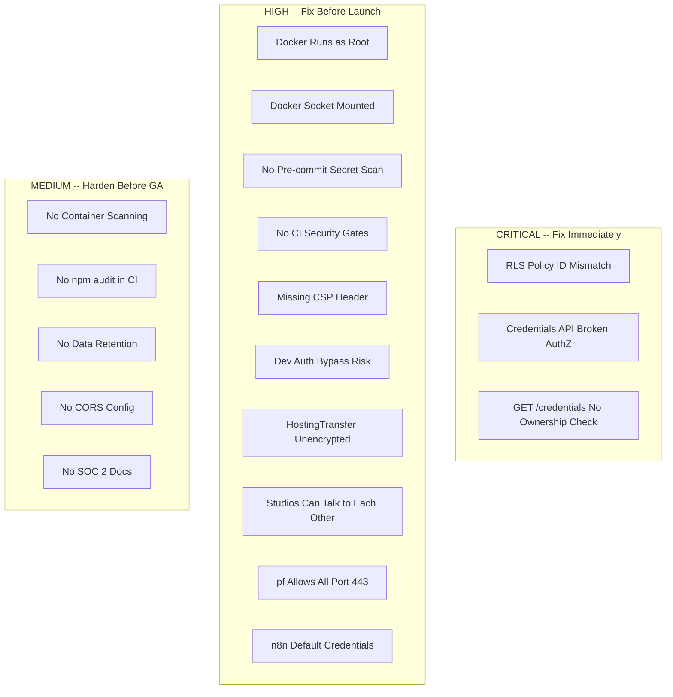

# Security Audit and Hardening Plan

## Critical Findings Summary

The audit uncovered **3 critical vulnerabilities**, **10 high-severity gaps**, and numerous medium-priority hardening opportunities.




---

## CRITICAL-1: RLS Policy ID Mismatch (Broken Data Isolation)

**Bug**: [packages/db/prisma/migrations/20260228000002_rls_realtime/migration.sql](packages/db/prisma/migrations/20260228000002_rls_realtime/migration.sql) compares `auth.uid()::text` (Supabase Auth UUID) with `Commission."userId"` (Prisma cuid). These are different identifier formats, so **RLS policies never match** -- meaning authenticated users see zero rows via RLS, but service-role bypasses it entirely.

**Fix**: Create a new migration that:

1. Adds a `supabaseAuthId` column (or lookup function) to resolve the mismatch
2. Rewrites Commission RLS policy:

```sql
CREATE POLICY "Users can view their own commissions"
  ON "Commission" FOR SELECT
  USING (
    EXISTS (
      SELECT 1 FROM "User" u
      WHERE u.id = "Commission"."userId"
        AND u."supabaseAuthId" = auth.uid()::text
    )
  );
```

1. Same pattern for Build RLS policy (join through Commission -> User)
2. Add INSERT/UPDATE/DELETE policies (currently only SELECT exists)

---

## CRITICAL-2: Credentials API Ownership Bug

**Bug**: [apps/web/src/app/api/credentials/route.ts](apps/web/src/app/api/credentials/route.ts) line 38 compares `commission.userId !== user.id` where `user.id` is the Supabase auth UUID but `commission.userId` is a Prisma cuid. This means:

- POST: All credential saves fail with 404 (masked bug)
- GET (line 92): **No ownership check at all** -- any authenticated user can read any commission's credential metadata

**Fix**:

- Resolve the Prisma `User` record via `supabaseAuthId = user.id`, then compare `commission.userId` to `User.id`
- Add ownership check to GET route
- Add RLS on the `Credential` table as defense-in-depth

---

## CRITICAL-3: Tables Missing RLS

Only `Commission` and `Build` have RLS. These tables are exposed without RLS:

- `Credential` (contains encrypted secrets)
- `Project`, `Delivery`, `HostingTransfer` (contains `clientCredentials` JSON -- **unencrypted**)
- `ClientPreference` (contains `slackWebhookUrl`)
- `User`, `SystemConfig`, `AuditLog`, `StudioMetrics`

**Fix**: New migration enabling RLS on all tables with appropriate policies.

---

## Task A: Network Boundaries (Tailscale ACLs + pf)

### A1: Restrict Studio-to-Studio Communication

Current [acl.hujson](acl.hujson) allows `tag:studio` to reach `tag:studio` on ports 22/5432/5678/6379. This means Studio 2 (running client A's build) can reach Studio 3 (running client B's build).

**Fix**: Remove `tag:studio:22,5432,5678,6379` from studio ACL. Studios should only reach `tag:admin` (Studio 1 / control plane). Worker-to-worker communication is not needed since BullMQ goes through Redis on Studio 1.

### A2: IP-Whitelist Outbound Traffic

Current [tailscale.sh](tailscale.sh) pf rules allow `pass out quick proto tcp to any port { 443, 53 }` -- any HTTPS destination. This is too broad.

**Fix**: Replace with explicit IP/CIDR allowlist:

```pf
# Supabase (*.supabase.co)
pass out quick proto tcp to 13.248.0.0/16 port 443
pass out quick proto tcp to 76.223.0.0/16 port 443
# GitHub
pass out quick proto tcp to 140.82.112.0/20 port 443
pass out quick proto tcp to 185.199.108.0/22 port 443
# Kimi API (moonshot.cn)
pass out quick proto tcp to <kimi-cidr> port 443
# DNS via Tailscale MagicDNS only
pass out quick proto udp to 100.100.100.100 port 53
```

Note: Exact CIDRs need to be resolved at deploy time. Consider a script that resolves hostnames and updates the pf anchor.

### A3: Verify MacBook-Only Entry Point

Current ACLs correctly restrict SSH (port 22) access. **Add**: Tailscale SSH with key-only auth (disable password auth in `sshd_config` on all Studios).

**Fix**: Add to [mac-studios-iac/ansible/setup-studio.yml](mac-studios-iac/ansible/setup-studio.yml):

```yaml
- name: Disable password SSH auth
  lineinfile:
    path: /etc/ssh/sshd_config
    regexp: '^#?PasswordAuthentication'
    line: 'PasswordAuthentication no'
- name: Disable challenge-response auth
  lineinfile:
    path: /etc/ssh/sshd_config
    regexp: '^#?ChallengeResponseAuthentication'
    line: 'ChallengeResponseAuthentication no'
```

---

## Task B: Application Boundaries (n8n)

### B1: n8n Credential Hardening

- Change default n8n admin credentials (set `N8N_DEFAULT_USER_EMAIL` and `N8N_DEFAULT_USER_PASSWORD` in compose env)
- n8n does not natively support 2FA; **workaround**: place n8n behind a Tailscale-only Caddy reverse proxy with mTLS or Tailscale Funnel auth
- Add `N8N_USER_MANAGEMENT_DISABLED=false` and `N8N_DIAGNOSTICS_ENABLED=false` to compose

### B2: Workflow Isolation

n8n in queue mode shares a single Postgres database. Workflows are not tenant-isolated.

**Fix**: Add `N8N_PERSONALIZATION_ENABLED=false`, ensure all workflow data references commission IDs, and add BMAD contract validation at workflow trigger boundaries (the existing `BmadValidator` n8n node already handles this).

### B3: Redis Security

Current Redis in [docker-compose.main.yml](docker/n8n-ha/docker-compose.main.yml) requires password (`--requirepass`), which is good. **Additional hardening**:

- Remove port mapping for Redis (it should not be exposed to host network, only Docker network)
- Add `maxmemory-policy allkeys-lru` and `rename-command FLUSHDB ""` to prevent accidental data loss
- Add `rename-command CONFIG ""` to block runtime config changes

---

## Task C: Data Boundaries (Supabase)

### C1: Fix RLS Policies (see CRITICAL-1 above)

### C2: Encrypt HostingTransfer.clientCredentials

[packages/db/prisma/schema.prisma](packages/db/prisma/schema.prisma) stores `clientCredentials` as plain JSON. Apply the same pgsodium encryption pattern used for `Credential.encryptedTokens`.

### C3: Data Retention Policies

No auto-deletion exists. Create a Supabase Edge Function or cron job that:

- Deletes completed commission build logs after 90 days
- Deletes audit logs after 1 year
- Deletes `Credential` records 30 days after commission delivery
- Anonymizes User PII upon account deletion request

### C4: Add RLS Tests

Create a test script (`packages/db/scripts/test-rls.ts`) that:

1. Creates a Supabase client with the anon key + a valid JWT for User A
2. Attempts to read User B's commissions, builds, credentials
3. Asserts zero rows returned
4. Attempts to read without a JWT entirely
5. Asserts zero rows returned

---

## Task D: Code Boundaries (CI Security Gates)

### D1: Add Security Jobs to CI

Extend [.github/workflows/ci.yml](.github/workflows/ci.yml):

```yaml
  security:
    runs-on: ubuntu-latest
    steps:
      - uses: actions/checkout@v4
      - uses: pnpm/action-setup@v4
      - run: pnpm install --frozen-lockfile
      - name: Dependency audit
        run: pnpm audit --audit-level=high
      - name: Secret scan
        uses: gitleaks/gitleaks-action@v2
        env:
          GITHUB_TOKEN: ${{ secrets.GITHUB_TOKEN }}

  container-scan:
    runs-on: ubuntu-latest
    steps:
      - uses: actions/checkout@v4
      - name: Build images
        run: |
          docker build -f packages/bmad-validator/Dockerfile -t bmad-validator .
          docker build -f packages/contract-checker/Dockerfile -t contract-checker .
          docker build -f packages/gsd-dependency/Dockerfile -t gsd-dependency .
          docker build -f docker/n8n-ha/Dockerfile.farm-monitor -t farm-monitor .
      - name: Trivy scan
        uses: aquasecurity/trivy-action@master
        with:
          scan-type: image
          image-ref: bmad-validator
          severity: CRITICAL,HIGH
          exit-code: 1
```

### D2: Pre-commit Hooks

Add a `.gitleaks.toml` config and install hooks via Husky:

```json
// package.json (root)
"scripts": {
  "prepare": "husky"
}
```

`.husky/pre-commit`:

```bash
#!/bin/sh
npx gitleaks protect --staged --verbose
pnpm lint-staged
```

### D3: Docker Image Hardening

For all Dockerfiles (`packages/bmad-validator/Dockerfile`, `packages/contract-checker/Dockerfile`, `packages/gsd-dependency/Dockerfile`, `docker/cursor-agent/Dockerfile`, `docker/n8n-ha/Dockerfile.farm-monitor`):

- Add non-root user: `RUN addgroup -S app && adduser -S app -G app` then `USER app`
- Use multi-stage builds (builder stage + slim production stage)
- Pin base image digests for reproducibility
- Remove Docker socket mount from [docker-compose.worker.yml](docker/n8n-ha/docker-compose.worker.yml) unless strictly required; if needed, use `docker.sock` with read-only mount and a socket proxy

### D4: Secret Scanning in Generated Code

The existing [packages/ai/src/code-review/secret-scanner.ts](packages/ai/src/code-review/secret-scanner.ts) is robust. **Enhancement**: wire it into a pre-delivery gate that blocks `Delivery` creation if secrets are found (currently it sets `secretScanPassed` but does not block).

---

## Task E: Application Security Headers

### E1: Add Content-Security-Policy

Current [apps/web/src/middleware.ts](apps/web/src/middleware.ts) has basic headers but is missing CSP and HSTS.

**Add to `SECURITY_HEADERS`**:

```typescript
'Content-Security-Policy': "default-src 'self'; script-src 'self' 'unsafe-inline' 'unsafe-eval'; style-src 'self' 'unsafe-inline'; img-src 'self' data: https:; connect-src 'self' https://*.supabase.co wss://*.supabase.co; frame-ancestors 'none';",
'Strict-Transport-Security': 'max-age=31536000; includeSubDomains',
'Permissions-Policy': 'camera=(), microphone=(), geolocation=()',
```

### E2: Remove Dev Auth Bypass Risk

The dev bypass at line 36-45 of `middleware.ts` checks `process.env.NODE_ENV === 'development'`, which is safe. However, add an explicit production guard:

```typescript
if (process.env.NODE_ENV === 'production' && process.env.NEXT_PUBLIC_DEV_BYPASS_AUTH) {
  throw new Error('DEV_BYPASS_AUTH must not be set in production')
}
```

---

## Task F: Secret Rotation

### F1: Pre-launch Key Rotation

Create a `scripts/rotate-secrets.sh` checklist script:

1. Stripe keys (regenerate in dashboard, update `.env`)
2. GitHub tokens (create new fine-grained PAT, revoke old)
3. Kimi API key (regenerate via Moonshot dashboard)
4. Supabase service role key (regenerate in Supabase dashboard)
5. n8n encryption key (generate new `openssl rand -hex 32`, re-encrypt credentials)
6. Redis password (generate new, update all compose files)
7. Update `Credential.rotationDate` for all stored credentials

### F2: Automated Rotation Reminders

The existing [packages/farm-monitor/src/collectors/security.ts](packages/farm-monitor/src/collectors/security.ts) already checks `Credential.rotationDate`. Extend to also check platform key ages (Stripe, GitHub) via their respective APIs.

---

## Task G: Penetration Testing

### G1: OWASP ZAP Automated Scan

Add to CI as a scheduled workflow (weekly):

```yaml
name: DAST Scan
on:
  schedule:
    - cron: '0 3 * * 1'
jobs:
  zap-scan:
    runs-on: ubuntu-latest
    steps:
      - uses: zaproxy/action-full-scan@v0.11.0
        with:
          target: 'https://staging.mismo.dev'
          rules_file_name: '.zap/rules.tsv'
```

### G2: Template Vulnerability Review

Review generated code templates in [packages/templates/src/configs.ts](packages/templates/src/configs.ts) for:

- XSS: Ensure React's default escaping is not bypassed (`dangerouslySetInnerHTML`)
- CSRF: Verify SameSite cookie attributes in Supabase auth config
- SQL Injection: Not applicable (Prisma parameterizes queries)

---

## Task H: Compliance

### H1: GDPR

- Flesh out [packages/ai/src/compliance/gdpr.ts](packages/ai/src/compliance/gdpr.ts) from template-only to enforced
- Create Data Processing Agreement (DPA) template in `docs/compliance/dpa-template.md`
- Implement actual data export endpoint (currently mock in `apps/web/src/app/api/compliance/gdpr/route.ts`)
- Implement actual data deletion with cascading cleanup

### H2: SOC 2 Controls Documentation

Create `docs/compliance/soc2-controls.md` documenting:

- Access control (Tailscale ACLs, SSH keys, RLS)
- Change management (GitHub PR reviews, CI gates)
- Monitoring (farm-monitor, alert system)
- Incident response (security responder actions)
- Data encryption (pgsodium at rest, Tailscale in transit)

### H3: HIPAA (Conditional)

If handling health data: create `docs/compliance/baa-template.md` (Business Associate Agreement). Flag healthcare commissions via the existing `complianceAddon` in pricing.

---

## Implementation Priority


| Priority | Task                                             | Effort |
| -------- | ------------------------------------------------ | ------ |
| P0       | CRITICAL-1: Fix RLS ID mismatch                  | 2h     |
| P0       | CRITICAL-2: Fix credentials API authz            | 1h     |
| P0       | CRITICAL-3: Add RLS to all tables                | 3h     |
| P0       | A1: Remove studio-to-studio ACL                  | 15min  |
| P1       | B1: n8n credential hardening                     | 1h     |
| P1       | D1: CI security gates (audit + gitleaks + trivy) | 2h     |
| P1       | D3: Docker non-root + multi-stage                | 2h     |
| P1       | E1: CSP + HSTS headers                           | 30min  |
| P1       | F1: Secret rotation                              | 2h     |
| P2       | A2: IP-whitelist pf rules                        | 1h     |
| P2       | A3: Disable password SSH                         | 30min  |
| P2       | B3: Redis hardening                              | 30min  |
| P2       | C2: Encrypt HostingTransfer creds                | 1h     |
| P2       | C3: Data retention policies                      | 2h     |
| P2       | C4: RLS tests                                    | 2h     |
| P2       | D2: Pre-commit hooks                             | 1h     |
| P2       | E2: Dev bypass guard                             | 15min  |
| P3       | G1: OWASP ZAP setup                              | 1h     |
| P3       | G2: Template vuln review                         | 1h     |
| P3       | H1-H3: Compliance docs                           | 3h     |


