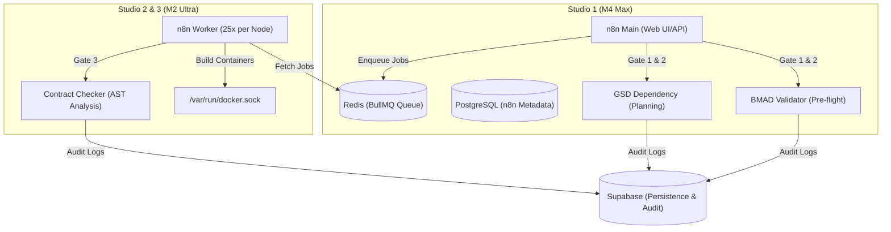

# n8n High-Availability Orchestrator Deployment Guide

This guide provides the necessary steps to deploy the n8n High-Availability (HA) Orchestrator using the Hybrid Adapter pattern on Mac Studio hardware.

## Architecture Overview

The system utilizes a Hybrid Adapter pattern where custom n8n nodes act as clients to dedicated microservices for compute-intensive tasks.



## Hardware Mapping

- **Studio 1 (M4 Max)**: Control Plane. Hosts the n8n main instance, Redis queue, PostgreSQL database, and the pre-flight/planning validation microservices (`BMAD-Validator` and `GSD-Dependency`).
- **Studio 2 & 3 (M2 Ultra)**: Execution Plane. Each node runs 25 n8n workers (50 total) and the `Contract-Checker` microservice for AST analysis.

## Role Setup

### Control Plane (Studio 1)

1.  Navigate to `docker/n8n-ha/`.
2.  Configure `.env` using `.env.example`.
3.  Deploy using `docker-compose.main.yml`:
    ```bash
    docker compose -f docker-compose.main.yml up -d
    ```

### Execution Plane (Studio 2 & 3)

1.  Navigate to `docker/n8n-ha/`.
2.  Configure `.env` using `.env.example`. Ensure `MAIN_NODE_IP` points to Studio 1's IP.
3.  Deploy using `docker-compose.worker.yml`:
    ```bash
    docker compose -f docker-compose.worker.yml up -d
    ```

## Validation Gates (BMAD Pattern)

The deployment implements validation gates integrated into n8n workflows:

- **Gate 1: BMAD Validator (Pre-flight)**: Triggered upon PRD receipt. Checks for `tech_stack`, `api_contracts`, `data_boundaries`, and `feasibility_score`. Logs rejections to `Build.errorLogs`.
- **Gate 2: GSD Dependency Checker (Planning)**: Triggered after swarm plan generation. Parses `gsd_decomposition` from PRD, performs topological sorting, cycle detection. Logs to `Build.executionIds`.
- **Gate 3: Contract Checker (Execution)**: Triggered upon task completion. API contract validation (path, method, status codes) and type safety checks (Zod schema usage, no `any` types). Logs violations to `Build.errorLogs` and triggers escalation after 3 failures.

## GSD Build Pipeline (Full Stack)

The complete build pipeline adds agent microservices and error logging. See [docs/gsd-build-pipeline.md](../../docs/gsd-build-pipeline.md) for full documentation.

| Service | Main Compose | Worker Compose | Port |
|---------|--------------|----------------|------|
| bmad-validator | ✓ | — | 3001→3000 |
| gsd-dependency | ✓ | — | 3002→3000 |
| contract-checker | — | ✓ | 3003→3000 |
| db-architect | (add Dockerfile) | — | 3001 |
| backend-engineer | (add Dockerfile) | — | 3002 |
| frontend-developer | (add Dockerfile) | — | 3003 |
| devops | (add Dockerfile) | — | 3004 |
| error-logger | (add Dockerfile) | — | 3005 |

For local development, run agents via `./scripts/start-build-pipeline.sh`. Set `GSD_DEPENDENCY_URL`, `BMAD_VALIDATOR_URL`, `CONTRACT_CHECKER_URL`, `DB_ARCHITECT_URL`, etc. in n8n environment when using external agent hosts.

## Supabase Integration

All gates log decisions to the `Build` and `Commission` tables in Supabase:

- `Build.executionIds`: Tracks the execution order of agents.
- `Build.errorLogs`: Stores detailed validation and contract violation logs.
- `Build.status` & `Build.failureCount`: Triggers human review escalation via database triggers.
- `Build.studioAssignment`: Tracks which Studio node handled the execution.

## Configuration & Resiliency

- **Shared Encryption**: All nodes must use the same `N8N_ENCRYPTION_KEY`.
- **Redis Failures**: Workers use a 30s timeout (`QUEUE_BULL_REDIS_TIMEOUT`) and auto-reconnection logic to handle intermittent connectivity drops between Studio nodes.
