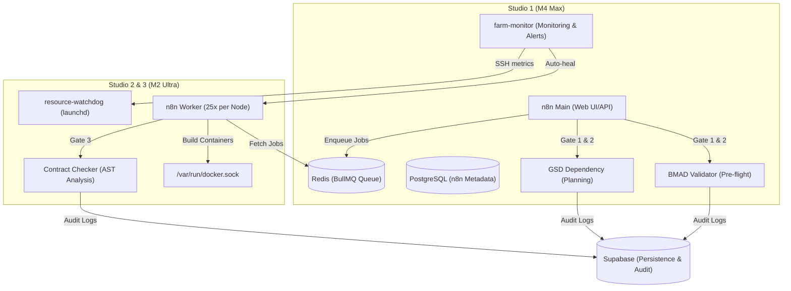

# n8n High-Availability Orchestrator Deployment Guide

This guide provides the necessary steps to deploy the n8n High-Availability (HA) Orchestrator using the Hybrid Adapter pattern on Mac Studio hardware.

## Architecture Overview

The system utilizes a Hybrid Adapter pattern where custom n8n nodes act as clients to dedicated microservices for compute-intensive tasks.



## Hardware Mapping

- **Studio 1 (M4 Max)**: Control Plane. Hosts the n8n main instance, Redis queue, PostgreSQL database, the pre-flight/planning validation microservices (`BMAD-Validator` and `GSD-Dependency`), and the **farm-monitor** service for agent farm monitoring and automated recovery.
- **Studio 2 & 3 (M2 Ultra)**: Execution Plane. Each node runs 25 n8n workers (50 total), the `Contract-Checker` microservice, and **resource-watchdog** (launchd) for local resource alerts.

## Role Setup

### Control Plane (Studio 1)

1.  Navigate to `docker/n8n-ha/`.
2.  Configure `.env` using `.env.example`.
3.  Deploy using `docker-compose.main.yml`:
    ```bash
    docker compose -f docker-compose.main.yml up -d
    ```

### Execution Plane (Studio 2 & 3)

1.  Navigate to `docker/n8n-ha/`.
2.  Configure `.env` using `.env.example`. Ensure `MAIN_NODE_IP` points to Studio 1's IP.
3.  Deploy using `docker-compose.worker.yml`:
    ```bash
    docker compose -f docker-compose.worker.yml up -d
    ```

## Validation Gates (BMAD Pattern)

The deployment implements validation gates integrated into n8n workflows:

- **Gate 1: BMAD Validator (Pre-flight)**: Triggered upon PRD receipt. Checks for `tech_stack`, `api_contracts`, `data_boundaries`, and `feasibility_score`. Logs rejections to `Build.errorLogs`.
- **Gate 2: GSD Dependency Checker (Planning)**: Triggered after swarm plan generation. Parses `gsd_decomposition` from PRD, performs topological sorting, cycle detection. Logs to `Build.executionIds`.
- **Gate 3: Contract Checker (Execution)**: Triggered upon task completion. API contract validation (path, method, status codes) and type safety checks (Zod schema usage, no `any` types). Logs violations to `Build.errorLogs` and triggers escalation after 3 failures.

## GSD Build Pipeline (Full Stack)

The complete build pipeline adds agent microservices and error logging. See [docs/gsd-build-pipeline.md](../../docs/gsd-build-pipeline.md) for full documentation.

| Service               | Main Compose     | Worker Compose | Port                        |
| --------------------- | ---------------- | -------------- | --------------------------- |
| bmad-validator        | ✓                | —              | 3011→3000                   |
| gsd-dependency        | ✓                | —              | 3010→3000                   |
| contract-checker      | —                | ✓              | 3012→3000                   |
| farm-monitor          | ✓                | —              | (internal; no exposed port) |
| db-architect          | (add Dockerfile) | —              | 3030                        |
| backend-engineer      | (add Dockerfile) | —              | 3031                        |
| frontend-developer    | (add Dockerfile) | —              | 3032                        |
| devops                | (add Dockerfile) | —              | 3033                        |
| error-logger          | (add Dockerfile) | —              | 3034                        |
| mobile-scaffold       | (add Dockerfile) | —              | 3020                        |
| mobile-feature        | (add Dockerfile) | —              | 3021                        |
| mobile-build-engineer | (add Dockerfile) | —              | 3022                        |
| store-submission      | (add Dockerfile) | —              | 3023                        |

For local development:

- **GSD (web) pipeline**: `./scripts/start-build-pipeline.sh`
- **Mobile pipeline**: `./scripts/start-mobile-pipeline.sh`

Set `GSD_DEPENDENCY_URL`, `BMAD_VALIDATOR_URL`, `CONTRACT_CHECKER_URL`, `DB_ARCHITECT_URL`, `MOBILE_SCAFFOLD_URL`, `MOBILE_FEATURE_URL`, etc. in n8n environment when using external agent hosts. See [docs/mobile-build-pipeline.md](../../docs/mobile-build-pipeline.md) for mobile pipeline details.

## Delivery Pipeline (Post-Build Source Code Transfer)

When Commission status becomes COMPLETED, the `notify_n8n_commission_completed` trigger sends a webhook to n8n. Import `packages/n8n-nodes/workflows/delivery-pipeline.json` and configure the webhook URL in the Supabase pg_net function to point to your n8n instance (e.g. `https://n8n.yourdomain.com/webhook/delivery-pipeline`).

**Required for Delivery Pipeline:**

- `GITHUB_TOKEN` — GitHub PAT with repo, admin:org, user scope
- `GITHUB_DELIVERY_ORG` — Agency org (e.g. `mismo-agency`)
- `DELIVERY_AGENT_URL` — Internal app URL (e.g. `http://internal-app:3001` when internal app runs in Docker)

Delivery API routes run in `apps/internal`; no separate microservices. See [docs/delivery-pipeline.md](../../docs/delivery-pipeline.md).

## Supabase Integration

All gates log decisions to the `Build` and `Commission` tables in Supabase:

- `Build.executionIds`: Tracks the execution order of agents.
- `Build.errorLogs`: Stores detailed validation and contract violation logs.
- `Build.status` & `Build.failureCount`: Triggers human review escalation via database triggers.
- `Build.studioAssignment`: Tracks which Studio node handled the execution.

## Agent Farm Monitoring

The **farm-monitor** service runs on Studio 1 and provides:

- **Resource alerts**: RAM >85% (5 min) → reduce worker concurrency; Disk >90% → docker prune; CPU >95% (10 min) → kill hung builds
- **API health**: Kimi latency >3s → switch to DeepSeek; Supabase down → queue builds locally; GitHub rate limit → pause new builds
- **Build recovery**: 3x commission failure → escalate via SMS; stuck builds >1hr → auto-kill; success rate <80% → P0 alert
- **Security**: Unauthorized SSH → ban IP; outbound anomalies → alert; credential expiry reminders

The **resource-watchdog** (launchd) runs locally on each Studio every 60s and can trigger alerts even when the network is degraded.

See [docs/agent-farm-monitoring.md](../../docs/agent-farm-monitoring.md) for full documentation. Deploy monitoring via:

```bash
cd mac-studios-iac/ansible
ansible-playbook setup-monitoring.yml -K
```

## Configuration & Resiliency

- **Shared Encryption**: All nodes must use the same `N8N_ENCRYPTION_KEY`.
- **Redis Failures**: Workers use a 30s timeout (`QUEUE_BULL_REDIS_TIMEOUT`) and auto-reconnection logic to handle intermittent connectivity drops between Studio nodes.
