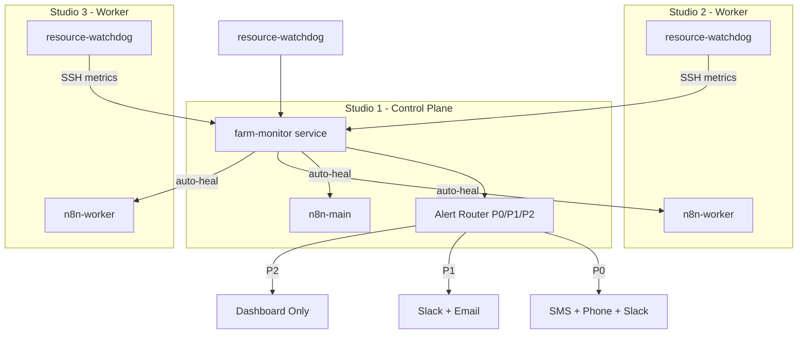

# Agent Farm Monitoring and Automated Recovery

Comprehensive monitoring, automated recovery, and multi-channel alerting for the 3-node Mac Studio agent farm.

## Architecture



Two main components:

1. **resource-watchdog.sh** — Lightweight shell script on each Studio via launchd; performs local resource checks and automated responses without network dependency
2. **farm-monitor** — TypeScript service on Studio 1 that collects metrics, monitors APIs, tracks builds, routes alerts, and triggers recovery

## Monitoring Rules

### Resource Alerts

| Condition | Duration  | Action                                      | Priority |
| --------- | --------- | ------------------------------------------- | -------- |
| RAM >85%  | >5 min    | Alert + reduce n8n worker concurrency to 10 | P1       |
| Disk >90% | immediate | Alert + run `docker system prune -af`       | P1       |
| CPU >95%  | >10 min   | Alert + kill containers running >90 min     | P0       |

### API Health

| Condition                          | Action                                                                                   |
| ---------------------------------- | ---------------------------------------------------------------------------------------- |
| Kimi API latency >3s               | Switch to DeepSeek temporarily; revert after 5 healthy checks                            |
| Supabase connection drops          | Queue builds locally; retry every 30s; alert on reconnect                                |
| GitHub rate limit (<100 remaining) | Pause new repo creation; set `github_builds_paused` in SystemConfig; queue for next hour |

### Build Failures

| Condition                      | Action                                                     |
| ------------------------------ | ---------------------------------------------------------- |
| Same commission fails 3 times  | Escalate to human via SMS; set status ESCALATED            |
| Build stuck >1 hour            | Auto-kill container; mark Build FAILED; notify client (P1) |
| Success rate <80% in last hour | Page developer (P0 critical)                               |

### Security

| Condition                  | Action                                               |
| -------------------------- | ---------------------------------------------------- |
| Unauthorized SSH attempt   | Ban IP immediately via `pfctl -t blocked_ips -T add` |
| Strange outbound traffic   | Alert (P0 possible breach)                           |
| Credential expiry <30 days | P1 alert with rotation reminder                      |

## Notification Channels

| Priority          | Channels                                     |
| ----------------- | -------------------------------------------- |
| **P0 (Critical)** | SMS + Phone call + Slack + Email + Dashboard |
| **P1 (Warning)**  | Slack + Email + Dashboard                    |
| **P2 (Info)**     | Dashboard only                               |

## Deployment

### Prerequisites

- Twilio account for P0 SMS and phone alerts
- `SLACK_ALERT_WEBHOOK_URL` for Slack notifications
- `ALERT_EMAIL` and `ALERT_PHONE_NUMBER` for developer contact

### Studio 1 (Control Plane)

The farm-monitor runs as a Docker service alongside n8n-main. It is included in `docker-compose.main.yml`.

Required env vars (see `docker/n8n-ha/.env.example`):

- `SUPABASE_URL`, `SUPABASE_SERVICE_ROLE_KEY`
- `STUDIO_1_SSH_HOST`, `STUDIO_2_SSH_HOST`, `STUDIO_3_SSH_HOST` (or use inventory defaults)
- `SSH_USER`, SSH keys mounted at `/root/.ssh`
- `KIMI_API_KEY`, `DEEPSEEK_API_KEY`, `GITHUB_TOKEN` for API health checks
- `SLACK_ALERT_WEBHOOK_URL`, `ALERT_EMAIL`, `ALERT_PHONE_NUMBER`
- Twilio: `TWILIO_ACCOUNT_SID`, `TWILIO_AUTH_TOKEN`, `TWILIO_FROM_NUMBER`

### All Studios: Resource Watchdog

Deploy via Ansible:

```bash
cd mac-studios-iac/ansible
ansible-playbook setup-monitoring.yml -K
```

This deploys:

- `resource-watchdog.sh` and launchd plist (runs every 60s)
- pf `blocked_ips` table for SSH ban
- Log rotation for `/var/log/mismo-watchdog*.log`

### Studio 3: Backup Verification

The `setup-monitoring.yml` playbook also deploys a daily backup verification job (3:00 AM) that:

- Restores latest backup from `/Volumes/1TB_Storage/supabase_backups/` to a temp DB
- Verifies key tables (User, Commission, Build, Project) have data
- Reports P2 on success, P0 on failure to farm-monitor

## Monitoring Intervals

| Collector                    | Interval  | Notes                  |
| ---------------------------- | --------- | ---------------------- |
| Resource watchdog (local)    | 60s       | launchd on each Studio |
| Resource collector (central) | 2 min     | SSH from Studio 1      |
| API health (Kimi, Supabase)  | 30s       | Direct HTTP            |
| API health (GitHub)          | 60s       | Rate limit check       |
| Build tracker                | 30s       | Supabase query         |
| Security scanner             | 5 min     | Log parsing via SSH    |
| n8n container health         | 2 min     | Docker ps via SSH      |
| Backup verification          | Daily 3am | launchd on Studio 3    |

## Dashboard and Status Interpretation

For interpreting fleet status in the Mission Control dashboard (worker vs no-worker, container counts, expected idle state), see [fleet-dashboard-reference.md](./fleet-dashboard-reference.md).

## Dashboard API

The internal app exposes farm status and alerts:

- **GET `/api/farm/status`** — Overall health, unresolved P0/P1 count, active provider, GitHub pause state
- **GET `/api/farm/alerts`** — Recent alerts (filter by `priority`, `category`, `unresolved`)
- **PATCH `/api/farm/alerts`** — Resolve alert: `{ "id": "...", "action": "resolve" }`

## Auto-Heal

- **n8n worker crash**: If worker container is missing, farm-monitor restarts it via `docker compose up -d`
- **Worker restart loop**: >5 restarts in 10 min triggers P0 alert

## Manual Scripts

For ad-hoc checks without the full farm-monitor:

```bash
# Cluster resource status (CPU, RAM, disk per Studio)
./mac-studios-iac/scripts/monitoring/cluster-health.sh

# n8n queue depth per Studio
./mac-studios-iac/scripts/monitoring/build-status.sh
```

## See Also

- [Data Management & Retention](ops/data-management.md) — DB pruning, in-memory alert cooldown pruning, write resilience, and automated retention for long-running stability.
