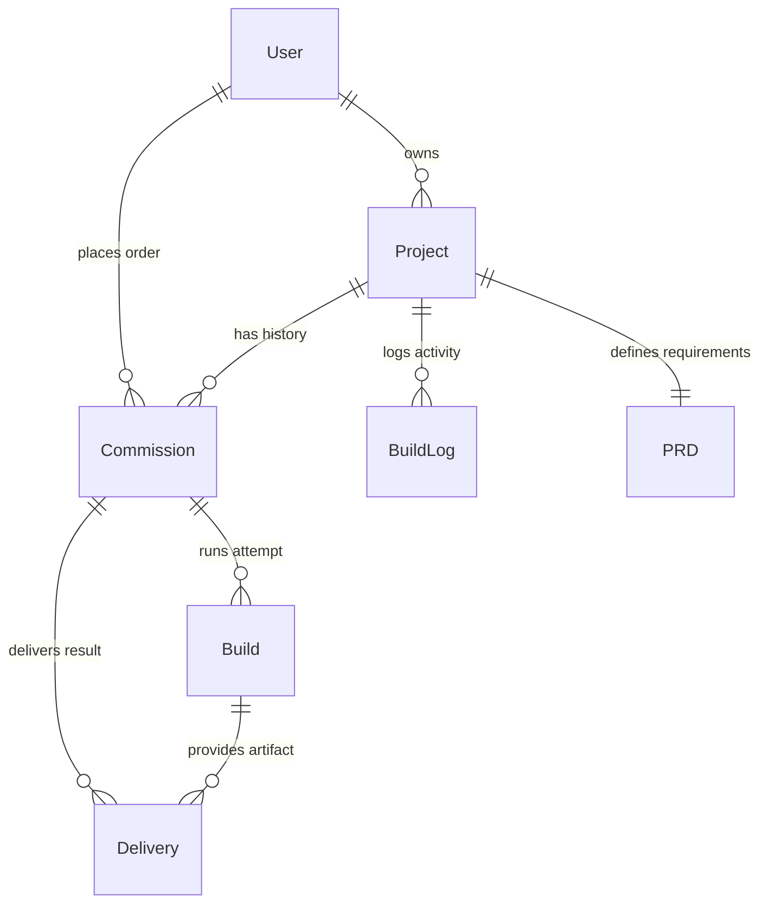

# API: Supabase Schema Overview

This document provides a curated overview of the core database tables and their relationships within the Mismo system.

---

## 🧱 Core Tables

The database is built on **PostgreSQL** (via Supabase) and managed using **Prisma**.

### 1. `User`
- **Purpose**: Stores information about clients, engineers, and admins.
- **Key Fields**: `supabaseAuthId`, `role`, `stripeCustomerId`.
- **Relationships**: Has many `Projects`, `Commissions`.

### 2. `Project`
- **Purpose**: High-level grouping for a client's work.
- **Key Fields**: `status`, `tier`, `safetyScore`, `contractSigned`.
- **Relationships**: Links to `User`, `PRD`, `Commissions`.

### 3. `Commission`
- **Purpose**: A specific build request/order.
- **Key Fields**: `status`, `paymentState`, `feasibilityScore`, `clientEmail`.
- **Relationships**: Links to `Project`, `Builds`, `Deliveries`, `RepoSurgeries`.

### 4. `Build`
- **Purpose**: A single attempt to fulfill a commission.
- **Key Fields**: `status`, `studioAssignment`, `kimiqTokensUsed`, `githubUrl`.
- **Relationships**: Links to `Commission`, `Deliveries`.

### 5. `BuildLog`
- **Purpose**: Real-time audit trail of agent activity.
- **Key Fields**: `stage`, `status`, `output`, `createdAt`.
- **Relationships**: Links to `Project`.

---

## 📊 Enum Definitions

Mismo uses several enums to strictly manage state transitions.

| Enum | Values |
|------|--------|
| **`Role`** | `CLIENT`, `ENGINEER`, `ADMIN` |
| **`CommissionStatus`** | `DRAFT`, `DISCOVERY`, `IN_PROGRESS`, `COMPLETED`, `CANCELLED`, `ESCALATED` |
| **`ProjectStatus`** | `DISCOVERY`, `REVIEW`, `CONTRACTED`, `DEVELOPMENT`, `VERIFICATION`, `DELIVERED` |
| **`PaymentState`** | `UNPAID`, `PARTIAL`, `FINAL` |
| **`AgentType`** | `DATABASE`, `BACKEND`, `FRONTEND`, `DEVOPS`, `QA`, `COORDINATOR` |

---

## 🔗 Key Relationships

---

## 🛡️ Security & RLS

Mismo implements **Row Level Security (RLS)** in Supabase to protect client data.

- **Clients**: Can only see their own `User`, `Project`, `Commission`, and `Build` records.
- **Engineers**: Can see all records for projects they are assigned to.
- **Admins**: Have full access to all records.

---

## 📡 Database Triggers

- **`notify_n8n_commission_completed`**: Fires when `Commission.status` becomes `COMPLETED`. Calls the delivery pipeline webhook.
- **`update_build_stage_metadata`**: Automatically updates the `Build` status and progress based on new `BuildLog` entries.
