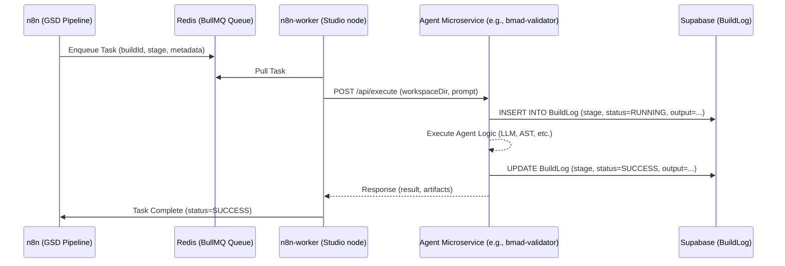

# Architecture: Agent Swarm Interaction

This document describes how the custom n8n nodes interact with the distributed agent microservices.

---

## 🤝 Hybrid Adapter Pattern

Mismo utilizes a **Hybrid Adapter Pattern** for agentic orchestration:
- **n8n (Control)**: Manages workflow state, retry logic, and task sequencing.
- **Microservices (Compute)**: Perform intensive tasks like code generation, AST analysis, and contract validation.



---

## 🛠️ n8n Custom Nodes (Hybrid Adapters)

Mismo's custom n8n nodes act as lightweight clients to the microservices. They are defined in `packages/n8n-nodes/nodes/`.

### Example: `GsdDependencyChecker`

**n8n Configuration:**
- `buildId`: (Expression) The ID of the current build.
- `workspaceDir`: (Expression) Path to the build directory on the worker node.
- `gsdDependencyUrl`: (Environment) URL of the GSD microservice.

**Internal Logic:**
1.  The node sends a POST request to `${GSD_DEPENDENCY_URL}/api/sort`.
2.  The microservice analyzes the project dependencies and returns a topological sort.
3.  The n8n node outputs the sorted list for the next workflow stage.

---

## 📡 Agent Communication

Agents communicate via structured JSON over HTTP.

**Example Task Payload (POST /api/execute):**
```json
{
  "buildId": "clxxx",
  "stage": "FRONTEND",
  "prompt": "Build a responsive landing page for a SaaS platform.",
  "workspaceDir": "/tmp/mismo-build/clxxx",
  "context": {
    "dbSchema": "...(previously generated schema)...",
    "apiSpec": "...(previously generated spec)..."
  }
}
```

**Example Response:**
```json
{
  "status": "SUCCESS",
  "artifacts": [
    { "path": "src/app/page.tsx", "content": "..." },
    { "path": "src/components/Hero.tsx", "content": "..." }
  ],
  "tokenUsage": { "kimi": 1250, "deepseek": 500 }
}
```

---

## 🛡️ Resilience & Retries

All agent interactions are wrapped in the **`GsdRetryWrapper`** n8n node:
- **Exponential Backoff**: Retries on network timeouts or LLM rate limits.
- **Human-in-the-loop**: If an agent fails 3 times, the build is paused and an alert is sent for manual intervention.
- **State Persistence**: Agents save their intermediate state to the `BuildLog` so they can resume after failure.
