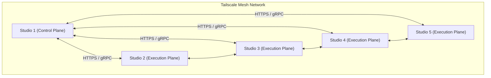

# Architecture: Network Topology

This document describes the network architecture and security configuration of the Mismo platform.

---

## 🌐 Tailscale Mesh Network

Mismo utilizes **Tailscale** to create a secure, flat mesh network between its distributed macOS nodes. This allows for seamless communication across different physical locations without exposing services to the public internet.

---

## 🔒 Zero-Trust Security (pf firewall)

Each node runs a custom **macOS pf (packet filter)** firewall configuration via `tailscale.sh`. This implements the principle of least privilege for outbound internet access.

**Allowed Outbound Destinations:**
- **Tailscale MagicDNS**: `100.100.100.100:53`
- **Supabase (AWS)**: `13.248.0.0/16`, `76.223.0.0/16` (Port 443)
- **GitHub**: `140.82.112.0/20`, `185.199.108.0/22`, `143.55.64.0/20` (Port 443)
- **Kimi API (Moonshot)**: `47.236.0.0/16` (Port 443)
- **npm Registry**: `104.16.0.0/12` (Port 443)

**Blocked:**
- All other outbound traffic to the public internet is blocked by default on Studio nodes.

---

## 📡 Service Advertisements

Services are advertised over the Tailscale network via their internal IP addresses (e.g., `100.x.y.z`).

| Service | Protocol | Access Scope | Description |
|---------|----------|--------------|-------------|
| **n8n-main** | HTTPS | Mesh-wide | Main Webhook/UI access |
| **postgres** | TCP/5432 | Mesh-wide | n8n metadata database |
| **redis** | TCP/6379 | Mesh-wide | BullMQ job queue |
| **bmad-validator** | HTTP/3001 | Mesh-wide | Pre-flight validation API |
| **contract-checker** | HTTP/3003 | Local-only | Execution-time validation API |
| **farm-monitor** | HTTPS | Mesh-wide | Health monitoring and recovery |

---

## 🛡️ Node Roles & Tags

Tailscale tags are used for access control and service discovery.

- **`tag:admin`**: Assigned to the Control Plane (Studio 1). Has full access to the mesh and can manage node configurations.
- **`tag:studio`**: Assigned to the Execution Plane nodes. Can connect to `n8n-main`, `postgres`, and `redis` on the Control Plane.
