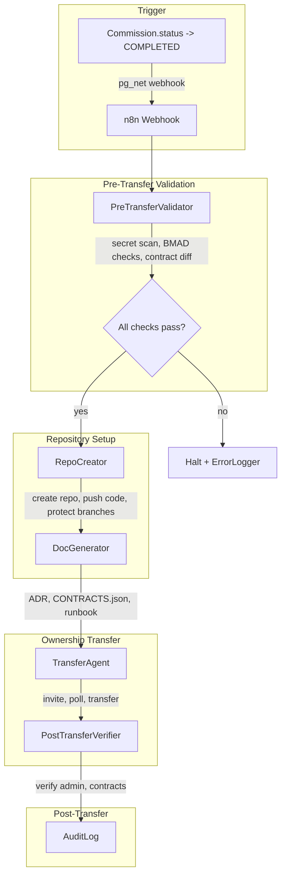

# GitHub Delivery Pipeline

Reference documentation for the BMAD-contract-verified source code delivery pipeline that automates repository creation, documentation generation, and ownership transfer to clients.

---

## Overview

The Delivery Pipeline runs after a build succeeds (Commission status becomes COMPLETED). It:

1. **Pre-Transfer Validation** — Secret scan, BMAD acceptance checks, contract diff, .env file gate
2. **Repository Creation** — Create repo under agency org, push code + BMAD docs
3. **Branch Protection** — Protect main, create development branch, configure GitHub Actions (if present)
4. **Ownership Transfer** — Invite client as admin, wait for acceptance (24h), transfer repo
5. **Post-Transfer Verification** — Verify admin access, repo accessibility, env contract match

### Pipeline Flow



---

## Prerequisites

- **GitHub Token** — Fine-grained PAT or classic token with `repo` (full control), `admin:org` (for org repos), `user` (for transfers). Set `GITHUB_TOKEN` and `GITHUB_DELIVERY_ORG` (e.g. `mismo-agency`).
- **Internal App** — Delivery API routes run in `apps/internal` (port 3001). n8n nodes call these via `DELIVERY_AGENT_URL`.
- **Build Workspace** — Path to Studio 2/3 build output (e.g. `/tmp/mismo-build/{buildId}`). Must contain no `.env` files and pass secret scan.
- **Contract Checker** — Optional; for contract diff gate. Set `CONTRACT_CHECKER_URL` (default `http://localhost:3012`).

---

## Components

### Core Library (`packages/ai/src/delivery/`)

| Module                 | Description                                                                                                                           |
| ---------------------- | ------------------------------------------------------------------------------------------------------------------------------------- |
| `GitHubClient`         | Raw fetch wrapper for GitHub REST API: createRepo, pushTreeCommit, setupBranchProtection, inviteCollaborator, transferRepo, createTag |
| `PreTransferValidator` | Secret scan (reuses `scanForSecrets`), .env file gate, BMAD acceptance, contract diff                                                 |
| `DocGenerator`         | Generates ADR, api_contracts.json, data_boundary_documentation.md, operational_runbook.md, hosting_contract.json                      |
| `TransferAgent`        | Orchestrates create → push → protect → tag → invite → poll (24h, 3 retries) → transfer → verify                                       |
| `PostTransferVerifier` | Admin access check, repo accessibility, env contract validation, optional health check, rollback plan                                 |

### n8n Custom Nodes

| Node                      | n8n Name                                | Description                                           |
| ------------------------- | --------------------------------------- | ----------------------------------------------------- |
| **PreTransferValidator**  | `n8n-nodes-mismo.preTransferValidator`  | Runs validation gates (secret, BMAD, contract, .env)  |
| **RepoCreator**           | `n8n-nodes-mismo.repoCreator`           | Creates repo under agency org, pushes code            |
| **DocGenerator**          | `n8n-nodes-mismo.docGenerator`          | Generates BMAD handoff documents                      |
| **DeliveryTransferAgent** | `n8n-nodes-mismo.deliveryTransferAgent` | Invites client, polls acceptance, transfers ownership |
| **PostTransferVerifier**  | `n8n-nodes-mismo.postTransferVerifier`  | Verifies admin access, env contract                   |

### Internal API Routes

| Endpoint                         | Method | Description                                                                            |
| -------------------------------- | ------ | -------------------------------------------------------------------------------------- |
| `/api/delivery/validate`         | POST   | Run pre-transfer validation                                                            |
| `/api/delivery/create-repo`      | POST   | Create repo + push code                                                                |
| `/api/delivery/generate-docs`    | POST   | Generate BMAD documentation                                                            |
| `/api/delivery/transfer`         | POST   | Execute transfer protocol                                                              |
| `/api/delivery/verify`           | POST   | Run post-transfer verification                                                         |
| `/api/delivery/pipeline`         | POST   | Full end-to-end pipeline                                                               |
| `/api/delivery/accept` (web app) | POST   | Client accepts or rejects deliverables; triggers Decidendi `clientAccept` when enabled |

---

## Environment Variables

| Variable               | Default                 | Description                                        |
| ---------------------- | ----------------------- | -------------------------------------------------- |
| `GITHUB_TOKEN`         | —                       | Required. GitHub PAT with repo + org + user scope  |
| `GITHUB_ORG`           | —                       | Fallback org (used if GITHUB_DELIVERY_ORG not set) |
| `GITHUB_DELIVERY_ORG`  | `mismo-agency`          | Org under which repos are created                  |
| `DELIVERY_AGENT_URL`   | `http://localhost:3001` | Internal app base URL for n8n nodes                |
| `CONTRACT_CHECKER_URL` | `http://localhost:3012` | Contract checker for diff gate                     |

---

## Database Model: Delivery

The `Delivery` model stores audit trail and status:

| Field                  | Type           | Description                                                      |
| ---------------------- | -------------- | ---------------------------------------------------------------- |
| `commissionId`         | string         | Links to Commission                                              |
| `buildId`              | string         | Links to Build                                                   |
| `repoName`             | string         | Repository name                                                  |
| `githubOrg`            | string         | Agency org                                                       |
| `clientGithubUsername` | string?        | Client to transfer to                                            |
| `status`               | DeliveryStatus | VALIDATING, CREATING_REPO, TRANSFERRING, COMPLETED, FAILED, etc. |
| `repoUrl`              | string?        | URL under agency org                                             |
| `transferredRepoUrl`   | string?        | URL after transfer                                               |
| `inviteRetryCount`     | int            | Retry count for invitation                                       |
| `auditLog`             | Json           | Array of `{ timestamp, step, status, details }`                  |

---

## BMAD Deliverable Contracts

Every delivery includes:

1. **Source Code** — GitHub repository with clean history, v1.0.0 tag
2. **Architecture Decision Record** — `docs/architecture_decision_record.md`
3. **Contract Documentation** — `docs/api_contracts.json`, `docs/data_boundary_documentation.md`
4. **Operational Runbook** — `docs/operational_runbook.md`
5. **Hosting Contract** — `docs/hosting_contract.json` (SLA, backup, monitoring, scaling limits)

---

## Pre-Transfer Validation Gates

| Gate                | Pass Criteria                                                          |
| ------------------- | ---------------------------------------------------------------------- |
| **Secret scan**     | No critical/high secrets in workspace (uses existing `scanForSecrets`) |
| **.env file**       | No `.env`, `.env.local`, `.env.production` in file list                |
| **BMAD acceptance** | Build status = SUCCESS, Commission status = COMPLETED                  |
| **Contract diff**   | API contracts match implemented routes (calls contract-checker)        |

---

## Transfer Protocol

1. Create repo under `{GITHUB_DELIVERY_ORG}/{repoName}`
2. Push build output + BMAD docs via Git Trees API
3. Set branch protection on main (no direct pushes, required reviews)
4. Create `development` branch
5. Tag `v1.0.0` on final commit
6. Invite client as collaborator (admin permission)
7. Poll every 4 hours for 24 hours (max 3 retry cycles with fresh invites)
8. On acceptance: transfer repo to client's account
9. Verify client has admin access via GitHub API

### Post-Delivery: Client Acceptance & Decidendi

After ownership transfer, the client reviews deliverables in the dashboard. When satisfied:

- **`POST /api/delivery/accept`** — Client submits `{ commissionId, accepted: true }`. Updates `clientAcceptedAt` and, if `ENABLE_DECIDENDI=true`, relays `clientAccept()` and `recordAccepted()` on-chain.
- **Final invoice** — Issued after acceptance; client pays remaining 60% via Stripe/PaymentAsia.

To relay delivery completion on-chain, the n8n delivery workflow (or equivalent) should call `POST /api/decidendi/milestone` with `{ commissionId, milestone: "DELIVERED", deliveryHash?: "0x..." }` after transfer completes. See [Decidendi Escrow](decidendi-escrow.md) and [API Webhook Specifications](api/webhook-specifications.md).

---

## n8n Workflow

**File:** `packages/n8n-nodes/workflows/delivery-pipeline.json`

- **Webhook:** `POST /webhook/delivery-pipeline`
- **Expected body:** `{ buildId, commissionId, repoName, workspaceDir, clientGithubUsername?, prdJson?, ... }`
- **Trigger:** `notify_n8n_commission_completed` DB trigger fires when Commission → COMPLETED

Configure the DB trigger webhook URL in Supabase (pg_net) to point to your n8n instance.

---

## Running Locally

The delivery pipeline runs via API routes in the internal app. No separate microservices. With `pnpm dev`:

```bash
# Test validation (requires workspaceDir with build output)
curl -X POST http://localhost:3001/api/delivery/validate \
  -H "Content-Type: application/json" \
  -d '{
    "workspaceDir": "/tmp/your-build-workspace",
    "buildStatus": "SUCCESS",
    "commissionStatus": "COMPLETED"
  }'

# Full pipeline (requires workspaceDir, buildId, commissionId, repoName, prdJson)
curl -X POST http://localhost:3001/api/delivery/pipeline \
  -H "Content-Type: application/json" \
  -d '{
    "buildId": "clxxx",
    "commissionId": "clyyy",
    "repoName": "client-project-abc",
    "workspaceDir": "/tmp/mismo-build/clxxx",
    "clientGithubUsername": "client-github-user",
    "prdJson": { "name": "Project ABC", "archTemplate": "MONOLITHIC_MVP" }
  }'
```

---

## Importing the Workflow

1. Open n8n (e.g. http://localhost:5678)
2. Create new workflow
3. **Import from File** → Select `packages/n8n-nodes/workflows/delivery-pipeline.json`
4. Build custom nodes: `pnpm --filter n8n-nodes-mismo build`
5. Ensure `GITHUB_TOKEN` and `GITHUB_DELIVERY_ORG` are set in n8n environment or `.env`
6. Set `DELIVERY_AGENT_URL` to your internal app URL (e.g. `http://internal-app:3001` in Docker)

---

## Related Documentation

- [GSD Build Pipeline](gsd-build-pipeline.md) — Build pipeline that produces the artifact delivered by this pipeline
- [Hosting Transfer Pipeline](hosting-transfer-pipeline.md) — Deploy and transfer hosting ownership (Vercel, Railway/Render, AWS/GCP, Self-Hosted) after code delivery
- [Repo Surgery Pipeline](repo-surgery-pipeline.md) — Modify existing codebases (different use case)
- [n8n HA Deployment](../docker/n8n-ha/DEPLOYMENT.md) — Production n8n deployment
- [README](../README.md) — Platform overview and setup
