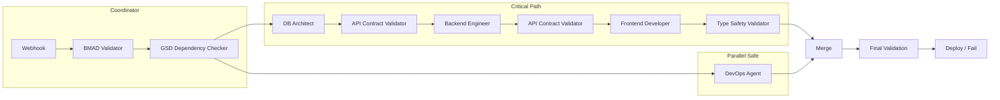

# GSD-Orchestrated Web App Build Pipeline

Reference documentation for the BMAD-contract build pipeline that coordinates specialized agents (Database Architect, Backend Engineer, Frontend Developer, DevOps) with strict contract enforcement between stages.

---

## Overview

The GSD Build Pipeline orchestrates web app generation from a BMAD-compliant PRD. Tasks are executed in topological order based on `gsd_decomposition` in the PRD. Each agent validates its output against BMAD contracts before proceeding. Failures trigger retries (3 attempts, exponential backoff); after 3 failures, the circuit breaks and a human review is flagged.

### Pipeline Flow



---

## Components

### n8n Custom Nodes

| Node                       | Package                                  | Description                                                               |
| -------------------------- | ---------------------------------------- | ------------------------------------------------------------------------- |
| **BmadValidator**          | `n8n-nodes-mismo.bmadValidator`          | Validates PRD completeness (tech_stack, api_contracts, data_boundaries)   |
| **GsdDependencyChecker**   | `n8n-nodes-mismo.gsdDependencyChecker`   | Parses PRD, builds dependency graph, topologically sorts tasks            |
| **GsdRetryWrapper**        | `n8n-nodes-mismo.gsdRetryWrapper`        | Wraps agent calls with retry (3x) + exponential backoff + circuit breaker |
| **ContractChecker**        | `n8n-nodes-mismo.contractChecker`        | API contract validation and type safety checks                            |
| **DbArchitectAgent**       | `n8n-nodes-mismo.dbArchitectAgent`       | Generates SQL schema + Zod schemas from data contracts                    |
| **BackendEngineerAgent**   | `n8n-nodes-mismo.backendEngineerAgent`   | Generates Next.js API routes + OpenAPI spec                               |
| **FrontendDeveloperAgent** | `n8n-nodes-mismo.frontendDeveloperAgent` | Generates React components + typed API client                             |
| **DevOpsAgent**            | `n8n-nodes-mismo.devOpsAgent`            | Generates Vercel/Terraform config + env template                          |
| **ErrorLogger**            | `n8n-nodes-mismo.errorLogger`            | Logs failures to centralized service with circuit breaker                 |

### Microservices

| Service                | Package                           | Port (local) | Description                                    |
| ---------------------- | --------------------------------- | ------------ | ---------------------------------------------- |
| **GSD Dependency**     | `@mismo/gsd-dependency`           | 3010         | Topological sort, PRD parsing, cycle detection |
| **BMAD Validator**     | `@mismo/bmad-validator`           | 3011         | PRD schema validation                          |
| **Contract Checker**   | `@mismo/contract-checker`         | 3012         | API contract and type safety validation        |
| **DB Architect**       | `@mismo/agent-db-architect`       | 3030         | SQL + Zod + TS types from data contracts       |
| **Backend Engineer**   | `@mismo/agent-backend-engineer`   | 3031         | Next.js routes + OpenAPI spec                  |
| **Frontend Developer** | `@mismo/agent-frontend-developer` | 3032         | React components + API client                  |
| **DevOps Agent**       | `@mismo/agent-devops`             | 3033         | Vercel config + env template + deploy script   |
| **Error Logger**       | `@mismo/error-logger`             | 3034         | Centralized failure logging, circuit breaker   |

> **Note:** For Docker deployments, validators use port 3000 (each in its own container). For local dev, use the ports above to run all services concurrently.

---

## Environment Variables

| Variable                 | Default (Docker)                 | Local dev example       |
| ------------------------ | -------------------------------- | ----------------------- |
| `GSD_DEPENDENCY_URL`     | `http://gsd-dependency:3000`     | `http://localhost:3010` |
| `BMAD_VALIDATOR_URL`     | `http://bmad-validator:3000`     | `http://localhost:3011` |
| `CONTRACT_CHECKER_URL`   | `http://contract-checker:3000`   | `http://localhost:3012` |
| `DB_ARCHITECT_URL`       | `http://db-architect:3030`       | `http://localhost:3030` |
| `BACKEND_ENGINEER_URL`   | `http://backend-engineer:3031`   | `http://localhost:3031` |
| `FRONTEND_DEVELOPER_URL` | `http://frontend-developer:3032` | `http://localhost:3032` |
| `DEVOPS_AGENT_URL`       | `http://devops-agent:3033`       | `http://localhost:3033` |
| `ERROR_LOGGER_URL`       | `http://error-logger:3034`       | `http://localhost:3034` |

For Docker, use service names as hostnames. For local development, set these in `.env` (see `.env.example`).

---

## Contract Enforcement

### Database Architect

- **Input:** `PRD.architecture.contracts.data`, `data_boundaries`
- **Output:** SQL DDL, Zod schemas, TypeScript types
- **Validation:** `required_entities`, `forbidden_fields`, `max_entities`

### Backend Engineer

- **Input:** DB schema (from DB Architect), `PRD.architecture.contracts.api`
- **Output:** Next.js API routes, OpenAPI 3.0 spec, TypeScript types
- **Validation:** Every contract endpoint has matching route with correct status code (e.g., POST /users → 201)

### Frontend Developer

- **Input:** Design DNA, Content JSON, Backend types
- **Output:** React components (using `@mismo/ui`), pages, typed API client
- **Validation:** No `any` types; API calls use Zod schemas; no raw `fetch()` without validation

### DevOps Agent

- **Input:** `PRD.architecture.hosting`, env requirements from Backend
- **Output:** `vercel.json`, `.env.template`, deployment script
- **Validation:** All required env vars appear in template

---

## Client Notifications (Project Lifecycle Communications)

When `Build.status` changes, a Postgres trigger (if migrations are applied) POSTs to `/api/comms/webhook`. The communication system then:

- **BUILD_STARTED** — When status becomes `RUNNING`
- **BUILD_COMPLETE** — When status becomes `SUCCESS`; triggers delivery package assembly
- **SUPPORT_REQUIRED** — When status becomes `FAILED` (or Commission escalates after 3 failures)

Notifications use Resend (or SMTP fallback) and optionally Slack. Templates support EN and CN. See [Project Lifecycle Communications](project-lifecycle-communications.md) for full documentation.

---

## Error Handling (GSD Pattern)

1. **Task failure** → Log to Supabase `Build.errorLogs` with source, timestamp, context
2. **Retry** → 3 attempts with exponential backoff (1s, 2s, 4s)
3. **Circuit break** → After 3 failures, set `Build.status=FAILED`, `humanReview=true`
4. **Critical path** (Database) → Halts entire build
5. **Non-critical** → Continue, flag for later

---

## Running Locally

### Option A: Start Pipeline Services Script

```bash
./scripts/start-build-pipeline.sh
```

Starts all microservices (GSD, BMAD, Contract Checker, DB Architect, Backend Engineer, Frontend Developer, DevOps, Error Logger) in the background. Requires `DATABASE_URL` and `DIRECT_URL` in `.env`.

### Option B: Individual Services

```bash
# Validators and orchestration
pnpm --filter @mismo/gsd-dependency dev      # Port 3000
pnpm --filter @mismo/bmad-validator dev      # Port 3000 (use different port via PORT=3006)
pnpm --filter @mismo/contract-checker dev    # Port 3000 (use PORT=3007)

# Agents
pnpm --filter @mismo/agent-db-architect dev      # Port 3030
pnpm --filter @mismo/agent-backend-engineer dev # Port 3031
pnpm --filter @mismo/agent-frontend-developer dev # Port 3032
pnpm --filter @mismo/agent-devops dev             # Port 3033

# Error logging
pnpm --filter @mismo/error-logger dev  # Port 3034
```

### Option C: Docker Compose (n8n HA)

For production-style deployment with n8n, see [docker/n8n-ha/DEPLOYMENT.md](../docker/n8n-ha/DEPLOYMENT.md). The main compose includes `bmad-validator`, `gsd-dependency`; the worker compose includes `contract-checker`. Agent services can be added to the compose or run separately via the start script.

---

## n8n Workflow

The master workflow is at `packages/n8n-nodes/workflows/build-pipeline.json`.

### Webhook Trigger

- **Path:** `POST /build-pipeline`
- **Body:** `{ buildId, prdJson }` where `prdJson` is the BMAD PRD with:
  - `gsd_decomposition.tasks` — Array of `{ id, type, dependencies }`
  - `architecture.contracts.data` — Entities, fields, relations
  - `architecture.contracts.api` — API endpoint definitions
  - `architecture.hosting` — Provider, region, framework

### Example PRD snippet

```json
{
  "gsd_decomposition": {
    "tasks": [
      { "id": "database_architect", "type": "DATABASE", "dependencies": [] },
      { "id": "backend_engineer", "type": "BACKEND", "dependencies": ["database_architect"] },
      { "id": "frontend_developer", "type": "FRONTEND", "dependencies": ["backend_engineer"] },
      { "id": "devops", "type": "DEVOPS", "dependencies": [] }
    ]
  },
  "architecture": {
    "contracts": {
      "data": { "entities": [...] },
      "api": { "endpoints": [...] }
    },
    "hosting": { "provider": "vercel", "region": "iad1" }
  }
}
```

---

## Importing the Workflow

1. Open n8n (e.g., http://localhost:5678)
2. Create new workflow
3. **Import from File** → Select `packages/n8n-nodes/workflows/build-pipeline.json`
4. Ensure custom nodes are installed: `pnpm --filter n8n-nodes-mismo build` and link the package to n8n's custom nodes directory
5. Configure environment variables for each node (or use default URLs)

---

## Testing

```bash
# Build n8n nodes
pnpm --filter n8n-nodes-mismo build

# Test GSD topological sort
curl -X POST http://localhost:3000/sort \
  -H "Content-Type: application/json" \
  -d '{"agents":[{"id":"a","dependencies":[]},{"id":"b","dependencies":["a"]}]}'

# Test Error Logger circuit breaker
curl -X POST http://localhost:3005/log \
  -H "Content-Type: application/json" \
  -d '{"buildId":"test-build","source":"test","error":"Test error","timestamp":"2025-01-01T00:00:00Z"}'
```

---

## Decidendi Milestone Relay

When `ENABLE_DECIDENDI=true`, the pipeline should relay milestones on-chain:

- **Build success**: After the build workflow completes successfully, call `POST /api/decidendi/milestone` with `{ commissionId, milestone: "BUILD_COMPLETE" }`.
- **Delivery complete**: After the delivery pipeline creates the repo and transfers ownership, call with `{ commissionId, milestone: "DELIVERED", deliveryHash?: "0x..." }`.

Both calls require the `x-internal-secret` header. See [API Webhook Specifications](api/webhook-specifications.md) and [Decidendi Escrow](decidendi-escrow.md) for details.

---

## Post-Build: Delivery Pipeline

When a build completes successfully, the `Commission` status transitions to `COMPLETED`. This triggers the **GitHub Delivery Pipeline** (via `notify_n8n_commission_completed` DB trigger):

1. Pre-transfer validation (secret scan, BMAD checks, contract diff)
2. Repository creation under agency org with code + BMAD documentation
3. Branch protection and development branch
4. Client invite → 24h acceptance window → ownership transfer

See [Delivery Pipeline](delivery-pipeline.md) for full documentation.

---

## Related Documentation

- [Delivery Pipeline](delivery-pipeline.md) — Automated source code delivery after build success
- [Hosting Transfer Pipeline](hosting-transfer-pipeline.md) — Deploy and transfer ownership (Vercel, Railway/Render, AWS/GCP, Self-Hosted)
- [Repo Surgery Pipeline](repo-surgery-pipeline.md) — Modify existing codebases with BMAD boundaries, Qdrant vector search
- [Mobile Build Pipeline](mobile-build-pipeline.md) — React Native + Expo iOS/Android builds with BMAD feasibility scoring
- [Content Generation Pipeline](content-generation-pipeline.md) — Runs before Frontend agent
- [Design DNA Enforcement](design-dna-enforcement.md) — Component library constraints
- [n8n HA Deployment](../docker/n8n-ha/DEPLOYMENT.md) — Production deployment
- [README](../README.md) — Platform overview and setup
