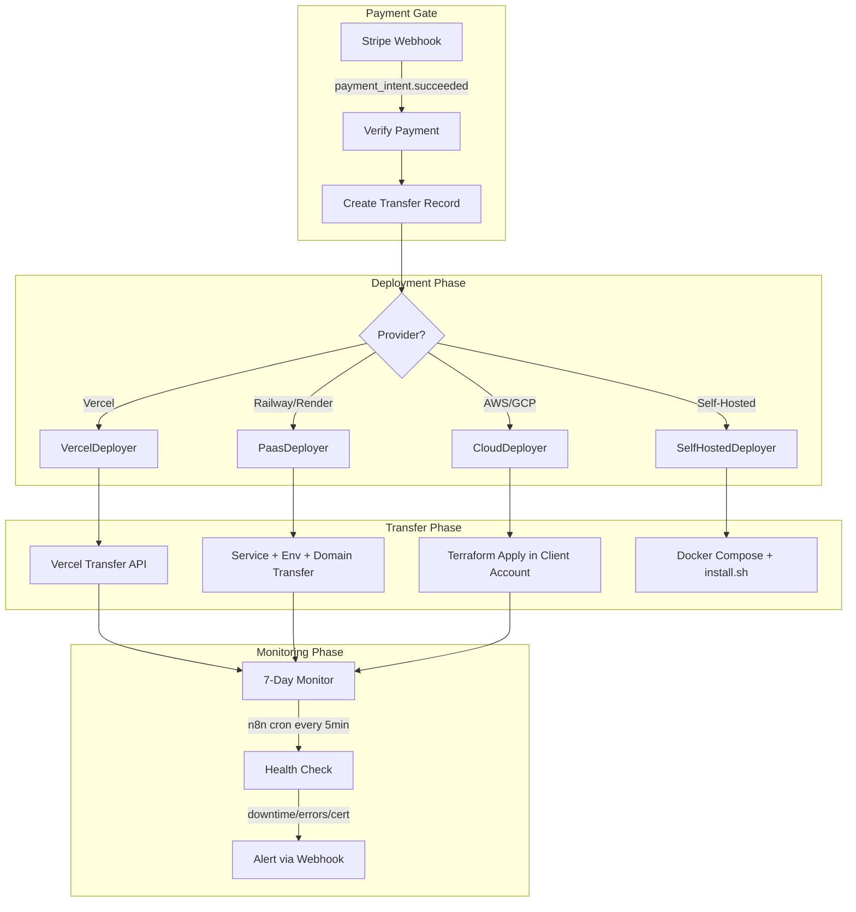

# Hosting Deployment and Ownership Transfer Pipeline

Reference documentation for the hosting deployment and ownership transfer system that deploys build output to four provider scenarios and transfers ownership to clients, gated by Stripe payment confirmation.

---

## Overview

The Hosting Transfer Pipeline supports deployment and ownership handoff across:

1. **Vercel** — Simplest: create project on Mismo account, deploy, transfer via API or fallback export
2. **Railway / Render** — PaaS with databases: service, encrypted env vars, custom domains
3. **AWS / GCP** — Enterprise: Terraform-generated infra (S3, CloudFront, RDS, EC2/Cloud Run) in client's cloud account
4. **Self-Hosted** — Docker Compose, Traefik, Let's Encrypt SSL, automated backups via `install.sh`

All transfers are **gated by Stripe payment confirmation** (`payment_intent.succeeded`). Post-transfer, **managed hosting** is monitored for 7 days with alerts for downtime, high error rate, or certificate expiry.

### Pipeline Flow



---

## Prerequisites

- **Stripe** — `STRIPE_WEBHOOK_SECRET` for webhook verification; payment gating uses `payment_intent.succeeded`
- **Provider API tokens** (as needed):
  - **Vercel**: `VERCEL_API_TOKEN`, optional `VERCEL_TEAM_ID`
  - **Railway**: `RAILWAY_API_TOKEN`
  - **Render**: `RENDER_API_KEY`
  - **AWS/GCP**: Client credentials stored in `Credential` model; Terraform binary at `TERRAFORM_BINARY_PATH` (default `/usr/local/bin/terraform`)
- **Slack** (optional): `SLACK_ALERT_WEBHOOK_URL` for monitoring alerts
- **n8n** (optional): For scheduled health checks; import `packages/n8n-nodes/workflows/hosting-monitor.json`

---

## Components

### Core Logic

| Module | Location | Description |
|--------|----------|-------------|
| **Orchestrator** | `packages/ai/src/hosting-transfer/orchestrator.ts` | State machine: initiate → payment → deploy → transfer → monitoring |
| **Vercel Deployer** | `packages/ai/src/hosting-transfer/providers/vercel.ts` | `POST /v9/projects/{id}/transfer`, fallback export |
| **PaaS Deployer** | `packages/ai/src/hosting-transfer/providers/paas.ts` | Railway (GraphQL) + Render (REST), env vars, domains |
| **Cloud Deployer** | `packages/ai/src/hosting-transfer/providers/cloud.ts` | Terraform generation + execution with client credentials |
| **Self-Hosted Deployer** | `packages/ai/src/hosting-transfer/providers/self-hosted.ts` | Docker Compose, Traefik, install.sh, backup scripts |
| **Health Monitor** | `packages/ai/src/hosting-transfer/monitoring.ts` | HTTP health check, TLS cert expiry, Slack alerts |

### API Routes

| Endpoint | Method | Description |
|----------|--------|-------------|
| `/api/delivery/deploy` | POST | Initiate transfer; returns `transferId`, `status`, `paymentRequired` |
| `/api/delivery/deploy/[id]/status` | GET | Poll transfer status, deployment URL, health status |
| `/api/delivery/deploy/[id]/retry` | POST | Retry failed transfer (max 3 retries) |
| `/api/delivery/monitors/active` | GET | Returns active monitors for n8n cron workflow |

### Database

**Model:** `HostingTransfer` in `packages/db/prisma/schema.prisma`

| Field | Purpose |
|-------|---------|
| `status` | PENDING_PAYMENT → PAYMENT_CONFIRMED → DEPLOYING → DEPLOYED → TRANSFERRING → COMPLETED / FAILED / MONITORING |
| `stripePaymentIntentId` | Idempotency; webhook looks up transfer by this |
| `deploymentConfig` | Provider-specific config (Vercel, PaaS, Cloud, Self-Hosted) |
| `deploymentOutput` | projectId, serviceId, deployment URL |
| `monitoringUntil` | 7 days after transfer; monitoring auto-disables after this |

---

## Payment Gating

1. Client initiates deployment via `POST /api/delivery/deploy` with `commissionId`, `provider`, `deploymentConfig`
2. Response includes `transferId`, `paymentRequired: true`
3. Frontend creates Stripe PaymentIntent with metadata `{ transferId }`
4. On `payment_intent.succeeded`, Stripe webhook calls `HostingTransferOrchestrator.onPaymentConfirmed(paymentIntent.id)`
5. Orchestrator finds transfer by `stripePaymentIntentId`, updates status, starts deployment

**Stripe webhook path:** `POST /api/billing/webhook`

```bash
stripe listen --forward-to localhost:3000/api/billing/webhook
```

---

## Provider-Specific Notes

### Vercel

- Creates project via `POST /v10/projects`, deploys via `POST /v13/deployments`
- Transfer: `POST /v9/projects/{id}/transfer` with `targetTeamId`
- Fallback: `exportConfig()` returns `vercel.json` + env template for manual import
- Requires: Client's Vercel account/team ID

### Railway / Render

- Railway: GraphQL API at `backboard.railway.app/graphql/v2`; project transfer via `projectTransferToTeam` mutation
- Render: REST API at `api.render.com/v1`; ownership transfer per service
- Both: encrypted env vars from `Credential` model; custom domain migration

### AWS / GCP

- Terraform generated at runtime or from build phase (`existingTerraformDir`)
- Uses client credentials from `Credential` model (AWS keys or GCP service account JSON)
- Resources: S3, CloudFront, RDS, EC2/ECS (AWS); Cloud Storage, Cloud SQL, Cloud Run (GCP)
- Post-deployment: if Mismo created sub-account, root credentials packaged for secure handoff

### Self-Hosted

- **Artifacts only** — no remote execution
- `docker-compose.yml`: app, Traefik, PostgreSQL, Redis (optional)
- `install.sh`: prerequisites check, env setup, `docker compose up`, SSL via Let's Encrypt
- `traefik/traefik.yml`, `traefik/dynamic.yml`: ACME config
- `backup.sh` + crontab if `backupS3Bucket` configured

---

## Monitoring

### n8n Workflow

**File:** `packages/n8n-nodes/workflows/hosting-monitor.json`

1. **Schedule Trigger** — every 5 minutes
2. **HTTP Request** — `GET /api/delivery/monitors/active`
3. **Split In Batches** — iterate monitors
4. **HTTP Request** — `GET {deploymentUrl}` health check
5. **IF Node** — status code 200? → Update health status : Send Slack alert

Import into n8n and activate to enable post-transfer monitoring.

### Alert Conditions

| Condition | Severity | Threshold |
|-----------|----------|-----------|
| Downtime | critical | HTTP non-200 or unreachable |
| Error rate | warning/critical | >1% (warning), >5% (critical) |
| Certificate expiry | warning/critical | <7 days (warning), <1 day (critical) |

Alerts posted to `SLACK_ALERT_WEBHOOK_URL` when configured.

---

## Environment Variables

```env
# Hosting Transfer
VERCEL_API_TOKEN=
VERCEL_TEAM_ID=
RAILWAY_API_TOKEN=
RENDER_API_KEY=
# AWS_ACCESS_KEY_ID=         # Mismo's AWS (sub-account creation)
# AWS_SECRET_ACCESS_KEY=
# GCP_SERVICE_ACCOUNT_JSON=
# TERRAFORM_BINARY_PATH=/usr/local/bin/terraform

# Monitoring (already used by n8n-alert)
SLACK_ALERT_WEBHOOK_URL=
```

---

## Quick Test

With dev servers running (`pnpm dev`):

```bash
# Initiate a deployment (use a valid commissionId from your database)
# Returns: { transferId, status, provider, paymentRequired }
curl -X POST http://localhost:3000/api/delivery/deploy \
  -H "Content-Type: application/json" \
  -d '{
    "commissionId": "<commission_id>",
    "provider": "VERCEL",
    "clientAccountId": "team_xxx"
  }'

# Poll status
curl http://localhost:3000/api/delivery/deploy/<transferId>/status

# Fetch active monitors (for n8n workflow)
curl http://localhost:3000/api/delivery/monitors/active
```

> **Note:** `deploymentConfig` must be set on the `HostingTransfer` record (e.g. via internal tooling or DB) before deployment runs; it contains provider-specific config (projectName, framework, envVars, etc.).

---

## Integration Points

- **ip-transfer.ts** — Planning logic (`planTransfer`) remains separate; orchestrator executes actual transfer
- **DevOps Agent** — Generates `vercel.json`; VercelDeployer uses similar config
- **Credential model** — Client credentials (Vercel, AWS, GCP) stored encrypted via pgsodium
- **Build model** — `HostingTransfer.buildId` references build whose output is deployed
- **Error Logger** — Failed transfers can forward to error-logger for circuit breaker

---

## Related Documentation

- [GSD Build Pipeline](gsd-build-pipeline.md) — Build output feeds into Hosting Transfer
- [n8n Workflow Pipeline](n8n-workflow-pipeline.md) — Hosting monitor workflow (Section 6)
- [README](../README.md) — Platform setup and environment variables
