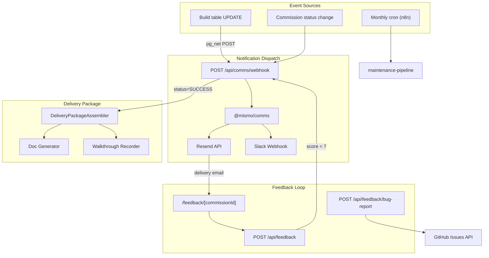

# Project Lifecycle Communication System

Reference documentation for the automated communication system that spans the full project lifecycle: status updates, delivery packaging, feedback collection, and maintenance mode.

---

## Overview

The communication system automates client-facing notifications throughout the build process:

1. **Status Updates** — Email (Resend) and/or Slack when build stages change, with specific progress (e.g., "Database schema designed (12 tables)", "Frontend 60% complete")
2. **Delivery Package** — GitHub URL, hosting URL, ADR, "How to modify" guide, API docs, and automated walkthrough video (Puppeteer + ffmpeg)
3. **Feedback Loop** — Post-delivery survey (1-10 rating), auto-escalation if &lt;7, bug reports as GitHub issues
4. **Maintenance Mode** — Monthly dependency checks (`npm outdated`), automated PRs for security patches, client approval for major updates

---

## Architecture



---

## Components

### Package: `@mismo/comms`

| Module | Description |
|--------|-------------|
| `dispatcher` | Orchestrates notifications via Resend (primary) and Slack; Resend falls back to SMTP if unavailable |
| `channels/resend` | Resend API integration; nodemailer SMTP fallback |
| `channels/slack` | Slack Incoming Webhook with Block Kit formatting |
| `templates/*` | React Email templates (EN + CN) for 6 events: Started, Progress, Complete, Transfer Ready, Support Required, Feedback Request |
| `delivery/package-assembler` | Assembles GitHub URL, hosting URL, ADR, how-to guide, API docs, walkthrough video |
| `delivery/doc-generator` | Generates ADR, "How to modify" guide (non-technical), API documentation |
| `delivery/walkthrough-recorder` | Puppeteer navigates deployed app routes; ffmpeg captures to MP4; uploads to Supabase Storage |
| `feedback/survey-handler` | Processes ratings; triggers escalation when rating &lt; 7 |
| `feedback/bug-report` | Creates GitHub issues with structured bug template |
| `maintenance/dependency-checker` | `npm outdated` + `npm audit`; classifies patch/minor/major |
| `maintenance/pr-creator` | Creates PRs for security patches and minor updates via GitHub API |

### API Routes (apps/web)

| Route | Method | Description |
|-------|--------|-------------|
| `/api/comms/webhook` | POST | Receives pg_net callbacks on Build/Commission status changes; dispatches notifications |
| `/api/feedback` | POST | Saves survey rating; escalates Commission if rating &lt; 7 |
| `/api/feedback/bug-report` | POST | Creates GitHub issue in build repo |
| `/api/maintenance/check` | POST | Runs dependency check on a repo; optionally creates PRs |
| `/api/maintenance/plans` | POST | Lists active MaintenancePlan records (maintenanceOptIn = true) |
| `/api/maintenance/report` | POST | Saves maintenance check result; updates lastCheckAt |

### Database Models

| Model | Purpose |
|-------|---------|
| `ClientPreference` | Per-commission locale (en/zh), Slack webhook URL, maintenanceOptIn |
| `Notification` | Audit log of sent notifications |
| `DeliveryPackage` | Assembled package (githubUrl, hostingUrl, adrDocument, howToGuide, apiDocs, videoUrl) |
| `Feedback` | Survey ratings and comments |
| `MaintenancePlan` | Opt-in maintenance; githubUrl, lastCheckAt, dependencyState |

---

## Setup

### Environment Variables

Add to `.env`:

```env
# Communication System (Resend primary, SMTP fallback)
RESEND_API_KEY=re_...
RESEND_FROM_EMAIL=updates@mismo.dev
SMTP_HOST=                    # Fallback SMTP host
SMTP_PORT=587
SMTP_USER=
SMTP_PASS=
COMMS_WEBHOOK_SECRET=         # Optional: verify pg_net webhook calls
```

### Supabase Trigger (pg_net)

The Build table has a trigger that POSTs to the comms webhook on status changes. For this to work:

1. **pg_net** must be available (Supabase includes it).
2. Set the webhook URL in your database:

```sql
ALTER DATABASE postgres SET app.comms_webhook_url = 'https://your-app.com/api/comms/webhook';
```

If using a shadow database for migrations, the trigger creation is conditional on pg_net availability and will skip when absent.

### Supabase Storage (Walkthrough Videos)

Create a public bucket `walkthrough-videos` in Supabase Storage for automated walkthrough uploads. The service role key must have write access.

---

## Email Templates

Templates are locale-aware (EN, CN). Tone is professional but warm.

| Event | Trigger | Example content |
|-------|---------|-----------------|
| BUILD_STARTED | Build status → RUNNING | "Hi [Name], your project [Project] is now being built. We've started with database architecture." |
| BUILD_PROGRESS | Stage change (e.g. 50%) | "Good news — [Project] is 60% complete. 6/10 screens done. Currently testing authentication flows." |
| BUILD_COMPLETE | Build status → SUCCESS | "Your project has been successfully built. We're preparing your delivery package." |
| TRANSFER_READY | Delivery assembled | "Everything is packaged. Here are your repo, docs, and walkthrough video." |
| SUPPORT_REQUIRED | Commission → ESCALATED or rating &lt; 7 | "We've encountered an issue. Our team has been notified." |
| FEEDBACK_REQUEST | Commission → COMPLETED | "How did we do? Rate 1-10. Found a bug? Report here." |

---

## Maintenance Pipeline (n8n)

**Workflow:** `packages/n8n-nodes/workflows/maintenance-pipeline.json`

- **Trigger:** Monthly cron (`0 9 1 * *` — 1st of month, 09:00)
- **Steps:** Fetch active MaintenancePlan records → For each repo, run MaintenanceChecker node → If security issues, send alert → Save report
- **MaintenanceChecker node:** Calls `POST /api/maintenance/check` with githubUrl, branch, autoCreatePrs

**Classification:**

- **Security patches** (patch version or npm audit): Auto-create PR
- **Minor updates**: Auto-create PR with `needs-review` label
- **Major updates**: Create GitHub issue for client approval (no auto-PR)

---

## Integration with Other Pipelines

### GSD Build Pipeline

When the build pipeline updates `Build.status`, the Postgres trigger fires and the webhook receives the payload. The dispatcher resolves `ClientPreference`, maps the status change to an event (BUILD_STARTED, BUILD_COMPLETE, SUPPORT_REQUIRED), and sends email/Slack.

For **stage-specific progress** (e.g., "Frontend 60% complete"), the build pipeline or agents must update Build with stage metadata. The current trigger fires on `status` changes only; pipeline-specific stages can be passed via `executionIds` or a future `stage` column.

### Delivery Pipeline

After a successful build, the delivery pipeline can call `assembleDeliveryPackage()` from `@mismo/comms` to generate docs and record the walkthrough. The result is stored in `DeliveryPackage` and the "Transfer Ready" email is sent.

---

## Required Accounts

- **Resend** (or SMTP): Email delivery
- **Slack** (optional): Client workspace webhook for parallel notifications
- **GitHub**: Bug report issue creation; maintenance PR creation
- **Supabase Storage**: Walkthrough video uploads
- **ffmpeg**: Must be installed on the host running the walkthrough recorder

---

## Related Documentation

- [GSD Build Pipeline](gsd-build-pipeline.md) — Build orchestration; status updates fire on Build changes
- [n8n Workflow Pipeline](n8n-workflow-pipeline.md) — Workflow generation; maintenance pipeline uses n8n
- [Hosting Transfer](../.cursor/plans/hosting_deployment_transfer_3cf7e4d0.plan.md) — Delivery transfer flow
