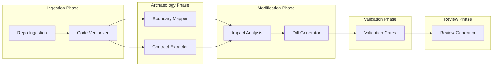

# Repo Surgery + BMAD-Archaeology Pipeline

Reference documentation for the pipeline that modifies existing codebases using BMAD boundary mapping, contract extraction, and safe diff generation.

---

## Overview

The Repo Surgery pipeline enables automated modification of legacy codebases with strict boundary enforcement. It combines:

1. **Ingestion** — Clone repo, run cloc/dependency analysis, extract AST (functions, routes, schemas)
2. **Vectorization** — Chunk code, embed with OpenAI text-embedding-3-large, store in Qdrant for semantic search
3. **Archaeology** — BMAD boundary mapping (Core/Shell/Adapter/Safe to Modify) and contract extraction (API, data, interface)
4. **Modification** — Impact analysis (which files to touch/avoid) and diff generation with test creation
5. **Validation** — Four gates: static analysis, regression tests, contract validation, security scan
6. **Review** — GitHub PR creation with confidence scoring and rollback reference

### Pipeline Flow



---

## Prerequisites

- **Qdrant** — Vector database for code embeddings (required; run via Docker or use hosted instance)
- **Docker** — For Qdrant, validation tools (ESLint, test runners), optional SonarQube
- **cloc** — Optional; for complexity analysis (install: `brew install cloc`)
- **git** — For cloning and branch operations
- **OpenAI API Key** — For text-embedding-3-large and LLM calls (boundary mapping, impact analysis, diff generation)
- **GitHub Token** — For PR creation (optional; pipeline runs without it but skips PR)

---

## Components

### Core Logic (`packages/ai/src/repo-surgery/`)

| Module | Description |
|--------|-------------|
| `RepoIngestion` | Git clone, cloc, dependency check, git log, AST parsing |
| `ASTParser` | Extracts functions, API routes, DB schemas (TS/JS/Python/Prisma/SQL) |
| `CodeChunker` | 100-line chunks with 20-line overlap |
| `CodeEmbedder` | OpenAI text-embedding-3-large (3072 dims) |
| `CodeVectorStore` | Qdrant per-surgery collections |
| `BoundaryMapper` | BMAD zone classification (heuristic + LLM refinement) |
| `ContractExtractor` | API, data, interface contracts |
| `ImpactAnalysisAgent` | Semantic search + boundary cross-reference |
| `DiffGenerationAgent` | LLM-driven unified diffs + test generation |
| `ValidationGates` | Static analysis, regression tests, contracts, security |
| `ReviewGenerator` | Git branch, apply diffs, GitHub PR, confidence score |

### n8n Custom Nodes

| Node | Package | Description |
|------|---------|-------------|
| **RepoIngestion** | `n8n-nodes-mismo.repoIngestion` | Clone and analyze a repository |
| **CodeVectorizer** | `n8n-nodes-mismo.codeVectorizer` | Chunk, embed, store in Qdrant |
| **BoundaryMapper** | `n8n-nodes-mismo.boundaryMapper` | BMAD zone classification |
| **ContractExtractor** | `n8n-nodes-mismo.contractExtractor` | Extract API/data/interface contracts |
| **ImpactAnalysis** | `n8n-nodes-mismo.impactAnalysis` | Determine files to touch/avoid |
| **DiffGenerator** | `n8n-nodes-mismo.diffGenerator` | Generate unified diffs and tests |
| **ValidationGate** | `n8n-nodes-mismo.validationGate` | Run validation gates (1–4 or all) |
| **ReviewGenerator** | `n8n-nodes-mismo.reviewGenerator` | Create GitHub PR with confidence score |

### API Routes (`apps/internal`)

| Route | Method | Description |
|-------|--------|-------------|
| `/api/repo-surgery/ingest` | POST | Clone + analyze a repo |
| `/api/repo-surgery/vectorize` | POST | Vectorize code into Qdrant |
| `/api/repo-surgery/analyze` | POST | Boundary mapping + contract extraction |
| `/api/repo-surgery/modify` | POST | Impact analysis + diff generation |
| `/api/repo-surgery/validate` | POST | Run validation gates |
| `/api/repo-surgery/review` | POST | Create GitHub PR |
| `/api/repo-surgery/pipeline` | POST | Full end-to-end pipeline |

---

## Environment Variables

| Variable | Default | Description |
|----------|---------|-------------|
| `REPO_SURGERY_WORKSPACE` | `/tmp/mismo-surgery` | Directory for cloned repos per surgery |
| `QDRANT_URL` | `http://localhost:6333` | Qdrant server URL |
| `QDRANT_API_KEY` | _(empty)_ | Qdrant API key (optional for local) |
| `OPENAI_API_KEY` | _required_ | For embeddings and LLM calls |
| `GITHUB_TOKEN` | _optional_ | For PR creation; pipeline runs without it |
| `REPO_SURGERY_URL` | `http://localhost:3001` | Internal API base URL for n8n nodes |
| `SONARQUBE_URL` | _optional_ | Enhanced static analysis (Gate 1) |
| `SONARQUBE_TOKEN` | _optional_ | SonarQube auth |

---

## BMAD Boundary Zones

| Zone | Description | Modification Policy |
|------|-------------|---------------------|
| **Core** | DB migrations, auth, core business logic | Never modify; massive risk |
| **Shell** | API routes, webhooks, external service clients | Maintain backward compatibility |
| **Adapter** | Middleware, DTOs, mappers | Safe; minimal dependencies |
| **Safe to Modify** | Isolated features, utils, UI components | Preferred for new features |

---

## Validation Gates

| Gate | Description | Pass Criteria |
|------|-------------|---------------|
| **1. Static Analysis** | ESLint, TypeScript, pylint, optional SonarQube | No new errors introduced |
| **2. Regression Tests** | Jest, Vitest, pytest, Go test | All existing + new tests pass |
| **3. Contract Validation** | API/data contract compliance | No contract violations |
| **4. Security Scan** | npm audit, pip-audit, secret scanning | No high/critical vulns, no secrets in diff |

If any gate fails, pipeline halts with `humanReview=true` and returns failure context.

---

## Running Locally

### 1. Start Qdrant

```bash
# Via Docker
docker run -d -p 6333:6333 -p 6334:6334 qdrant/qdrant

# Or use the convenience script
./scripts/start-repo-surgery-services.sh
```

### 2. Start Dev Servers

```bash
pnpm dev
```

The internal app (port 3001) hosts all Repo Surgery API routes. No separate microservices are required.

### 3. Trigger the Pipeline

**Option A: Full pipeline via API**

```bash
curl -X POST http://localhost:3001/api/repo-surgery/pipeline \
  -H "Content-Type: application/json" \
  -d '{
    "repoUrl": "https://github.com/owner/repo.git",
    "branch": "main",
    "changeRequest": "Add OAuth login with Google",
    "forbiddenFiles": []
  }'
```

**Option B: n8n workflow**

1. Import `packages/n8n-nodes/workflows/repo-surgery-pipeline.json` into n8n
2. Set `REPO_SURGERY_URL` to `http://localhost:3001` (or internal app hostname)
3. Trigger via webhook: `POST /webhook/repo-surgery-pipeline`
4. Body: `{ repoUrl, branch, changeRequest, forbiddenFiles?, commissionId?, surgeryId? }`

---

## Safety Features

- **Branch isolation** — All changes on `surgery/{surgeryId}/*` branches; never commits to main
- **Rollback** — Original branch reference preserved for 30 days
- **Workspace isolation** — Each surgery gets `/tmp/mismo-surgery/{surgeryId}/`
- **Qdrant cleanup** — Per-surgery collections `repo_surgery_{surgeryId}` deleted after 30 days
- **Cleanup script** — `pnpm repo-surgery:cleanup` removes expired workspaces and collections

---

## Cleanup

```bash
# Remove expired workspaces and Qdrant collections (default: 30 days)
pnpm repo-surgery:cleanup

# Customize retention
RETENTION_DAYS=14 pnpm repo-surgery:cleanup
```

---

## Related Documentation

- [GSD Build Pipeline](gsd-build-pipeline.md) — BMAD-contract build orchestration for new projects
- [n8n Workflow Pipeline](n8n-workflow-pipeline.md) — Workflow generation and deployment
- [Design DNA Enforcement](design-dna-enforcement.md) — Qdrant usage for Design DNA references
- [README](../README.md) — Platform overview and setup
